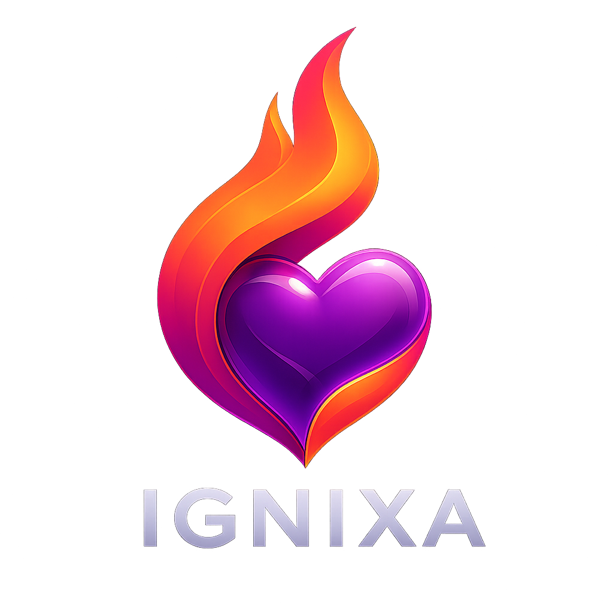

<div align="center">
  
  <h1>Ignixa FHIR Server</h1>
  <p>
    <b>High-Performance, Multi-Tenant, Cloud-Native FHIR Server for dotnet</b>
  </p>

[](https://dotnet.microsoft.com/) 
[](https://hl7.org/fhir/) 
[](https://www.nuget.org/packages?q=Ignixa) 
[](https://github.com/users/brendankowitz/packages/container/package/ignixa-fhir) 
[](LICENSE)

</div>

---

## 🚀 Overview

**Ignixa** is an enterprise-grade, reference implementation of a FHIR Server, engineered for high performance and scalability. Built on **dotnet** and **Clean Architecture** principles, it offers a robust foundation for healthcare data interoperability.

Designed for the cloud, Ignixa supports **multi-tenancy** out of the box, with data isolation and configurable storage backends including **SQL Server** and **Azure Blob Storage**.

## ✨ Key Features

### 🏥 Core FHIR Capabilities
*   **Multi-Version Support**: Seamlessly handles **R4, R4B, R5, R6-Ballot2, and STU3**.
*   **Comprehensive API**: Full CRUD, Search, History, Batch/Transaction Bundles, and Patch (FHIRPath Patch).
*   **Advanced Validation**: Three-tier validation engine (Fast, Spec, Profile) ensuring data integrity.
*   **Extensive Search**: Support for standard and advanced search parameters, including chaining and includes.

### ⚡ Performance & Scalability
*   **Streaming-First**: Zero-copy serialization and response streaming minimize memory footprint, even for large datasets.
*   **High Throughput**: Built on ASP.NET Core Minimal APIs for the lowest overhead.
*   **Background Processing**: Integrated **DurableTask** framework for reliable, asynchronous bulk `$export` and `$import` operations.

### 🏢 Enterprise Ready
*   **Multi-Tenancy**: Built-in tenant isolation (Physical partitioning).
*   **Production Storage**: robust **SQL Server (EF Core)** provider with optimized indexing.
*   **Cloud Native**: Container-ready with Azure integration (App Service, SQL Database, Storage).
*   **Clean Architecture**: Strict separation of concerns (Domain, Application, Infrastructure, API) facilitates maintenance and extension.

## 📦 Deployment

### Azure

Ignixa can be deployed to Azure using **Bicep** (Infrastructure as Code). This provisions a complete, secure environment with:
- **App Service (Linux)** for hosting the container.
- **SQL Server** with auto-provisioned tenant databases.
- **Storage Accounts** for FHIR data and DurableTask orchestration.
- **Managed Identity** for zero-trust, passwordless security.

**Single-Tenant Deployment (One-Click):**

[](https://portal.azure.com/#create/Microsoft.Template/uri/https%3A%2F%2Fraw.githubusercontent.com%2Fbrendankowitz%2Fignixa-fhir%2Fmain%2Fdeploy%2Fazure%2Fazuredeploy.json)

Or use the CLI:
```bash
az deployment group create \
  --resource-group ignixa-dev \
  --template-file deploy/azure/azuredeploy.json \
  --parameters appName=ignixa-demo
```

**Advanced: Bicep Templates for Multi-Tenant Deployment (e.g., 10 tenants):**
```bash
az deployment group create \
  --resource-group ignixa-prod \
  --template-file deploy/azure/main.bicep \
  --parameters appName=ignixa-prod tenantCount=10
```

[**📚 View Complete Azure Deployment Guide**](deploy/azure/README.md)

### Docker

The official image is available on GitHub Container Registry:

```bash
docker pull ghcr.io/brendankowitz/ignixa-fhir:release
```

#### Production Mode (SQL Server) 🚀

For a complete, high-performance experience with **SQL Server**, use Docker Compose. This enables full ACID transactions, advanced indexing, and concurrency support.

```bash
docker compose up -d
```

The server will be available at `http://localhost:8080/metadata`.

> **Configuration**: You must create a `.env` file (see `.env.example`) to set the `SQL_SA_PASSWORD` and optionally the image tag.

## 🛠️ Quick Start (Local Development)

### Prerequisites
*   [dotnet 9.0 SDK](https://dotnet.microsoft.com/download/dotnet/9.0)
*   Docker (optional, for SQL Server tests)

### Build & Run

```bash
# 1. Clone the repository
git clone https://github.com/brendankowitz/ignixa-fhir.git
cd ignixa-fhir

# 2. Build the solution
dotnet build All.sln

# 3. Run the API (defaults to File System storage for dev)
cd src/Ignixa.Api
dotnet run
```

Access the metadata endpoint at `https://localhost:5001/metadata`.

### Configuration

Ignixa uses standard `appsettings.json` for configuration.

**Enable SQL Server (Recommended for Production):**

```json
{
  "Storage": {
    "Provider": "SqlServer",
    "ConnectionString": "Server=(localdb)\mssqllocaldb;Database=IgnixaFhir;Trusted_Connection=True;"
  }
}
```

*See `appsettings.json` for full configuration options.*

## 💻 Developer Tools

Ignixa includes a suite of powerful CLI tools to accelerate development and testing.

| Tool | Description |
|------|-------------|
| **[ignixa-fakes](tools/Ignixa.FhirFakes.Cli)** | Generate realistic synthetic patient data, clinical scenarios, and populations at scale. |
| **[ignixa-validator](tools/Ignixa.Validation.Cli)** | High-performance FHIR resource validation (JSON/XML) against official profiles. |
| **[ignixa-sqlonfhir](tools/Ignixa.SqlOnFhir.Cli)** | Transform FHIR data into tabular formats (Parquet/CSV) using SQL-on-FHIR ViewDefinitions. |

Install any tool globally:
```bash
dotnet tool install --global Ignixa.FhirFakes.Cli
```

## 🏗️ Architecture

Ignixa follows a strict **Clean Architecture** pattern using **CQRS** (Command Query Responsibility Segregation) with **[Medino](https://github.com/brendankowitz/Medino)**.

*   **API**: Minimal API endpoints, middleware, and presentation logic.
*   **Application**: Business logic, CQRS Handlers (Commands/Queries).
*   **Domain**: Core entities, value objects, and repository interfaces.
*   **DataLayer**: Infrastructure implementations (SQL, FileSystem, BlobStorage).

## 🧩 Ignixa Core SDK

The heart of Ignixa is a set of high-performance, reusable **dotnet libraries** available on NuGet. These can be used independently to build custom FHIR applications.

| Package | Feature |
|---------|---------|
| **[Ignixa.Specification](src/Core/Ignixa.Specification)** | **FHIR structure definitions** and auto-generated providers for R4/R4B/R5/R6/STU3. |
| **[Ignixa.Serialization](src/Core/Ignixa.Serialization)** | **System.Text.Json** based serialization optimized for high-throughput. |
| **[Ignixa.Search](src/Core/Ignixa.Search)** | **Search parameter definitions**, indexing, and high-speed value extraction. |
| **[Ignixa.FhirPath](src/Core/Ignixa.FhirPath)** | A **fast, compiled FHIRPath engine**. |
| **[Ignixa.Validation](src/Core/Ignixa.Validation)** | **Three-tier validation engine** (Fast, Spec, Profile) for robust data integrity. |
| **[Ignixa.FhirMappingLanguage](src/Core/Ignixa.FhirMappingLanguage)** | **FHIR Mapping Language (FML)** parser and StructureMap engine. |
| **[Ignixa.SqlOnFhir](src/Core/Ignixa.SqlOnFhir)** | Implementation of the **SQL on FHIR v2** specification for data transformation. |
| **[Ignixa.PackageManagement](src/Core/Ignixa.PackageManagement)** | **NPM-based package manager** for downloading and caching FHIR implementation guides. |

See the [Core SDK Documentation](src/Core/README.md) for full details.

## 🤝 Contributing

We welcome contributions! Please see our [Contributing Guidelines](CONTRIBUTING.md) and the [Developer Guide](CLAUDE.md) for details on setting up your environment and submitting PRs.

## 📄 License

This project is licensed under the MIT License - see the [LICENSE](LICENSE) file for details.

## 🙏 Acknowledgments

Ignixa is inspired by and incorporates patterns from excellent open-source projects:
*   [Microsoft FHIR Server](https://github.com/microsoft/fhir-server)
*   [Firely dotnet SDK](https://github.com/FirelyTeam/firely-net-sdk)

---

<p align="center">
  <b>Ignixa</b> — Intelligent Gateway for Next-generation Interoperability and eXtensible APIs.
</p>