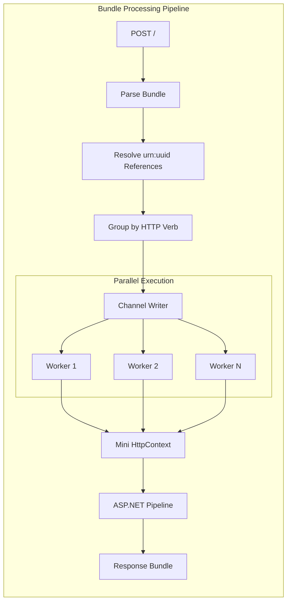

# ADR 2509: Bundle Processing with Channels

## Status

Accepted

## Context

FHIR Bundle transactions require atomic multi-resource operations. Traditional switch-statement routing becomes unmaintainable as operations grow.

## Decision

We will use **ASP.NET Core pipeline routing** with **System.Threading.Channels** for bundle processing.



### Key Innovation: Pipeline Routing

Instead of switch statements, we create mini `HttpContext` objects for each bundle entry:

```csharp
// Each bundle entry routes through ASP.NET Core pipeline
httpContext.Request.Method = entry.HttpVerb;  // PUT, POST, DELETE
httpContext.Request.Path = entry.RequestUrl;   // Patient/123
await _pipeline(httpContext);  // Automatic routing!
```

### Processing Order

1. **POST** entries first (creates)
2. **PUT** entries second (updates)
3. **DELETE** entries last

### Channel Configuration

| Setting | Value | Rationale |
|---------|-------|-----------|
| Bounded capacity | 100 | Backpressure for memory control |
| Concurrent workers | 10 | Balance parallelism vs contention |

## Consequences

### Positive
- No switch statements to maintain
- New operations work automatically
- Parallel execution via channels
- Reference resolution for `urn:uuid:`

### Negative
- Mini HttpContext overhead (~1ms per entry)
- Streaming mode cannot resolve `urn:uuid:` references
