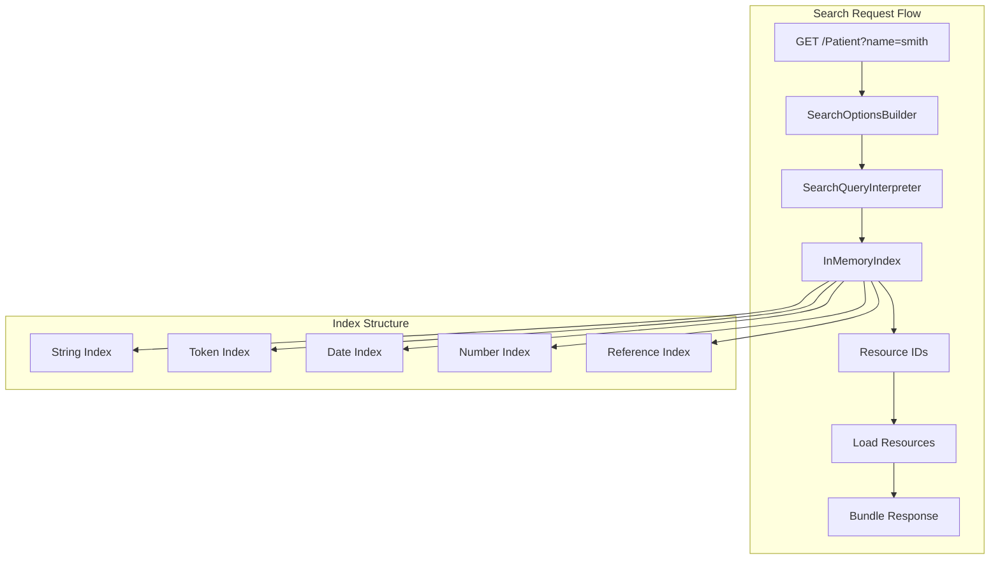

# ADR 2509: InMemory Search Architecture

## Status

Accepted

## Context

FHIR search requires expression parsing, type-specific comparisons, and indexing. Building from scratch is error-prone and time-consuming.

## Decision

We will **port the InMemory search from microsoft/fhir-server** (`feature/subscription-engine` branch).



### Ported Components

| Component | Purpose |
|-----------|---------|
| `SearchQueryInterpreter` | Expression visitor for search parameter parsing |
| `ComparisonValueVisitor` | Type-specific value comparisons |
| `InMemoryIndex` | Optimized index with grouped lookups |

### Index Key Format

```
{ResourceType}:{ParamName}:{NormalizedValue} → List<ResourceId>
```

Example: `Patient:name:smith → ["patient-1", "patient-2"]`

### Startup Loading

Indices are pre-extracted in `.metadata.ndjson` files, enabling 10x faster startup compared to re-extracting on every boot.

## Consequences

### Positive
- Proven in production microsoft/fhir-server
- Handles edge cases (partial dates, case-insensitive strings)
- 10x faster than re-extracting indices
- All FHIR search parameter types supported

### Negative
- Memory footprint grows with resource count
- Code porting requires careful adaptation
- MIT license attribution required
