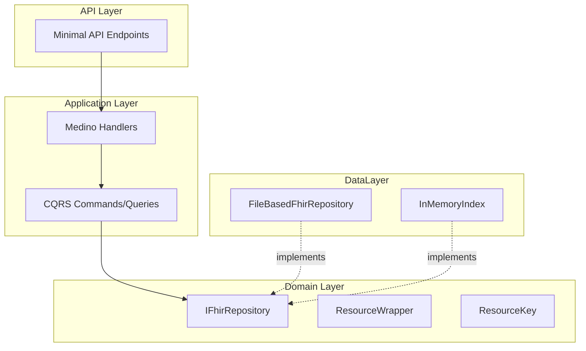

# ADR 2509: Vertical Slice Architecture

## Status

Accepted

## Context

FHIR Server v2 requires a foundational architecture prioritizing developer experience. A developer should press F5 and have a working FHIR server with zero external dependencies.

## Decision

We will use **vertical slice architecture** with layered separation:



### Key Decisions

| Decision | Rationale |
|----------|-----------|
| File-based storage | Zero external dependencies for F5 experience |
| `.metadata.ndjson` sidecar files | 10x faster startup (pre-extracted search indices) |
| Ignixa namespace | Clean separation from Microsoft.Health |
| Layered projects | Clear dependency flow, testable in isolation |

### Project Structure

```
Ignixa.Domain        → Models and abstractions (no dependencies)
Ignixa.Application   → Business logic, CQRS handlers (→ Domain)
Ignixa.DataLayer.*   → Storage implementations (→ Domain)
Ignixa.Api           → HTTP endpoints, middleware (→ all layers)
```

### Storage Layout

```
fhir-data/{ResourceType}/{YYYY}/{MM}/{DD}/
  tx-{timestamp}.ndjson            # Bundle + Resource data
  tx-{timestamp}.metadata.ndjson   # Pre-extracted search indices
```

## Consequences

### Positive
- F5 works with zero setup
- Clear layer separation enables testing
- Foundation for SQL/Cosmos backends

### Negative
- File I/O performance limitations
- Index memory grows with resource count
