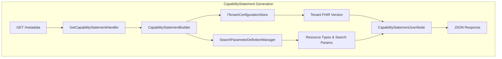

# ADR 2510: CapabilityStatement Without Firely SDK

## Status

Accepted

## Context

CapabilityStatement generation must avoid Firely SDK dependency in application layers. Ignixa uses custom FHIR models based on the SourceNode pattern for multi-version support and serialization control.

## Decision

We will implement CapabilityStatement using custom **SourceNode-based POCOs** consistent with existing patterns (`BundleJsonNode`, `OperationOutcomeJsonNode`).



### Model Pattern

```csharp
public class CapabilityStatementJsonNode : ResourceJsonNode
{
    [JsonPropertyName("rest")]
    public IList<RestComponentJsonNode> Rest { get; set; }

    // Inherits ToSourceNode() and ToTypedElement()
}
```

### Key Decisions

| Decision | Rationale |
|----------|-----------|
| Custom POCOs | No third-party dependency, proven pattern |
| System.Text.Json | Modern .NET, better performance |
| Application layer | Business logic, not HTTP concern |
| Builder pattern | Dynamic discovery, tenant-aware |

## Consequences

### Positive
- No Firely SDK dependency
- Multi-version support (R4, R4B, R5, STU3)
- Consistent with existing SourceNode patterns
- Dynamic resource/search param discovery

### Negative
- Must maintain FHIR CapabilityStatement structure
- ~300-400 lines of model definitions
- Manual updates for FHIR spec changes
