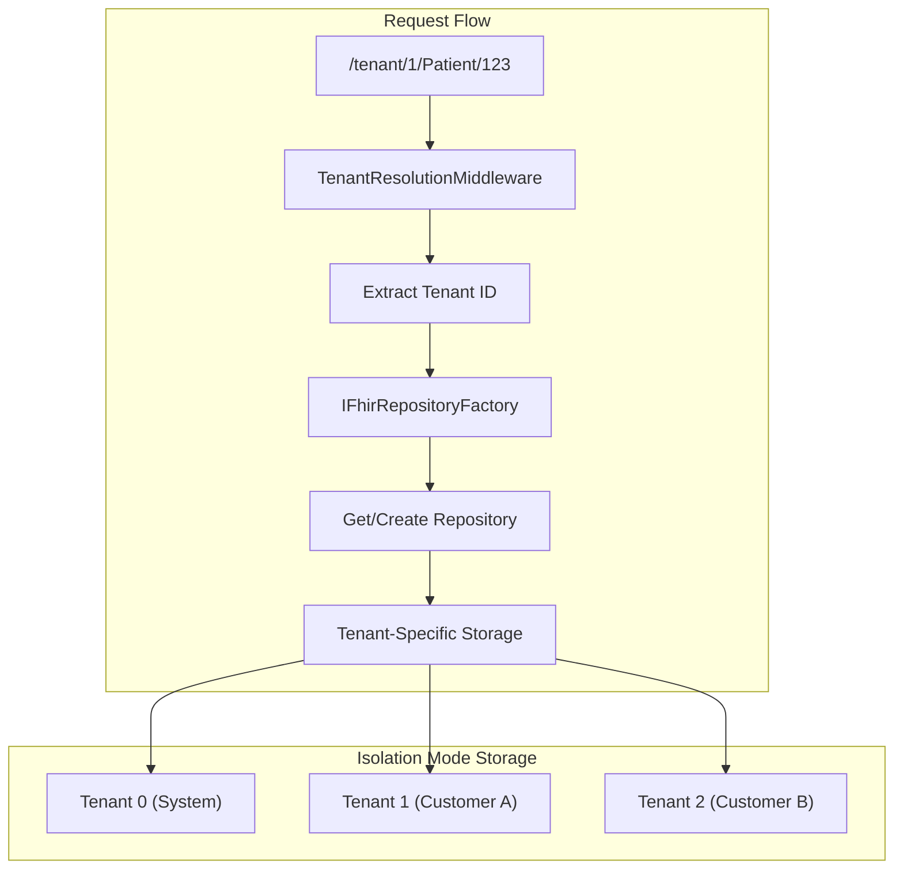

# ADR 2510: Multi-Tenancy and Data Partitioning

## Status

Proposed

## Context

FHIR server deployments require flexible data partitioning supporting:

1. **Isolation Mode**: Multiple separate customers with isolated data stores (SaaS model)
2. **Distributed Mode**: Single customer with horizontal sharding for scale (future)

Traditional approaches force a binary choice between these patterns.

## Decision

We will implement multi-tenancy with factory-based abstractions.

### Tenant Configuration
- `ITenantConfigurationStore`: Loads tenant config from `appsettings.json`
- Integer tenant IDs (0, 1, 2...) for O(1) array lookup
- Per-tenant FHIR version, storage type, and search configuration

### Factory Pattern
- `IFhirRepositoryFactory`: Creates and caches tenant-specific repositories
- `ISearchServiceFactory`: Creates and caches tenant-specific search services
- Repository instances cached per tenant for reuse

### Partition Strategy
- `IPartitionStrategy`: Determines which partition(s) to use for read/write
- `IsolatedModePartitionStrategy`: Always uses explicit tenant ID from route
- `IQueryExecutionStrategy`: Executes search queries (handles future fanout)

### Routing
- Isolation mode routes: `/tenant/{tenantId:int}/{resourceType}/{id?}`
- `TenantResolutionMiddleware`: Extracts tenant ID, validates tenant exists

### Storage Patterns
- **FileSystem**: Directory per tenant (`fhir-data/tenants/{tenantId}/`)
- **SQL Server**: Database or schema per tenant (future)
- **Cosmos DB**: Partition key isolation (future)

## Consequences

### Positive
- Clean separation via factory pattern
- O(1) tenant lookup with caching
- Backward compatible (single-tenant = tenant 0)
- Foundation for distributed mode
- Mixed FHIR versions per tenant

### Negative
- Breaking URL change (add `/tenant/{id}` prefix)
- Configuration grows with tenant count
- Small factory lookup overhead (~1ms)

### Trade-offs

| Decision | Alternative | Rationale |
|----------|-------------|-----------|
| Integer tenant IDs | String/GUID | O(1) array lookup, simpler URLs |
| Factory pattern | Context injection | Better caching and lifecycle control |
| Directory per tenant | Partition keys | Explicit isolation, simpler prototype |
| Isolation first | Distributed first | Validate patterns before fanout complexity |
