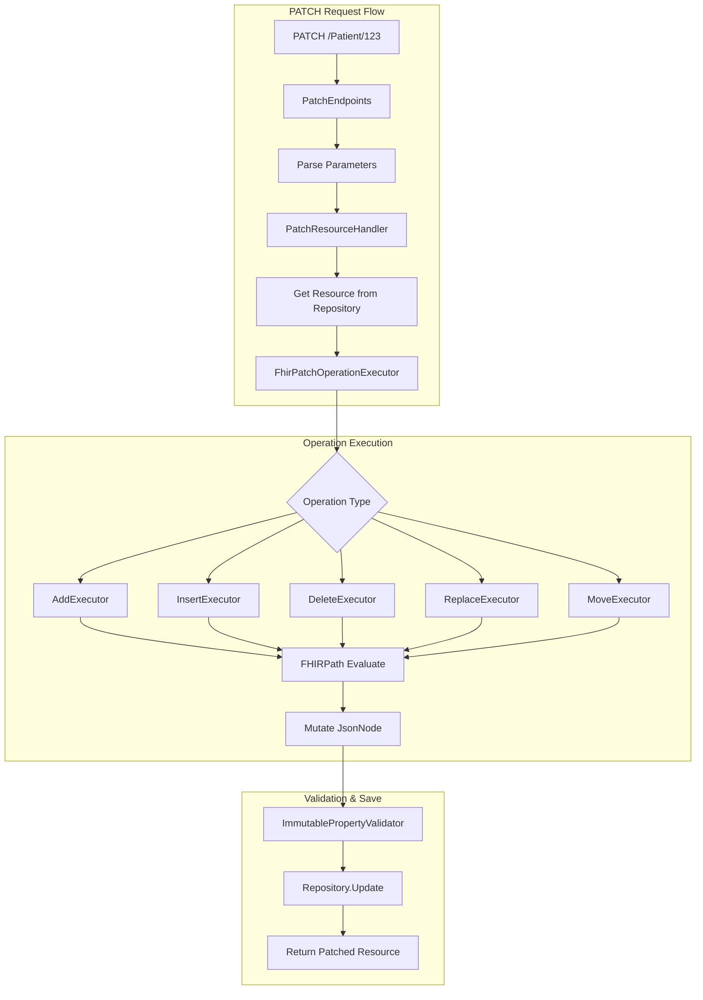

# ADR 2510: FHIR Patch Operations

## Status

In Progress

## Context

FHIR PATCH enables partial resource updates using FHIRPath expressions. This provides:
- 90%+ bandwidth reduction vs full PUT (150KB → 800 bytes)
- Field-level audit trails
- Efficient mobile/offline sync

FHIR R4 Section 3.1.0.7.1 **requires** FHIRPath evaluation for path navigation.

## Decision

We will implement FHIRPath Patch using a strategy pattern with the existing `Ignixa.FhirPath` evaluator.



### Operation Types

| Operation | Purpose | Path Matches |
|-----------|---------|--------------|
| **add** | Add element to collection | Collection (0..*) |
| **insert** | Insert at specific index | Collection + index |
| **delete** | Remove element(s) | One or more |
| **replace** | Replace value | Exactly one |
| **move** | Reorder within collection | Source + destination |

### Key Design Decisions

| Decision | Rationale |
|----------|-----------|
| FHIRPath evaluation | FHIR spec requires FHIRPath, not simple path parsing |
| Strategy pattern | `IOperationExecutor` per operation type for testability |
| In-place JsonNode mutation | Avoids serialization roundtrips |
| Immutable property protection | Prevent changes to `id`, `meta.versionId`, `meta.lastUpdated` |

### Request Format

```http
PATCH /Patient/123
Content-Type: application/fhir+json
If-Match: W/"2"

{
  "resourceType": "Parameters",
  "parameter": [{
    "name": "operation",
    "part": [
      { "name": "type", "valueCode": "replace" },
      { "name": "path", "valueString": "Patient.name[0].family" },
      { "name": "value", "valueString": "Johnson" }
    ]
  }]
}
```

### Error Responses

| Status | Condition |
|--------|-----------|
| 400 | Invalid Parameters, FHIRPath error, type mismatch |
| 404 | Resource not found |
| 412 | Version conflict (If-Match mismatch) |

## Consequences

### Positive
- FHIR R4 specification compliance
- Significant bandwidth reduction for partial updates
- Atomic multi-operation support
- Multi-tenant routing

### Negative
- FHIRPath evaluation overhead (~50ms)
- Complex expressions harder to debug
- Fewer client tools support FHIRPath vs JSON Patch

### Future Enhancement

JSON Patch (RFC 6902) can be added later via `application/json-patch+json` content-type if customers request it.
