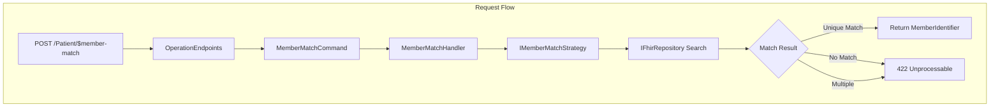

# ADR 2512: $member-match Operation

## Status

Proposed

## Context

The `$member-match` operation is defined by the HL7 Da Vinci HRex Implementation Guide for payer-to-payer data exchange. It enables identifying a member (patient) in a target health plan using demographics and coverage information.

**Use Cases**:
- Payer-to-payer data exchange (CMS interoperability requirements)
- Member identification across health plan systems
- Coverage record linking

## Decision

We will implement `$member-match` following existing Ignixa patterns.

### Input Parameters (HRex Specification)

| Parameter | Cardinality | Type | Description |
|-----------|-------------|------|-------------|
| MemberPatient | 1..1 | Patient | Demographics for matching |
| CoverageToMatch | 1..1 | Coverage | Prior coverage information |
| CoverageToLink | 0..1 | Coverage | New coverage to link |
| Consent | 0..1 | Consent | Authorization for sharing |

### Output

| Parameter | Cardinality | Type | Description |
|-----------|-------------|------|-------------|
| MemberIdentifier | 1..1 | Identifier | Matched member's identifier |
| Patient | 0..1 | Reference | Reference to matched Patient |

### Key Design Decisions

| Decision | Rationale |
|----------|-----------|
| Strategy pattern | Allows custom matching logic (deterministic, probabilistic, org-specific) |
| No patient creation | $member-match is read-only per HRex spec |
| Multi-tenant routes | `/tenant/{id}/Patient/$member-match` and auto-detect |
| Minimal profile validation | Accept any valid Patient/Coverage; strict HRex validation opt-in |

### Default Matching Strategy

1. Extract identifiers from MemberPatient (subscriber ID, member ID)
2. Extract identifiers from CoverageToMatch (subscriberId, beneficiary)
3. Search for Patient with matching identifier
4. Verify Coverage linkage
5. Return unique match or 422 error

## Consequences

### Positive
- HRex specification compliance
- Extensible via strategy pattern
- Consistent with existing Medino/Minimal API patterns
- Multi-tenant support

### Negative
- Default strategy is basic identifier matching
- Sophisticated probabilistic matching requires custom strategy
- No federated matching (single-server only)

## References

- [HRex $member-match OperationDefinition](https://build.fhir.org/ig/HL7/davinci-ehrx/OperationDefinition-member-match.html)
- [LinuxForHealth FHIR member-match](https://github.com/LinuxForHealth/FHIR/tree/main/operation/fhir-operation-member-match)
