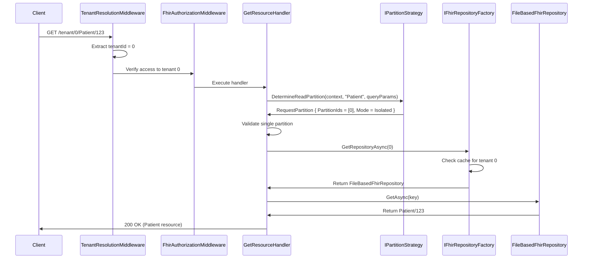
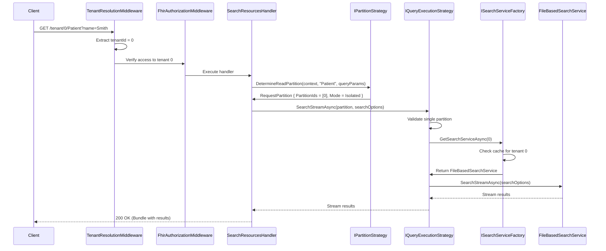

# ADR 2523: Phase 20 - Multi-Tenancy and Data Partitioning

## Status

Proposed

## Context

### Problem Statement

Modern FHIR server deployments require flexible data partitioning patterns that support both **multi-tenant isolation** (multiple separate customers) and **horizontal sharding** (single customer at scale). Traditional approaches force a binary choice:

1. **Isolation Only**: Database-per-tenant or partition key isolation for multiple customers
   - ✅ Perfect for SaaS with multiple organizations
   - ❌ Cannot scale a single customer beyond one data store
   - ❌ No horizontal sharding for large datasets

2. **Distributed Only**: Federated queries across multiple data stores
   - ✅ Enables horizontal sharding for scale
   - ❌ Cannot provide strict tenant isolation between customers
   - ❌ All-or-nothing participation model

**Ignixa's Vision**: Support **both** isolation and distributed modes as **first-class concepts** with **zero architectural friction** between them:

- **Isolation Mode**: Multiple separate customers (tenants), each with their own isolated data store
  - Example: Mayo Clinic (tenant 0), Cedars-Sinai (tenant 1), Johns Hopkins (tenant 2)
  - API: `/tenant/0/Patient`, `/tenant/1/Patient`, `/tenant/2/Patient`

- **Distributed Mode**: Single customer with data sharded across multiple stores for scale
  - Example: Acme Hospital with 100M patients sharded across 3 data stores
  - API: `/Patient` (transparent fanout to all shards, merge results)
  - Sharding strategies: Hash-based, geography-based, time-based

### Investigation Summary

Based on `docs/investigations/multi-tenancy-data-partitioning-modes.md`, this ADR implements:

- **Isolation Mode**: Multiple separate customers with isolated data stores (database per tenant, schema per tenant, or partition key isolation)
  - Different organizations as separate tenants
  - Explicit tenant ID in API URLs

- **Distributed Mode**: Single customer with horizontal sharding across multiple data stores
  - Same organization with data partitioned for scale
  - Transparent API (no shard ID in URLs)
  - Fanout/union operations for unified querying

- **Pass-Through Optimization**: Zero overhead for Isolation mode and Distributed mode with 0-1 shards

### Real-World Use Cases

#### Use Case 1: Multi-Tenant SaaS (Isolation Mode)
**Scenario**: FHIR SaaS provider hosting multiple healthcare organizations

**Requirements**:
- Complete data isolation between organizations
- Each organization is a separate customer
- Different FHIR versions per organization

**Ignixa Solution**:
```csharp
// Different customers, each with isolated data
Tenant 0: Mayo Clinic     → fhir-data/tenants/0/  (FHIR R4)
Tenant 1: Cedars-Sinai    → fhir-data/tenants/1/  (FHIR R4)
Tenant 2: Johns Hopkins   → fhir-data/tenants/2/  (FHIR R5)

// API uses explicit tenant ID in URL
GET /tenant/0/Patient?name=Smith  → Mayo Clinic only
GET /tenant/1/Patient?name=Smith  → Cedars-Sinai only
GET /tenant/2/Patient?name=Smith  → Johns Hopkins only
```

#### Use Case 2: Horizontal Sharding (Distributed Mode)
**Scenario**: Single large hospital with 100M patients needing scale-out storage

**Requirements**:
- All data belongs to same customer (Acme Hospital)
- Shard data across multiple stores for performance
- Transparent queries (users don't specify shard)

**Ignixa Solution**:
```csharp
// Single customer, multiple shards (same organization)
Shard 0: Patients A-M      → fhir-data/0/
Shard 1: Patients N-Z      → fhir-data/1/
Shard 2: Old data (2020-2022) → fhir-data/2/

// API uses transparent endpoint (no tenant/shard ID in URL)
GET /Patient?name=Smith
→ System determines sharding strategy (e.g., hash on name)
→ Fanout to relevant shards (0, 1)
→ Merge results
→ Return unified Bundle

// Different sharding strategies:
// - Hash-based: Hash(patientId) % shardCount
// - Geography-based: US East, US West, EU
// - Time-based: Current year, previous years, archive
```

### Current Implementation Status

**Completed (Weeks 1-2)**:
- ✅ `TenantConfiguration` model (`Ignixa.Domain/Models/TenantConfiguration.cs`)
- ✅ `TenantMode` enum (Isolated, Distributed) (`Ignixa.Domain/Models/TenantMode.cs`)
- ✅ `ITenantConfigurationStore` interface (`Ignixa.Domain/Abstractions/ITenantConfigurationStore.cs`)
- ✅ `AppSettingsTenantConfigurationStore` implementation (`Ignixa.Application/Infrastructure/AppSettingsTenantConfigurationStore.cs`)
- ✅ `ResourceKey.TenantId` property added (`Ignixa.Domain/Models/ResourceKey.cs`)
- ✅ `ResourceWrapper.TenantId` property added (`Ignixa.Domain/Models/ResourceWrapper.cs`)

**Configuration Structure**:
```json
{
  "Tenants": {
    "Mode": "Isolated",
    "Configurations": [
      {
        "TenantId": 0,
        "DisplayName": "Mayo Clinic",
        "FhirVersion": "4.0",
        "IsActive": true,
        "Storage": {
          "Type": "FileSystem",
          "BaseDirectory": "tenants/0"
        },
        "Search": {
          "Type": "InMemory"
        }
      }
    ]
  }
}
```

## Decision

Implement **Phase 20: Multi-Tenancy Data Partitioning** with the following architecture:

### 1. Core Abstractions

#### ITenantConfigurationStore (COMPLETED)
- Loads tenant configuration from `appsettings.json`
- System-wide `Mode` property (Isolated or Distributed)
- Get tenant configuration by integer ID (0, 1, 2, ...)
- O(1) lookup when TenantId matches array index

#### IFhirRepositoryFactory (NEW)
- Creates tenant-specific `IFhirRepository` instances
- Caches repositories per tenant for reuse
- Supports multiple storage types (FileSystem, SqlServer, CosmosDb)

```csharp
public interface IFhirRepositoryFactory
{
    /// <summary>
    /// Get repository for a specific tenant (creates and caches)
    /// </summary>
    Task<IFhirRepository> GetRepositoryAsync(
        int tenantId,
        CancellationToken ct = default);
}
```

#### ISearchServiceFactory (NEW)
- Creates tenant-specific `ISearchService` instances
- Caches search services per tenant for reuse
- Supports multiple search types (InMemory, Sql, Elastic)

```csharp
public interface ISearchServiceFactory
{
    /// <summary>
    /// Get search service for a specific tenant (creates and caches)
    /// </summary>
    Task<ISearchService> GetSearchServiceAsync(
        int tenantId,
        CancellationToken ct = default);
}
```

#### IPartitionStrategy (NEW - HAPI FHIR-Inspired)
- Determines which partition(s) to use for read and write operations
- Inspired by HAPI FHIR's partition interceptor pattern
- Two implementations: `IsolatedModePartitionStrategy` and `DistributedModePartitionStrategy`

**Interface**:
```csharp
public interface IPartitionStrategy
{
    /// <summary>
    /// Determine which partition(s) to READ from based on request context
    /// </summary>
    RequestPartition DetermineReadPartition(
        HttpContext context,
        string resourceType,
        IReadOnlyDictionary<string, string> queryParams);

    /// <summary>
    /// Determine which partition to WRITE to based on resource content
    /// </summary>
    RequestPartition DetermineWritePartition(
        HttpContext context,
        ISourceNode resource);
}

public record RequestPartition
{
    public required int[] PartitionIds { get; init; }  // Can be multiple for distributed reads
    public required PartitionMode Mode { get; init; }
}

public enum PartitionMode
{
    Isolated,    // Single tenant (must have exactly 1 partition ID)
    Distributed  // Sharding (can have 1+ partition IDs)
}
```

**Isolation Mode Strategy**:
```csharp
public class IsolatedModePartitionStrategy : IPartitionStrategy
{
    public RequestPartition DetermineReadPartition(
        HttpContext context,
        string resourceType,
        IReadOnlyDictionary<string, string> queryParams)
    {
        // Always use explicit tenant ID from route
        var tenantId = context.Items["TenantId"] as int?;
        if (!tenantId.HasValue)
        {
            throw new InvalidOperationException("TenantId required in Isolation mode");
        }

        return new RequestPartition
        {
            PartitionIds = [tenantId.Value],
            Mode = PartitionMode.Isolated
        };
    }

    public RequestPartition DetermineWritePartition(
        HttpContext context,
        ISourceNode resource)
    {
        // Always use explicit tenant ID from route
        var tenantId = context.Items["TenantId"] as int?;
        if (!tenantId.HasValue)
        {
            throw new InvalidOperationException("TenantId required in Isolation mode");
        }

        return new RequestPartition
        {
            PartitionIds = [tenantId.Value],
            Mode = PartitionMode.Isolated
        };
    }
}
```

**Distributed Mode Strategy** (Future - Phase 20.2+):
```csharp
public class DistributedModePartitionStrategy : IPartitionStrategy
{
    private readonly int _shardCount;

    public RequestPartition DetermineReadPartition(
        HttpContext context,
        string resourceType,
        IReadOnlyDictionary<string, string> queryParams)
    {
        // Strategy 1: Patient Compartment Routing
        if (queryParams.ContainsKey("patient"))
        {
            // If patient ID is known, route to patient's shard
            var patientId = queryParams["patient"];
            var shardId = HashPatientId(patientId) % _shardCount;
            return new RequestPartition
            {
                PartitionIds = [shardId],
                Mode = PartitionMode.Distributed
            };
        }

        // Strategy 2: System Data (always shard 0)
        if (IsSystemResource(resourceType))
        {
            return new RequestPartition
            {
                PartitionIds = [0],
                Mode = PartitionMode.Distributed
            };
        }

        // Strategy 3: Broad query - fanout to ALL shards
        return new RequestPartition
        {
            PartitionIds = Enumerable.Range(0, _shardCount).ToArray(),
            Mode = PartitionMode.Distributed
        };
    }

    public RequestPartition DetermineWritePartition(
        HttpContext context,
        ISourceNode resource)
    {
        // Strategy 1: Patient resources - hash based on patient ID
        if (resource.Name == "Patient")
        {
            var patientId = resource.GetResourceId();
            var shardId = HashPatientId(patientId) % _shardCount;
            return new RequestPartition
            {
                PartitionIds = [shardId],
                Mode = PartitionMode.Distributed
            };
        }

        // Strategy 2: Patient Compartment - route to patient's shard
        var patientReference = resource.GetPatientReference();
        if (patientReference != null)
        {
            var shardId = HashPatientId(patientReference) % _shardCount;
            return new RequestPartition
            {
                PartitionIds = [shardId],
                Mode = PartitionMode.Distributed
            };
        }

        // Strategy 3: System data (e.g., ValueSets, CodeSystems)
        if (IsSystemResource(resource.Name))
        {
            return new RequestPartition
            {
                PartitionIds = [0],
                Mode = PartitionMode.Distributed
            };
        }

        // Default: random shard
        return new RequestPartition
        {
            PartitionIds = [Random.Shared.Next(_shardCount)],
            Mode = PartitionMode.Distributed
        };
    }

    private int HashPatientId(string patientId)
    {
        // Consistent hash for patient ID
        return Math.Abs(patientId.GetHashCode());
    }

    private bool IsSystemResource(string resourceType)
    {
        return resourceType is "ValueSet" or "CodeSystem" or "StructureDefinition" or "CapabilityStatement";
    }
}
```

**Key Patterns from HAPI FHIR**:
1. **Read Partition**: Determine which shard(s) to query based on search parameters
2. **Write Partition**: Determine which shard to write based on resource content
3. **Patient Compartment**: Resources related to patients route to patient's shard
4. **System Data**: Canonical resources (ValueSets, etc.) always on shard 0
5. **Fanout**: Broad queries without specific identifiers query all shards

#### IQueryExecutionStrategy (NEW)
- Executes **search queries** against partition(s) determined by `IPartitionStrategy`
- **ONLY for search operations** - CRUD operations (Get/Create/Update/Delete) use `IFhirRepositoryFactory` directly
- Separates partition determination (WHERE) from search execution (HOW)
- Two implementations: `PassthroughExecutionStrategy` (Isolation mode) and `FanoutExecutionStrategy` (Distributed mode)

**Why Search Needs a Strategy (but CRUD doesn't):**
- **CRUD operations** always target a **single partition** → Use IFhirRepositoryFactory directly
  - GET /Patient/123 → Partition strategy says partition [0] → Get repository → GetAsync()
  - PUT /Patient/123 → Partition strategy says partition [0] → Get repository → CreateOrUpdateAsync()
- **Search operations** may need to query **multiple partitions** (Distributed mode fanout) → Use IQueryExecutionStrategy
  - GET /Patient?name=Smith → Partition strategy says partitions [0, 1, 2] → Fanout to all, merge results

**Interface**:
```csharp
public interface IQueryExecutionStrategy
{
    /// <summary>
    /// Stream search results from the determined partition(s)
    /// In Isolation mode: streams from single partition
    /// In Distributed mode: fans out to multiple partitions and merges results
    /// </summary>
    IAsyncEnumerable<ResourceWrapper> SearchStreamAsync<TSearchOptions>(
        RequestPartition partition,
        TSearchOptions searchOptions,
        CancellationToken ct = default)
        where TSearchOptions : class;

    /// <summary>
    /// Count matching resources in the determined partition(s)
    /// In Isolation mode: counts from single partition
    /// In Distributed mode: fans out to multiple partitions and sums results
    /// </summary>
    ValueTask<int> CountAsync<TSearchOptions>(
        RequestPartition partition,
        TSearchOptions searchOptions,
        CancellationToken ct = default)
        where TSearchOptions : class;
}
```

**Passthrough Execution Strategy** (Phase 20 - Isolation Mode):
```csharp
public class PassthroughExecutionStrategy : IQueryExecutionStrategy
{
    private readonly ISearchServiceFactory _searchServiceFactory;

    public PassthroughExecutionStrategy(ISearchServiceFactory searchServiceFactory)
    {
        _searchServiceFactory = searchServiceFactory;
    }

    public async IAsyncEnumerable<ResourceWrapper> SearchStreamAsync<TSearchOptions>(
        RequestPartition partition,
        TSearchOptions searchOptions,
        [EnumeratorCancellation] CancellationToken ct = default)
        where TSearchOptions : class
    {
        // Validate single partition (Isolation mode requirement)
        if (partition.PartitionIds.Length != 1)
        {
            throw new InvalidOperationException(
                "Passthrough strategy requires exactly 1 partition ID. " +
                $"Received {partition.PartitionIds.Length} partition IDs.");
        }

        // Get search service for the single partition
        var searchService = await _searchServiceFactory.GetSearchServiceAsync(
            partition.PartitionIds[0],
            ct);

        // Stream results directly (no aggregation needed)
        await foreach (var resource in searchService.SearchStreamAsync(searchOptions, ct))
        {
            yield return resource;
        }
    }

    public async ValueTask<int> CountAsync<TSearchOptions>(
        RequestPartition partition,
        TSearchOptions searchOptions,
        CancellationToken ct = default)
        where TSearchOptions : class
    {
        // Validate single partition
        if (partition.PartitionIds.Length != 1)
        {
            throw new InvalidOperationException(
                "Passthrough strategy requires exactly 1 partition ID. " +
                $"Received {partition.PartitionIds.Length} partition IDs.");
        }

        // Get search service for the single partition
        var searchService = await _searchServiceFactory.GetSearchServiceAsync(
            partition.PartitionIds[0],
            ct);

        // Count directly
        return await searchService.CountAsync(searchOptions, ct);
    }
}
```

**Fanout Execution Strategy** (Future - Phase 20.2+, Distributed Mode):
```csharp
public class FanoutExecutionStrategy : IQueryExecutionStrategy
{
    private readonly ISearchServiceFactory _searchServiceFactory;

    public FanoutExecutionStrategy(ISearchServiceFactory searchServiceFactory)
    {
        _searchServiceFactory = searchServiceFactory;
    }

    public async IAsyncEnumerable<ResourceWrapper> SearchStreamAsync<TSearchOptions>(
        RequestPartition partition,
        TSearchOptions searchOptions,
        [EnumeratorCancellation] CancellationToken ct = default)
        where TSearchOptions : class
    {
        // Optimization: If only one partition, bypass fanout logic
        if (partition.PartitionIds.Length == 1)
        {
            var searchService = await _searchServiceFactory.GetSearchServiceAsync(
                partition.PartitionIds[0],
                ct);

            await foreach (var resource in searchService.SearchStreamAsync(searchOptions, ct))
            {
                yield return resource;
            }
            yield break;
        }

        // Fanout to multiple shards in parallel
        var searchTasks = partition.PartitionIds.Select(async partitionId =>
        {
            var searchService = await _searchServiceFactory.GetSearchServiceAsync(partitionId, ct);
            return searchService.SearchStreamAsync(searchOptions, ct);
        }).ToArray();

        var streams = await Task.WhenAll(searchTasks);

        // Merge streams (simplified - production needs sorting/deduplication)
        // TODO Phase 20.2: Implement proper merge logic with:
        // - Sort by _lastUpdated or other sort parameters
        // - Deduplication if resource appears in multiple shards
        // - Pagination with composite continuation tokens
        foreach (var stream in streams)
        {
            await foreach (var resource in stream.WithCancellation(ct))
            {
                yield return resource;
            }
        }
    }

    public async ValueTask<int> CountAsync<TSearchOptions>(
        RequestPartition partition,
        TSearchOptions searchOptions,
        CancellationToken ct = default)
        where TSearchOptions : class
    {
        // Optimization: If only one partition, direct count
        if (partition.PartitionIds.Length == 1)
        {
            var searchService = await _searchServiceFactory.GetSearchServiceAsync(
                partition.PartitionIds[0],
                ct);
            return await searchService.CountAsync(searchOptions, ct);
        }

        // Fanout count to all shards and sum
        var countTasks = partition.PartitionIds.Select(async partitionId =>
        {
            var searchService = await _searchServiceFactory.GetSearchServiceAsync(partitionId, ct);
            return await searchService.CountAsync(searchOptions, ct);
        }).ToArray();

        var counts = await Task.WhenAll(countTasks);
        return counts.Sum();
    }
}
```

**Key Benefits**:
1. **Clean Separation**: Partition determination (IPartitionStrategy) vs search execution (IQueryExecutionStrategy)
2. **CRUD Simplicity**: CRUD operations use IFhirRepositoryFactory directly - no extra abstraction layer
3. **Search Complexity Isolated**: Multi-shard fanout logic contained in IQueryExecutionStrategy
4. **Zero Overhead**: Passthrough validates single partition, direct search service call
5. **Future-Ready**: FanoutExecutionStrategy slots in for Phase 20.2+ without handler changes
6. **Testable**: Mock strategies independently

### 2. Routing Strategy

#### Isolation Mode Routes (Multiple Customers)
**Routes**: `/tenant/{tenantId:int}/{resourceType}/{id?}`

**Examples**:
```
GET /tenant/0/Patient?name=Smith          → Tenant 0 (Mayo Clinic)
GET /tenant/1/Observation?code=covid-19   → Tenant 1 (Cedars-Sinai)
PUT /tenant/0/Patient/123                 → Tenant 0 (Mayo Clinic)
```

**Middleware Pipeline**:
```
1. TenantResolutionMiddleware → Extract tenantId from route, store in HttpContext.Items
2. FhirAuthorizationMiddleware → Verify user has access to tenant
3. FhirEndpoints → Route to resource handler
4. Handler → Use IPartitionStrategy to determine partition(s)
5. Handler → For CRUD: Use IFhirRepositoryFactory directly
   Handler → For Search: Use IQueryExecutionStrategy (handles fanout if needed)
```

**Handler Flow Examples** (Isolation Mode):

**Example 1: CRUD Handler (GetResourceHandler) - No execution strategy needed**
```csharp
public class GetResourceHandler : IRequestHandler<GetResourceQuery, ResourceWrapper?>
{
    private readonly IPartitionStrategy _partitionStrategy;
    private readonly IFhirRepositoryFactory _repositoryFactory;
    private readonly IHttpContextAccessor _httpContextAccessor;
    private readonly ILogger<GetResourceHandler> _logger;

    public async Task<ResourceWrapper?> HandleAsync(
        GetResourceQuery query,
        CancellationToken ct)
    {
        // 1. Determine partition using IPartitionStrategy
        var partition = _partitionStrategy.DetermineReadPartition(
            _httpContextAccessor.HttpContext,
            query.ResourceType,
            queryParams: new Dictionary<string, string>());

        // 2. Validate single partition (CRUD always targets one partition)
        if (partition.PartitionIds.Length != 1)
        {
            throw new InvalidOperationException(
                $"Get operation requires exactly 1 partition, received {partition.PartitionIds.Length}");
        }

        _logger.LogDebug(
            "Partition determined: {PartitionId} (Mode: {Mode})",
            partition.PartitionIds[0],
            partition.Mode);

        // 3. Get repository and execute directly
        var repository = await _repositoryFactory.GetRepositoryAsync(
            partition.PartitionIds[0],
            ct);

        var result = await repository.GetAsync(
            new ResourceKey(query.ResourceType, query.Id),
            ct);

        return result;
    }
}
```

**Example 2: Search Handler (SearchResourcesHandler) - Uses execution strategy**
```csharp
public class SearchResourcesHandler : IRequestHandler<SearchResourcesQuery, SearchResourcesResult>
{
    private readonly IPartitionStrategy _partitionStrategy;
    private readonly IQueryExecutionStrategy _executionStrategy;
    private readonly IHttpContextAccessor _httpContextAccessor;
    private readonly ILogger<SearchResourcesHandler> _logger;

    public async Task<SearchResourcesResult> HandleAsync(
        SearchResourcesQuery query,
        CancellationToken ct)
    {
        // 1. Determine partition(s) using IPartitionStrategy
        var partition = _partitionStrategy.DetermineReadPartition(
            _httpContextAccessor.HttpContext,
            query.ResourceType,
            query.QueryParams);

        _logger.LogDebug(
            "Partition(s) determined: [{PartitionIds}] (Mode: {Mode})",
            string.Join(",", partition.PartitionIds),
            partition.Mode);

        // 2. Execute using IQueryExecutionStrategy
        //    - PassthroughExecutionStrategy: validates single partition, direct query
        //    - FanoutExecutionStrategy: can handle multiple partitions (future)
        var resourceStream = _executionStrategy.SearchStreamAsync(
            partition,
            query.SearchOptions,
            ct);

        return new SearchResourcesResult(
            Resources: resourceStream,
            Total: null,
            ContinuationToken: null);
    }
}
```

**Request Flow Examples:**

**Example 1: CRUD Operation (GET /tenant/0/Patient/123)**
```csharp
// 1. Middleware extracts tenant ID
context.Items["TenantId"] = 0;

// 2. Handler uses IPartitionStrategy to determine partition
var partition = _partitionStrategy.DetermineReadPartition(
    context,
    resourceType: "Patient",
    queryParams: new Dictionary<string, string>());

// Result: partition = { PartitionIds = [0], Mode = Isolated }

// 3. Handler validates single partition
if (partition.PartitionIds.Length != 1)
    throw new InvalidOperationException("Get requires exactly 1 partition");

// 4. Handler gets repository from factory
var repository = await _repositoryFactory.GetRepositoryAsync(0, ct);

// 5. Handler calls repository directly (no execution strategy)
var result = await repository.GetAsync(new ResourceKey("Patient", "123"), ct);
```

**Example 2: Search Operation (GET /tenant/0/Patient?name=Smith)**
```csharp
// 1. Middleware extracts tenant ID
context.Items["TenantId"] = 0;

// 2. Handler uses IPartitionStrategy to determine partition
var queryParams = new Dictionary<string, string> { ["name"] = "Smith" };
var partition = _partitionStrategy.DetermineReadPartition(
    context,
    resourceType: "Patient",
    queryParams);

// Result: partition = { PartitionIds = [0], Mode = Isolated }

// 3. Handler uses IQueryExecutionStrategy to execute
var results = _executionStrategy.SearchStreamAsync(
    partition,
    searchOptions,
    ct);

// 4. PassthroughExecutionStrategy validates single partition, gets search service
//    - Validates partition.PartitionIds.Length == 1
//    - Gets search service from factory: await _searchServiceFactory.GetSearchServiceAsync(0)
//    - Streams results directly: searchService.SearchStreamAsync(searchOptions)
```

#### Distributed Mode Routes (Single Customer with Sharding) - FUTURE
**Routes**: `/{resourceType}/{id?}` (no tenant ID in URL)

**Examples**:
```
GET /Patient?name=Smith          → Strategy determines fanout to all shards
GET /Observation?patient=123     → Strategy routes to patient's shard only
PUT /Patient/abc-123             → Strategy hashes patient ID to determine shard
POST /ValueSet                   → Strategy routes to shard 0 (system data)
```

**Middleware Pipeline** (Future Implementation):
```
1. (No TenantResolutionMiddleware - no tenant ID in URL)
2. FhirAuthorizationMiddleware → Verify user has access
3. FhirEndpoints → Route to resource handler
4. Handler → Use IPartitionStrategy to determine partition(s)
5. Handler → For CRUD: Validate single partition, use IFhirRepositoryFactory directly
   Handler → For Search: Use IQueryExecutionStrategy (FanoutExecutionStrategy handles multi-shard)
```

**Handler Flow** (Distributed Mode - Future):

**CRUD handlers remain the same - partition strategy determines single shard:**
```csharp
public class GetResourceHandler : IRequestHandler<GetResourceQuery, ResourceWrapper?>
{
    private readonly IPartitionStrategy _partitionStrategy;
    private readonly IFhirRepositoryFactory _repositoryFactory;
    private readonly IHttpContextAccessor _httpContextAccessor;

    public async Task<ResourceWrapper?> HandleAsync(GetResourceQuery query, CancellationToken ct)
    {
        // 1. Determine partition (DistributedModePartitionStrategy determines correct shard)
        var partition = _partitionStrategy.DetermineReadPartition(
            _httpContextAccessor.HttpContext,
            query.ResourceType,
            queryParams: new Dictionary<string, string>());

        // 2. Validate single partition (CRUD always targets one shard)
        if (partition.PartitionIds.Length != 1)
            throw new InvalidOperationException("Get requires exactly 1 partition");

        // 3. Get repository and execute (same as Isolation mode!)
        var repository = await _repositoryFactory.GetRepositoryAsync(partition.PartitionIds[0], ct);
        return await repository.GetAsync(new ResourceKey(query.ResourceType, query.Id), ct);
    }
}
```

**Search handler also remains the same - execution strategy handles fanout:**
```csharp
public class SearchResourcesHandler : IRequestHandler<SearchResourcesQuery, SearchResourcesResult>
{
    private readonly IPartitionStrategy _partitionStrategy;
    private readonly IQueryExecutionStrategy _executionStrategy;
    private readonly IHttpContextAccessor _httpContextAccessor;

    public async Task<SearchResourcesResult> HandleAsync(
        SearchResourcesQuery query,
        CancellationToken ct)
    {
        // 1. Determine partition(s) (DistributedModePartitionStrategy may return multiple)
        var partition = _partitionStrategy.DetermineReadPartition(
            _httpContextAccessor.HttpContext,
            query.ResourceType,
            query.QueryParams);

        // 2. Execute using IQueryExecutionStrategy
        //    - FanoutExecutionStrategy: handles single OR multiple partitions
        var resourceStream = _executionStrategy.SearchStreamAsync(
            partition,
            query.SearchOptions,
            ct);

        return new SearchResourcesResult(
            Resources: resourceStream,
            Total: null, // TODO: Phase 20.2
            ContinuationToken: null);
    }
}
```

**Request Flow Examples** (Distributed Mode - Future):

**Example 1: CRUD Operation - GET /Patient/abc-123 (single shard)**
```csharp
// 1. Handler uses IPartitionStrategy (DistributedModePartitionStrategy)
var partition = _partitionStrategy.DetermineReadPartition(
    context,
    resourceType: "Patient",
    queryParams: new Dictionary<string, string>());

// Result: partition = { PartitionIds = [1], Mode = Distributed }
// (Patient abc-123 hashes to shard 1 via consistent hashing)

// 2. Handler validates single partition
if (partition.PartitionIds.Length != 1)
    throw new InvalidOperationException("Get requires exactly 1 partition");

// 3. Handler gets repository from factory
var repository = await _repositoryFactory.GetRepositoryAsync(1, ct);

// 4. Handler calls repository directly (no execution strategy for CRUD)
var result = await repository.GetAsync(new ResourceKey("Patient", "abc-123"), ct);
```

**Example 2: CRUD Operation - PUT /Patient/abc-123 (single shard)**
```csharp
// 1. Handler uses IPartitionStrategy
var partition = _partitionStrategy.DetermineWritePartition(context, resourceNode);

// Result: partition = { PartitionIds = [1], Mode = Distributed }
// (Hash patient ID "abc-123" → shard 1)

// 2. Handler validates single partition
if (partition.PartitionIds.Length != 1)
    throw new InvalidOperationException("Write requires exactly 1 partition");

// 3. Handler gets repository and writes directly
var repository = await _repositoryFactory.GetRepositoryAsync(1, ct);
var key = await repository.CreateOrUpdateAsync(wrapper, ct);
```

**Example 3: Search with Patient Context - GET /Observation?patient=Patient/abc-123 (single shard)**
```csharp
// 1. Handler uses IPartitionStrategy
var queryParams = new Dictionary<string, string> { ["patient"] = "Patient/abc-123" };
var partition = _partitionStrategy.DetermineReadPartition(
    context,
    resourceType: "Observation",
    queryParams);

// Result: partition = { PartitionIds = [1], Mode = Distributed }
// (Patient abc-123 hashes to shard 1, observations follow patient)

// 2. Handler uses IQueryExecutionStrategy (FanoutExecutionStrategy)
var results = _executionStrategy.SearchStreamAsync(partition, searchOptions, ct);

// 3. FanoutExecutionStrategy sees single partition, bypasses fanout
//    - Gets search service: await _searchServiceFactory.GetSearchServiceAsync(1)
//    - Streams results: searchService.SearchStreamAsync(searchOptions)
```

**Example 4: Broad Search - GET /Patient?name=Smith (multiple shards)**
```csharp
// 1. Handler uses IPartitionStrategy
var queryParams = new Dictionary<string, string> { ["name"] = "Smith" };
var partition = _partitionStrategy.DetermineReadPartition(
    context,
    resourceType: "Patient",
    queryParams);

// Result: partition = { PartitionIds = [0, 1, 2], Mode = Distributed }
// (Broad query, no specific patient ID - must fanout to all shards)

// 2. Handler uses IQueryExecutionStrategy (FanoutExecutionStrategy)
var results = _executionStrategy.SearchStreamAsync(partition, searchOptions, ct);

// 3. FanoutExecutionStrategy sees multiple partitions, parallel fanout
//    - Creates tasks for each shard: partition.PartitionIds.Select(...)
//    - Awaits all search services: await Task.WhenAll(searchTasks)
//    - Merges streams (TODO: proper sorting/dedup/pagination)
```

**Note**: Distributed mode is out of scope for Phase 20. This phase focuses only on Isolation mode.

### 3. Request Flow

**Sequence Diagram (CRUD Operation - GET /tenant/0/Patient/123):**


**Sequence Diagram (Search Operation - GET /tenant/0/Patient?name=Smith):**


### 4. Storage Isolation Patterns

#### Pattern 1: Directory per Tenant (FileSystem)
```
fhir-data/
└── tenants/
    ├── 0/                              # Tenant 0 (Mayo Clinic)
    │   ├── Patient/
    │   │   ├── 123.json
    │   │   └── 123.meta.json
    │   └── Observation/
    ├── 1/                              # Tenant 1 (Cedars-Sinai)
    │   ├── Patient/
    │   └── Observation/
    └── 2/                              # Tenant 2 (Johns Hopkins)
        ├── Patient/
        └── Observation/
```

#### Pattern 2: Database per Tenant (SQL Server)
```csharp
Tenant 0: ConnectionString = "Server=sql1;Database=tenant_0;"
Tenant 1: ConnectionString = "Server=sql1;Database=tenant_1;"
Tenant 2: ConnectionString = "Server=sql2;Database=tenant_2;"  // Scale out to second server
```

#### Pattern 3: Schema per Tenant (SQL Server)
```csharp
Tenant 0: Schema = "tenant_0"  → SELECT * FROM [tenant_0].[Resource]
Tenant 1: Schema = "tenant_1"  → SELECT * FROM [tenant_1].[Resource]
Tenant 2: Schema = "tenant_2"  → SELECT * FROM [tenant_2].[Resource]
```

#### Pattern 4: Partition Key (Cosmos DB)
```csharp
Tenant 0: PartitionKeyPrefix = "/tenantId/0"
Tenant 1: PartitionKeyPrefix = "/tenantId/1"
Tenant 2: PartitionKeyPrefix = "/tenantId/2"

// Query with partition key filter
SELECT * FROM c WHERE c.tenantId = 0 AND c.resourceType = 'Patient'
```

### 5. Phase 20 Scope (Isolation Mode Only)

**Focus**: Implement Isolation mode with FileSystem and InMemory search

**Out of Scope for Phase 20**:
- ❌ Distributed mode (fanout/union queries) - Future Phase 20.2+
- ❌ SQL Server or Cosmos DB tenancy - Covered in Phase 8/8a/9
- ❌ Cross-tenant research queries - Future Phase 20.2+

**Why Isolation First?**:
1. Simpler implementation (no fanout/aggregation logic)
2. Validates factory pattern and routing with FileSystem storage
3. Enables immediate SaaS deployments
4. Foundation for Distributed mode in future phases

## Implementation Plan

### Week 1-2: Factory Pattern and Routing (32 hours)

#### Deliverables:
1. **IFhirRepositoryFactory interface** (`Ignixa.Domain/Abstractions/IFhirRepositoryFactory.cs`)
2. **FileBasedFhirRepositoryFactory implementation** (`Ignixa.Application/Infrastructure/FileBasedFhirRepositoryFactory.cs`)
3. **ISearchServiceFactory interface** (`Ignixa.Domain/Abstractions/ISearchServiceFactory.cs`)
4. **FileBasedSearchServiceFactory implementation** (`Ignixa.Application/Infrastructure/FileBasedSearchServiceFactory.cs`)
5. **TenantResolutionMiddleware** (`Ignixa.Api/Middleware/TenantResolutionMiddleware.cs`)
6. **Update FileBasedFhirRepository** to accept `int? tenantId` constructor parameter
7. **Update FileBasedSearchService** to accept `int? tenantId` constructor parameter
8. **Update FhirEndpoints routing** to `/tenant/{tenantId:int}/{resourceType}/{id?}`

#### Implementation Steps:

**Step 1: Create IFhirRepositoryFactory**
```csharp
namespace Ignixa.Domain.Abstractions;

public interface IFhirRepositoryFactory
{
    /// <summary>
    /// Get repository for a specific tenant (creates and caches)
    /// </summary>
    Task<IFhirRepository> GetRepositoryAsync(
        int tenantId,
        CancellationToken ct = default);
}
```

**Step 2: Implement FileBasedFhirRepositoryFactory**
```csharp
namespace Ignixa.Application.Infrastructure;

public class FileBasedFhirRepositoryFactory : IFhirRepositoryFactory
{
    private readonly ITenantConfigurationStore _configStore;
    private readonly IConfiguration _configuration;
    private readonly ILogger<FileBasedFhirRepositoryFactory> _logger;
    private readonly RecyclableMemoryStreamManager _memoryStreamManager;
    private readonly ConcurrentDictionary<int, IFhirRepository> _repositoryCache;

    public FileBasedFhirRepositoryFactory(
        ITenantConfigurationStore configStore,
        IConfiguration configuration,
        ILogger<FileBasedFhirRepositoryFactory> logger,
        RecyclableMemoryStreamManager memoryStreamManager)
    {
        _configStore = configStore;
        _configuration = configuration;
        _logger = logger;
        _memoryStreamManager = memoryStreamManager;
        _repositoryCache = new ConcurrentDictionary<int, IFhirRepository>();
    }

    public async Task<IFhirRepository> GetRepositoryAsync(
        int tenantId,
        CancellationToken ct = default)
    {
        // Check cache first
        if (_repositoryCache.TryGetValue(tenantId, out var cachedRepository))
        {
            return cachedRepository;
        }

        // Load tenant configuration
        var tenantConfig = await _configStore.GetTenantConfigurationAsync(tenantId, ct);
        if (tenantConfig == null)
        {
            throw new InvalidOperationException($"Tenant {tenantId} not found or inactive");
        }

        // Validate storage type
        if (tenantConfig.Storage.Type != "FileSystem")
        {
            throw new NotSupportedException(
                $"Storage type '{tenantConfig.Storage.Type}' not supported by FileBasedFhirRepositoryFactory");
        }

        // Build base directory for tenant
        string globalBaseDirectory = _configuration["FhirRepository:BaseDirectory"]
            ?? Path.Combine(Directory.GetCurrentDirectory(), "fhir-data");

        string tenantBaseDirectory = tenantConfig.Storage.BaseDirectory != null
            ? Path.Combine(globalBaseDirectory, tenantConfig.Storage.BaseDirectory)
            : Path.Combine(globalBaseDirectory, "tenants", tenantId.ToString());

        // Create logger for repository
        var repoLogger = _logger; // Could create tenant-specific logger here

        // Create repository
        var repository = new FileBasedFhirRepository(
            tenantBaseDirectory,
            repoLogger as ILogger<FileBasedFhirRepository>,
            _memoryStreamManager);

        // Cache and return
        _repositoryCache.TryAdd(tenantId, repository);

        _logger.LogInformation(
            "Created repository for tenant {TenantId} ({DisplayName}) at {BaseDirectory}",
            tenantId,
            tenantConfig.DisplayName,
            tenantBaseDirectory);

        return repository;
    }
}
```

**Step 3: Create TenantResolutionMiddleware**
```csharp
namespace Ignixa.Api.Middleware;

public class TenantResolutionMiddleware
{
    private readonly RequestDelegate _next;
    private readonly ITenantConfigurationStore _configStore;
    private readonly ILogger<TenantResolutionMiddleware> _logger;

    public TenantResolutionMiddleware(
        RequestDelegate next,
        ITenantConfigurationStore configStore,
        ILogger<TenantResolutionMiddleware> logger)
    {
        _next = next;
        _configStore = configStore;
        _logger = logger;
    }

    public async Task InvokeAsync(HttpContext context)
    {
        // Extract tenantId from route
        if (context.Request.RouteValues.TryGetValue("tenantId", out var tenantIdObj) &&
            int.TryParse(tenantIdObj?.ToString(), out var tenantId))
        {
            // Verify tenant exists and is active
            var tenantConfig = await _configStore.GetTenantConfigurationAsync(
                tenantId,
                context.RequestAborted);

            if (tenantConfig == null)
            {
                context.Response.StatusCode = 404;
                await context.Response.WriteAsync($"Tenant {tenantId} not found or inactive");
                return;
            }

            // Store tenant context in HttpContext.Items for downstream handlers
            context.Items["TenantId"] = tenantId;
            context.Items["TenantConfiguration"] = tenantConfig;

            _logger.LogDebug(
                "Resolved tenant {TenantId} ({DisplayName})",
                tenantId,
                tenantConfig.DisplayName);
        }

        await _next(context);
    }
}
```

**Step 4: Update FhirEndpoints routing**
```csharp
// Update FhirEndpoints.cs to use tenant-specific routes
app.MapGet("/tenant/{tenantId:int}/{resourceType}/{id}", GetResourceEndpoint);
app.MapPut("/tenant/{tenantId:int}/{resourceType}/{id}", CreateOrUpdateResourceEndpoint);
app.MapDelete("/tenant/{tenantId:int}/{resourceType}/{id}", DeleteResourceEndpoint);
app.MapGet("/tenant/{tenantId:int}/{resourceType}", SearchResourcesEndpoint);
app.MapPost("/tenant/{tenantId:int}", ProcessBundleEndpoint);
```

**Step 5: Update handlers to use factory**
```csharp
// Update GetResourceHandler to use IFhirRepositoryFactory
public class GetResourceHandler : IRequestHandler<GetResourceQuery, ResourceWrapper?>
{
    private readonly IFhirRepositoryFactory _repositoryFactory;
    private readonly ILogger<GetResourceHandler> _logger;

    public GetResourceHandler(
        IFhirRepositoryFactory repositoryFactory,
        ILogger<GetResourceHandler> logger)
    {
        _repositoryFactory = repositoryFactory;
        _logger = logger;
    }

    public async ValueTask<ResourceWrapper?> HandleAsync(
        GetResourceQuery request,
        CancellationToken cancellationToken)
    {
        // Get repository for tenant
        var repository = await _repositoryFactory.GetRepositoryAsync(
            request.TenantId ?? 0,  // Default to tenant 0 if not specified
            cancellationToken);

        // Query repository
        var result = await repository.GetAsync(
            request.ResourceType,
            request.Id,
            cancellationToken);

        return result;
    }
}
```

**Step 6: Update Program.cs DI registration**
```csharp
// Register ITenantConfigurationStore (ALREADY DONE)
containerBuilder.RegisterType<AppSettingsTenantConfigurationStore>()
    .As<ITenantConfigurationStore>()
    .SingleInstance();

// Register IFhirRepositoryFactory (NEW)
containerBuilder.RegisterType<FileBasedFhirRepositoryFactory>()
    .As<IFhirRepositoryFactory>()
    .SingleInstance();

// Register ISearchServiceFactory (NEW)
containerBuilder.RegisterType<FileBasedSearchServiceFactory>()
    .As<ISearchServiceFactory>()
    .SingleInstance();

// Register IPartitionStrategy (NEW)
// Phase 20: Always use IsolatedModePartitionStrategy
// Phase 20.2+: Select strategy based on TenantMode (Isolated vs Distributed)
containerBuilder.RegisterType<IsolatedModePartitionStrategy>()
    .As<IPartitionStrategy>()
    .SingleInstance();

// Register IQueryExecutionStrategy (NEW)
// Phase 20: Always use PassthroughExecutionStrategy (validates single partition)
// Phase 20.2+: Select strategy based on TenantMode
//   - Isolated mode → PassthroughExecutionStrategy
//   - Distributed mode → FanoutExecutionStrategy
containerBuilder.RegisterType<PassthroughExecutionStrategy>()
    .As<IQueryExecutionStrategy>()
    .SingleInstance();

// REMOVE singleton FileBasedFhirRepository registration (old approach)
// containerBuilder.RegisterType<FileBasedFhirRepository>()
//     .As<IFhirRepository>()
//     .SingleInstance();
```

**Step 7: Update middleware pipeline**
```csharp
// Program.cs - Add TenantResolutionMiddleware
app.UseFhirExceptionHandler();
app.UseMiddleware<TenantResolutionMiddleware>();  // NEW
app.UseHttpsRedirection();
app.MapFhirEndpoints();
app.MapControllers();
```

### Week 3-4: Handler Updates and Testing (32 hours)

#### Deliverables:
1. **Update all handlers** to use `IPartitionStrategy` and `IQueryExecutionStrategy`
   - GetResourceHandler ✅
   - CreateOrUpdateResourceHandler
   - DeleteResourceHandler
   - SearchResourcesHandler
   - BundleProcessor
2. **Add `IHttpContextAccessor`** to all handlers for partition determination
3. **Integration tests** for multi-tenant scenarios
4. **E2E tests** for tenant isolation

#### Implementation Steps:

**Step 1: Update GetResourceHandler (CRUD - No execution strategy)**
```csharp
public class GetResourceHandler : IRequestHandler<GetResourceQuery, ResourceWrapper?>
{
    private readonly IPartitionStrategy _partitionStrategy;
    private readonly IFhirRepositoryFactory _repositoryFactory;
    private readonly IHttpContextAccessor _httpContextAccessor;
    private readonly ILogger<GetResourceHandler> _logger;

    public GetResourceHandler(
        IPartitionStrategy partitionStrategy,
        IFhirRepositoryFactory repositoryFactory,
        IHttpContextAccessor httpContextAccessor,
        ILogger<GetResourceHandler> logger)
    {
        _partitionStrategy = partitionStrategy;
        _repositoryFactory = repositoryFactory;
        _httpContextAccessor = httpContextAccessor;
        _logger = logger;
    }

    public async Task<ResourceWrapper?> HandleAsync(
        GetResourceQuery query,
        CancellationToken ct)
    {
        // 1. Determine partition using IPartitionStrategy
        var partition = _partitionStrategy.DetermineReadPartition(
            _httpContextAccessor.HttpContext,
            query.ResourceType,
            queryParams: new Dictionary<string, string>());

        // 2. Validate single partition (CRUD always targets one partition)
        if (partition.PartitionIds.Length != 1)
        {
            throw new InvalidOperationException(
                $"Get operation requires exactly 1 partition, received {partition.PartitionIds.Length}");
        }

        _logger.LogDebug(
            "Partition determined: {PartitionId} (Mode: {Mode})",
            partition.PartitionIds[0],
            partition.Mode);

        // 3. Get repository and execute directly
        var repository = await _repositoryFactory.GetRepositoryAsync(
            partition.PartitionIds[0],
            ct);

        var result = await repository.GetAsync(
            new ResourceKey(query.ResourceType, query.Id),
            ct);

        return result;
    }
}
```

**Step 2: Update CreateOrUpdateResourceHandler (CRUD - No execution strategy)**
```csharp
public class CreateOrUpdateResourceHandler : IRequestHandler<CreateOrUpdateResourceCommand, ResourceKey>
{
    private readonly IPartitionStrategy _partitionStrategy;
    private readonly IFhirRepositoryFactory _repositoryFactory;
    private readonly IHttpContextAccessor _httpContextAccessor;
    private readonly ILogger<CreateOrUpdateResourceHandler> _logger;

    public CreateOrUpdateResourceHandler(
        IPartitionStrategy partitionStrategy,
        IFhirRepositoryFactory repositoryFactory,
        IHttpContextAccessor httpContextAccessor,
        ILogger<CreateOrUpdateResourceHandler> logger)
    {
        _partitionStrategy = partitionStrategy;
        _repositoryFactory = repositoryFactory;
        _httpContextAccessor = httpContextAccessor;
        _logger = logger;
    }

    public async Task<ResourceKey> HandleAsync(
        CreateOrUpdateResourceCommand command,
        CancellationToken ct)
    {
        // Business logic (validation, etc.) - omitted for brevity

        // 1. Determine partition using IPartitionStrategy
        var partition = _partitionStrategy.DetermineWritePartition(
            _httpContextAccessor.HttpContext,
            command.Resource);

        // 2. Validate single partition (writes always go to one partition)
        if (partition.PartitionIds.Length != 1)
        {
            throw new InvalidOperationException(
                $"Write operation requires exactly 1 partition, received {partition.PartitionIds.Length}");
        }

        // 3. Get repository and execute directly
        var repository = await _repositoryFactory.GetRepositoryAsync(
            partition.PartitionIds[0],
            ct);

        var key = await repository.CreateOrUpdateAsync(wrapper, ct);

        return key;
    }
}
```

**Step 3: Update SearchResourcesHandler**
```csharp
public class SearchResourcesHandler : IRequestHandler<SearchResourcesQuery, SearchResourcesResult>
{
    private readonly IPartitionStrategy _partitionStrategy;
    private readonly IQueryExecutionStrategy _executionStrategy;
    private readonly IHttpContextAccessor _httpContextAccessor;
    private readonly ILogger<SearchResourcesHandler> _logger;

    public SearchResourcesHandler(
        IPartitionStrategy partitionStrategy,
        IQueryExecutionStrategy executionStrategy,
        IHttpContextAccessor httpContextAccessor,
        ILogger<SearchResourcesHandler> logger)
    {
        _partitionStrategy = partitionStrategy;
        _executionStrategy = executionStrategy;
        _httpContextAccessor = httpContextAccessor;
        _logger = logger;
    }

    public async Task<SearchResourcesResult> HandleAsync(
        SearchResourcesQuery query,
        CancellationToken ct)
    {
        // 1. Determine partition(s) using IPartitionStrategy
        var partition = _partitionStrategy.DetermineReadPartition(
            _httpContextAccessor.HttpContext,
            query.ResourceType,
            query.QueryParams);

        // 2. Execute using IQueryExecutionStrategy
        //    PassthroughExecutionStrategy: validates single partition, direct query
        //    FanoutExecutionStrategy: fans out to multiple shards, merges results
        var resourceStream = _executionStrategy.SearchStreamAsync(
            partition,
            query.SearchOptions,
            ct);

        // TODO: Calculate total count if requested
        int? total = null;

        return new SearchResourcesResult(
            Resources: resourceStream,
            Total: total,
            ContinuationToken: null);
    }
}
```

**Step 3: Update FhirEndpoints to extract tenantId**
```csharp
// Example: GetResourceEndpoint
private static async Task<IResult> GetResourceEndpoint(
    HttpContext context,
    IMediator mediator,
    int tenantId,  // Bound from route
    string resourceType,
    string id)
{
    var query = new GetResourceQuery(
        ResourceType: resourceType,
        Id: id,
        TenantId: tenantId);  // Pass to query

    var result = await mediator.SendAsync(query, context.RequestAborted);

    if (result == null)
    {
        return Results.NotFound();
    }

    return Results.Ok(result.RawJson);
}
```

**Step 4: Write integration tests**
```csharp
// IsolationModeTests.cs
public class IsolationModeTests : IClassFixture<WebApplicationFactory<Program>>
{
    private readonly HttpClient _client;

    public IsolationModeTests(WebApplicationFactory<Program> factory)
    {
        _client = factory.CreateClient();
    }

    [Fact]
    public async Task GivenTwoTenants_WhenCreatingPatient_ThenResourcesAreIsolated()
    {
        // Arrange
        var patient1 = CreatePatient("Alice", "Smith");
        var patient2 = CreatePatient("Bob", "Jones");

        // Act: Create Patient in tenant 0
        var response1 = await _client.PutAsync(
            "/tenant/0/Patient/test-123",
            JsonContent.Create(patient1));

        // Act: Create Patient in tenant 1
        var response2 = await _client.PutAsync(
            "/tenant/1/Patient/test-123",  // Same ID, different tenant
            JsonContent.Create(patient2));

        // Assert: Both succeed
        Assert.Equal(HttpStatusCode.Created, response1.StatusCode);
        Assert.Equal(HttpStatusCode.Created, response2.StatusCode);

        // Act: Read from tenant 0
        var getResponse1 = await _client.GetAsync("/tenant/0/Patient/test-123");
        var retrieved1 = await getResponse1.Content.ReadFromJsonAsync<Patient>();

        // Act: Read from tenant 1
        var getResponse2 = await _client.GetAsync("/tenant/1/Patient/test-123");
        var retrieved2 = await getResponse2.Content.ReadFromJsonAsync<Patient>();

        // Assert: Correct patient returned from each tenant
        Assert.Equal("Alice", retrieved1.Name[0].Given.First());
        Assert.Equal("Bob", retrieved2.Name[0].Given.First());
    }

    [Fact]
    public async Task GivenInvalidTenant_WhenRequesting_ThenReturns404()
    {
        // Act
        var response = await _client.GetAsync("/tenant/999/Patient/test-123");

        // Assert
        Assert.Equal(HttpStatusCode.NotFound, response.StatusCode);
    }

    [Fact]
    public async Task GivenTwoTenants_WhenSearching_ThenResultsAreIsolated()
    {
        // Arrange: Create patients in both tenants
        await _client.PutAsync("/tenant/0/Patient/p1", JsonContent.Create(CreatePatient("Alice", "Smith")));
        await _client.PutAsync("/tenant/0/Patient/p2", JsonContent.Create(CreatePatient("Bob", "Smith")));
        await _client.PutAsync("/tenant/1/Patient/p3", JsonContent.Create(CreatePatient("Charlie", "Smith")));

        // Act: Search tenant 0
        var response0 = await _client.GetAsync("/tenant/0/Patient?family=Smith");
        var bundle0 = await response0.Content.ReadFromJsonAsync<Bundle>();

        // Act: Search tenant 1
        var response1 = await _client.GetAsync("/tenant/1/Patient?family=Smith");
        var bundle1 = await response1.Content.ReadFromJsonAsync<Bundle>();

        // Assert: Tenant 0 has 2 results
        Assert.Equal(2, bundle0.Total);
        Assert.Equal(2, bundle0.Entry.Count);

        // Assert: Tenant 1 has 1 result
        Assert.Equal(1, bundle1.Total);
        Assert.Equal(1, bundle1.Entry.Count);
    }
}
```

### Week 5-6: Authorization and Security (32 hours)

#### Deliverables:
1. **TenantIsolationHandler** - Verify user has access to requested tenant
2. **Update FhirAuthorizationMiddleware** - Add tenant claim verification
3. **Authorization tests** - Ensure cross-tenant access is denied
4. **Audit logging** - Log all tenant access attempts
5. **Documentation** - Security guidelines for multi-tenant deployments

#### Implementation Steps:

**Step 1: Add tenant claim verification**
```csharp
// Update FhirAuthorizationMiddleware.cs
public async Task InvokeAsync(HttpContext context)
{
    // ... existing authentication logic ...

    // Verify tenant access
    if (context.Items.TryGetValue("TenantId", out var tenantIdObj) &&
        tenantIdObj is int tenantId)
    {
        var user = context.User;

        // Check if user has access to this tenant
        if (!user.HasClaim("tenant", tenantId.ToString()) &&
            !user.IsInRole("Administrator"))
        {
            _logger.LogWarning(
                "User {UserId} attempted to access tenant {TenantId} without permission",
                user.Identity?.Name,
                tenantId);

            context.Response.StatusCode = 403;
            await context.Response.WriteAsync(
                "Access denied to this tenant");
            return;
        }
    }

    await _next(context);
}
```

**Step 2: Add audit logging**
```csharp
// AuditLogger.cs
public interface IAuditLogger
{
    void LogTenantAccess(
        string userId,
        int tenantId,
        string operation,
        string resourceType,
        string? resourceId);
}

public class AuditLogger : IAuditLogger
{
    private readonly ILogger<AuditLogger> _logger;

    public void LogTenantAccess(
        string userId,
        int tenantId,
        string operation,
        string resourceType,
        string? resourceId)
    {
        _logger.LogInformation(
            "Tenant access: User={UserId}, Tenant={TenantId}, " +
            "Operation={Operation}, Resource={ResourceType}/{ResourceId}",
            userId,
            tenantId,
            operation,
            resourceType,
            resourceId);
    }
}
```

**Step 3: Write authorization tests**
```csharp
// TenantAuthorizationTests.cs
[Fact]
public async Task GivenUserWithoutTenantClaim_WhenAccessing_ThenReturns403()
{
    // Arrange: User with access to tenant 0 only
    var userClaims = new[]
    {
        new Claim("sub", "user-123"),
        new Claim("tenant", "0")
    };
    var client = CreateAuthenticatedClient(userClaims);

    // Act: Try to access tenant 1
    var response = await client.GetAsync("/tenant/1/Patient/test-123");

    // Assert
    Assert.Equal(HttpStatusCode.Forbidden, response.StatusCode);
}

[Fact]
public async Task GivenAdministrator_WhenAccessingAnyTenant_ThenSucceeds()
{
    // Arrange: Admin user
    var userClaims = new[]
    {
        new Claim("sub", "admin-456"),
        new Claim(ClaimTypes.Role, "Administrator")
    };
    var client = CreateAuthenticatedClient(userClaims);

    // Act: Access tenant 0 and tenant 1
    var response0 = await client.GetAsync("/tenant/0/Patient/test-123");
    var response1 = await client.GetAsync("/tenant/1/Patient/test-456");

    // Assert: Both succeed (or return 404, but not 403)
    Assert.NotEqual(HttpStatusCode.Forbidden, response0.StatusCode);
    Assert.NotEqual(HttpStatusCode.Forbidden, response1.StatusCode);
}
```

### Week 7-8: Performance and Documentation (32 hours)

#### Deliverables:
1. **Performance benchmarks** - Compare single-tenant vs multi-tenant overhead
2. **Load testing** - 1000 tenants with concurrent requests
3. **Documentation** - Deployment guide for multi-tenant configurations
4. **Configuration examples** - Sample appsettings.json for common scenarios
5. **Migration guide** - Single-tenant to multi-tenant migration steps

#### Performance Targets:
| Scenario | Target Latency (P95) | Overhead vs Single-Tenant |
|----------|---------------------|---------------------------|
| Isolation mode (directory per tenant) | < 100ms | < 5ms |
| Isolation mode (cached repository) | < 50ms | < 1ms |
| 1000 concurrent tenants | < 200ms | < 10ms |

#### Implementation Steps:

**Step 1: Write performance benchmarks**
```csharp
// TenantPerformanceTests.cs
[Fact]
public async Task Benchmark_RepositoryFactoryCaching()
{
    // Arrange
    var factory = CreateRepositoryFactory();
    var stopwatch = Stopwatch.StartNew();

    // Act: First call (cold cache)
    var repo1 = await factory.GetRepositoryAsync(0);
    var firstCallTime = stopwatch.Elapsed;

    stopwatch.Restart();

    // Act: Second call (warm cache)
    var repo2 = await factory.GetRepositoryAsync(0);
    var secondCallTime = stopwatch.Elapsed;

    // Assert: Cached call should be < 1ms
    Assert.True(secondCallTime < TimeSpan.FromMilliseconds(1));
    Assert.Same(repo1, repo2);  // Same instance returned
}

[Fact]
public async Task Benchmark_ConcurrentTenantAccess()
{
    // Arrange: 100 tenants
    var tasks = new List<Task>();
    var stopwatch = Stopwatch.StartNew();

    // Act: Create 1000 concurrent requests across 100 tenants
    for (int i = 0; i < 1000; i++)
    {
        int tenantId = i % 100;  // 10 requests per tenant
        tasks.Add(_client.GetAsync($"/tenant/{tenantId}/Patient/test-{i}"));
    }

    await Task.WhenAll(tasks);
    stopwatch.Stop();

    // Assert: Total time < 5 seconds
    Assert.True(stopwatch.Elapsed < TimeSpan.FromSeconds(5));

    // Assert: Average request time < 50ms
    var avgTime = stopwatch.Elapsed.TotalMilliseconds / 1000;
    Assert.True(avgTime < 50);
}
```

**Step 2: Write deployment documentation**
```markdown
# docs/guides/multi-tenant-deployment.md

## Multi-Tenant Deployment Guide

### Configuration

Example `appsettings.json` for 3 tenants:

```json
{
  "Tenants": {
    "Mode": "Isolated",
    "Configurations": [
      {
        "TenantId": 0,
        "DisplayName": "Acme Hospital",
        "FhirVersion": "4.0",
        "IsActive": true,
        "Storage": {
          "Type": "FileSystem",
          "BaseDirectory": "tenants/0"
        },
        "Search": {
          "Type": "InMemory"
        }
      },
      {
        "TenantId": 1,
        "DisplayName": "Beta Clinic",
        "FhirVersion": "4.0",
        "IsActive": true,
        "Storage": {
          "Type": "FileSystem",
          "BaseDirectory": "tenants/1"
        },
        "Search": {
          "Type": "InMemory"
        }
      },
      {
        "TenantId": 2,
        "DisplayName": "Gamma Medical Center",
        "FhirVersion": "5.0",
        "IsActive": true,
        "Storage": {
          "Type": "FileSystem",
          "BaseDirectory": "tenants/2"
        },
        "Search": {
          "Type": "InMemory"
        }
      }
    ]
  }
}
```

### Directory Structure

```
fhir-data/
└── tenants/
    ├── 0/
    │   ├── Patient/
    │   ├── Observation/
    │   └── index.json
    ├── 1/
    │   ├── Patient/
    │   ├── Observation/
    │   └── index.json
    └── 2/
        ├── Patient/
        ├── Observation/
        └── index.json
```

### Migration from Single-Tenant

**Step 1: Backup existing data**
```bash
cp -r fhir-data fhir-data-backup
```

**Step 2: Create tenant directory structure**
```bash
mkdir -p fhir-data/tenants/0
mv fhir-data/Patient fhir-data/tenants/0/
mv fhir-data/Observation fhir-data/tenants/0/
```

**Step 3: Update appsettings.json**
```json
{
  "Tenants": {
    "Mode": "Isolated",
    "Configurations": [
      {
        "TenantId": 0,
        "DisplayName": "Default Tenant",
        "FhirVersion": "4.0",
        "IsActive": true,
        "Storage": {
          "Type": "FileSystem",
          "BaseDirectory": "tenants/0"
        }
      }
    ]
  }
}
```

**Step 4: Update client applications**
- Change URLs from `/Patient/123` to `/tenant/0/Patient/123`
- Add `tenant` claim to user authentication tokens
```

### Week 9-10: SQL Server Support (32 hours) - OPTIONAL

**Note**: This week is optional for Phase 20. SQL Server multi-tenancy patterns will be fully implemented in Phase 8/8a.

#### Deliverables (if implemented):
1. **SqlServerFhirRepositoryFactory** - Database per tenant and schema per tenant
2. **Connection string management** - Secure storage and retrieval
3. **Migration scripts** - Create tenant databases/schemas
4. **Integration tests** - SQL Server multi-tenant scenarios

### Week 11-12: Future Mode Foundation (32 hours) - OPTIONAL

**Note**: This week lays groundwork for Distributed mode (Phase 20.2+) but does NOT implement fanout/union logic.

#### Deliverables (if implemented):
1. **ShardingStrategy interface** - For future Distributed mode (hash-based, geography-based, time-based)
2. **Stub DistributedMode configuration** - Parse but do not execute
3. **Documentation** - Roadmap for Distributed mode implementation with `IFhirRepository` pattern

## Configuration Examples

### Single-Tenant (Backward Compatible)
```json
{
  "Tenants": {
    "Mode": "Isolated",
    "Configurations": [
      {
        "TenantId": 0,
        "DisplayName": "Default",
        "FhirVersion": "4.0",
        "IsActive": true,
        "Storage": {
          "Type": "FileSystem",
          "BaseDirectory": "tenants/0"
        },
        "Search": {
          "Type": "InMemory"
        }
      }
    ]
  }
}
```

### Multi-Tenant SaaS (3 tenants, shared infrastructure)
```json
{
  "Tenants": {
    "Mode": "Isolated",
    "Configurations": [
      {
        "TenantId": 0,
        "DisplayName": "Mayo Clinic",
        "FhirVersion": "4.0",
        "IsActive": true,
        "Storage": {
          "Type": "FileSystem",
          "BaseDirectory": "tenants/0"
        },
        "Search": {
          "Type": "InMemory"
        }
      },
      {
        "TenantId": 1,
        "DisplayName": "Cedars-Sinai",
        "FhirVersion": "4.0",
        "IsActive": true,
        "Storage": {
          "Type": "FileSystem",
          "BaseDirectory": "tenants/1"
        },
        "Search": {
          "Type": "InMemory"
        }
      },
      {
        "TenantId": 2,
        "DisplayName": "Johns Hopkins",
        "FhirVersion": "5.0",
        "IsActive": true,
        "Storage": {
          "Type": "FileSystem",
          "BaseDirectory": "tenants/2"
        },
        "Search": {
          "Type": "InMemory"
        }
      }
    ]
  }
}
```

### Mixed FHIR Versions (R4 and R5)
```json
{
  "Tenants": {
    "Mode": "Isolated",
    "Configurations": [
      {
        "TenantId": 0,
        "DisplayName": "Legacy R4 Tenant",
        "FhirVersion": "4.0",
        "IsActive": true,
        "Storage": {
          "Type": "FileSystem",
          "BaseDirectory": "tenants/0"
        },
        "Search": {
          "Type": "InMemory"
        }
      },
      {
        "TenantId": 1,
        "DisplayName": "Modern R5 Tenant",
        "FhirVersion": "5.0",
        "IsActive": true,
        "Storage": {
          "Type": "FileSystem",
          "BaseDirectory": "tenants/1"
        },
        "Search": {
          "Type": "InMemory"
        }
      }
    ]
  }
}
```

### Inactive Tenant (Soft Delete)
```json
{
  "Tenants": {
    "Mode": "Isolated",
    "Configurations": [
      {
        "TenantId": 0,
        "DisplayName": "Active Tenant",
        "FhirVersion": "4.0",
        "IsActive": true,
        "Storage": {
          "Type": "FileSystem",
          "BaseDirectory": "tenants/0"
        }
      },
      {
        "TenantId": 1,
        "DisplayName": "Deactivated Tenant",
        "FhirVersion": "4.0",
        "IsActive": false,
        "Storage": {
          "Type": "FileSystem",
          "BaseDirectory": "tenants/1"
        }
      }
    ]
  }
}
```

## Success Criteria

### Functional Requirements
1. ✅ Support 1000+ isolated tenants on shared infrastructure
2. ✅ Complete data isolation (no cross-tenant data leaks)
3. ✅ Tenant-specific FHIR version configuration
4. ✅ O(1) tenant resolution and repository caching
5. ✅ Backward compatible with single-tenant deployments

### Performance Targets
| Scenario | Target Latency (P95) | Overhead vs Single-Tenant |
|----------|---------------------|---------------------------|
| Isolation mode (directory per tenant) | < 100ms | < 5ms |
| Isolation mode (cached repository) | < 50ms | < 1ms |
| 1000 concurrent tenants | < 200ms | < 10ms |
| Repository cache lookup | < 1ms | < 0.5ms |

### Security Requirements
1. ✅ User authentication with tenant claim verification
2. ✅ Authorization middleware prevents cross-tenant access
3. ✅ Audit logging for all tenant access attempts
4. ✅ Zero cross-tenant data leaks (validated by security audit)

### Test Coverage
1. ✅ 80% minimum code coverage for new components
2. ✅ 20+ integration tests for multi-tenant scenarios
3. ✅ 10+ E2E tests for tenant isolation verification
4. ✅ Performance benchmarks for 1000 concurrent tenants

## E2E Test Inventory

### IsolationModeTests.cs (20 tests)
1. `GivenTwoTenants_WhenCreatingPatient_ThenResourcesAreIsolated`
2. `GivenInvalidTenant_WhenRequesting_ThenReturns404`
3. `GivenTwoTenants_WhenSearching_ThenResultsAreIsolated`
4. `GivenCachedRepository_WhenRequesting_ThenUsesCache`
5. `GivenInactiveTenant_WhenRequesting_ThenReturns404`
6. `GivenTenantWithDifferentFhirVersion_WhenCreating_ThenStoresCorrectVersion`
7. `GivenMultipleTenants_WhenCreatingTransactionBundle_ThenIsolatesTransactions`
8. `GivenTenantDirectoryDoesNotExist_WhenCreating_ThenCreatesDirectory`
9. `GivenTenantWithCustomBaseDirectory_WhenCreating_ThenUsesCorrectPath`
10. `GivenTenant_WhenDeleting_ThenDoesNotAffectOtherTenants`
11. `GivenMultipleTenants_WhenSearchingAcrossAllTenants_ThenReturnsIsolatedResults`
12. `GivenTenantIdInRoute_WhenMissing_ThenReturns400`
13. `GivenTenantIdZero_WhenRequesting_ThenSucceeds`
14. `GivenTenantIdMaxInt_WhenRequesting_ThenHandlesCorrectly`
15. `GivenTenantMismatch_WhenResourceContainsTenantId_ThenValidates`
16. `GivenTenant_WhenQueryingMetadata_ThenReturnsTenantSpecificCapability`
17. `GivenTenantRepositoryCreation_WhenConcurrentRequests_ThenCreatesOnce`
18. `GivenTenantSearch_WhenUsingContinuationToken_ThenIsolatesResults`
19. `GivenTenantVersionUpdate_WhenReading_ThenReturnsCorrectVersion`
20. `GivenTenantBundle_WhenProcessing_ThenIsolatesReferences`

### TenantAuthorizationTests.cs (10 tests)
1. `GivenUserWithoutTenantClaim_WhenAccessing_ThenReturns403`
2. `GivenUserWithTenantClaim_WhenAccessingOwnTenant_ThenSucceeds`
3. `GivenUserWithTenantClaim_WhenAccessingOtherTenant_ThenReturns403`
4. `GivenAdministrator_WhenAccessingAnyTenant_ThenSucceeds`
5. `GivenUnauthenticatedUser_WhenAccessing_ThenReturns401`
6. `GivenUserWithMultipleTenantClaims_WhenAccessing_ThenSucceedsForBoth`
7. `GivenExpiredToken_WhenAccessing_ThenReturns401`
8. `GivenMalformedTenantClaim_WhenAccessing_ThenReturns403`
9. `GivenAuditLogger_WhenAccessing_ThenLogsAccess`
10. `GivenUnauthorizedAccess_WhenAttempting_ThenLogsAttempt`

### TenantPerformanceTests.cs (10 tests)
1. `Benchmark_RepositoryFactoryCaching`
2. `Benchmark_ConcurrentTenantAccess`
3. `Benchmark_TenantResolutionMiddleware`
4. `Benchmark_RepositoryCreation_ColdCache`
5. `Benchmark_RepositoryCreation_WarmCache`
6. `Benchmark_1000Tenants_ConcurrentRequests`
7. `Benchmark_TenantSwitch_Overhead`
8. `Benchmark_SearchAcrossTenants_Sequential`
9. `Benchmark_BundleProcessing_MultiTenant`
10. `Benchmark_IndexLoading_PerTenant`

**Total E2E Tests**: 40 tests

## Future Enhancements (Phase 20.2+)

### Distributed Mode (Out of Scope for Phase 20)

**Overview**: Horizontal sharding for a single customer across multiple data stores with transparent fanout/union queries.

**Key Difference from Isolation Mode**:
- **Isolation Mode**: Different customers (Mayo, Cedars, Johns Hopkins) with separate data stores
- **Distributed Mode**: Same customer (Acme Hospital) with data sharded across multiple stores for scale

**Key Components**:
1. **ShardingStrategy** - Determines which shard(s) to query (hash-based, geography-based, time-based)
2. **IDistributedQueryExecutor** - Fans out queries to multiple `IFhirRepository` instances in parallel
3. **IResultAggregator** - Merges results from multiple shards, handles sorting and deduplication
4. **Composite Continuation Tokens** - Per-shard tokens for distributed pagination

**Example Distributed Query**:
```csharp
// Single customer (Acme Hospital) with 3 shards
Shard 0: Patients A-M      → IFhirRepository (fhir-data/0/)
Shard 1: Patients N-Z      → IFhirRepository (fhir-data/1/)
Shard 2: Old data (2020-2022) → IFhirRepository (fhir-data/2/)

// API: Transparent endpoint (no shard ID)
GET /Patient?name=Smith
→ ShardingStrategy determines relevant shards (0, 1)
→ Fanout to IFhirRepository instances for shards 0 and 1 in parallel
→ Aggregate results (union)
→ Sort by lastUpdated descending
→ Return unified Bundle with continuation token
```

**Sharding Strategies**:
1. **Hash-based**: `Hash(patientId) % shardCount` → Route to specific shard
2. **Geography-based**: US East, US West, EU → Separate regional data stores
3. **Time-based**: Current year, previous years, archive → Hot/warm/cold storage tiers
4. **Hybrid**: Combine multiple strategies (e.g., geography + time)

**Partition Strategy Pattern** (HAPI FHIR-Inspired):

The distributed mode will use the same `IPartitionStrategy` interface defined in Core Abstractions, with the `DistributedModePartitionStrategy` implementation providing intelligent routing:

```csharp
// Example 1: Creating a Patient resource
POST /Patient
{
  "resourceType": "Patient",
  "id": "abc-123",
  "name": [{"family": "Smith"}]
}

// Strategy determines write partition:
var partition = _partitionStrategy.DetermineWritePartition(context, patientNode);
// Result: partition.PartitionIds = [1] (hash of "abc-123" → shard 1)
// Writes to fhir-data/1/Patient/abc-123.json

// Example 2: Creating an Observation for a patient
POST /Observation
{
  "resourceType": "Observation",
  "subject": {"reference": "Patient/abc-123"},
  "code": {"coding": [{"code": "8480-6"}]}
}

// Strategy uses patient compartment routing:
var partition = _partitionStrategy.DetermineWritePartition(context, observationNode);
// Result: partition.PartitionIds = [1] (follows patient "abc-123" → shard 1)
// Writes to fhir-data/1/Observation/{id}.json

// Example 3: Querying Observations for a specific patient
GET /Observation?patient=Patient/abc-123

// Strategy routes to patient's shard only:
var partition = _partitionStrategy.DetermineReadPartition(context, "Observation", queryParams);
// Result: partition.PartitionIds = [1] (patient "abc-123" → shard 1)
// Queries only fhir-data/1/ → Fast, no fanout

// Example 4: Broad search without patient context
GET /Patient?name=Smith

// Strategy cannot determine specific shard, must fanout:
var partition = _partitionStrategy.DetermineReadPartition(context, "Patient", queryParams);
// Result: partition.PartitionIds = [0, 1, 2] (all shards)
// Queries all shards, merges results

// Example 5: System data (ValueSets, CodeSystems)
POST /ValueSet
{
  "resourceType": "ValueSet",
  "url": "http://example.org/fhir/ValueSet/example"
}

// Strategy routes system data to shard 0:
var partition = _partitionStrategy.DetermineWritePartition(context, valueSetNode);
// Result: partition.PartitionIds = [0]
// Writes to fhir-data/0/ValueSet/{id}.json
```

**Key Benefits**:
1. **Patient Co-location**: Resources for same patient stay together (fast patient-level queries)
2. **Selective Fanout**: Queries with patient context hit one shard, broad queries hit all
3. **System Data Centralization**: ValueSets/CodeSystems always on shard 0
4. **Consistent Hashing**: Same patient ID always routes to same shard

**Performance Targets (Future)**:
| Scenario | Target Latency (P95) |
|----------|---------------------|
| Distributed parallel (3 shards) | < 500ms |
| Distributed parallel (10 shards) | < 1s |
| Pass-through (1 shard) | < 100ms (zero overhead) |

**Implementation Roadmap** (Future Phases):
- **Phase 20.1**: ShardingStrategy abstraction and implementations - 1 week
- **Phase 20.2**: IDistributedQueryExecutor with parallel fanout - 2 weeks
- **Phase 20.3**: Result aggregator with sorting and deduplication - 1 week
- **Phase 20.4**: Composite continuation tokens - 1 week
- **Phase 20.5**: Transparent API routing (no shard ID in URL) - 1 week
- **Phase 20.6**: Performance optimization and load testing - 1 week

**See `docs/investigations/multi-tenancy-data-partitioning-modes.md`** for complete Distributed mode design.

## Consequences

### Positive

1. **Flexible Deployment Models**: Supports single-tenant, multi-tenant SaaS, and future distributed analytics
2. **Clean Separation**: Factory pattern isolates tenant concerns from business logic
3. **Performance**: Repository caching provides O(1) lookup after initial creation
4. **Backward Compatible**: Single-tenant deployments work unchanged with tenantId=0
5. **Foundation for Future**: Establishes patterns for Distributed mode (Phase 20.2+)
6. **Security**: Authorization middleware prevents cross-tenant data leaks
7. **Mixed Versions**: Different tenants can run different FHIR versions (R4, R5)

### Negative

1. **URL Changes**: Breaking change for existing clients (need to add `/tenant/{tenantId}` prefix)
2. **Configuration Complexity**: appsettings.json grows with number of tenants
3. **Factory Overhead**: Small performance overhead for repository lookup (~1ms)
4. **Directory Proliferation**: Large number of tenants creates many subdirectories
5. **Incomplete Distributed Mode**: Phase 20 only implements Isolation mode

### Mitigation

1. **Migration Guide**: Provide clear documentation and scripts for URL migration
2. **Configuration Validation**: Startup checks for tenant configuration errors
3. **Caching**: Factory pattern caches repositories to minimize overhead
4. **Storage Options**: Future SQL/Cosmos implementations will use database isolation
5. **Phased Approach**: Isolation mode validates patterns before Distributed complexity

### Trade-offs

| Decision | Alternative | Rationale |
|----------|------------|-----------|
| Integer tenant IDs | String/GUID tenant IDs | Integer IDs enable O(1) array lookup and simpler URLs |
| Factory pattern | Tenant context injection | Factory provides better caching and repository lifecycle management |
| Directory per tenant | Partition key in metadata | Directory isolation is simpler for prototype, more explicit |
| Isolation mode first | Distributed mode first | Simpler implementation validates patterns before complex fanout logic |

## Timeline

### Phase 20 Core (Isolation Mode Only): 8 weeks, 128 hours

| Week | Focus | Hours | Key Deliverables |
|------|-------|-------|------------------|
| 1-2 | Factory Pattern & Routing | 32 | IFhirRepositoryFactory, TenantResolutionMiddleware, Updated FhirEndpoints |
| 3-4 | Handler Updates & Testing | 32 | All handlers use factory, Integration tests |
| 5-6 | Authorization & Security | 32 | TenantIsolationHandler, Audit logging |
| 7-8 | Performance & Documentation | 32 | Benchmarks, Load testing, Deployment guide |

### Optional Extensions: +4 weeks, +64 hours
- Week 9-10: SQL Server Support (32 hours)
- Week 11-12: Future Mode Foundation (32 hours)

### Future Phases (Distributed Mode): +4 weeks, +64 hours
- Phase 20.1-20.8: Distributed mode implementation (see Future Enhancements)

**Total Phase 20 Time**: 8-12 weeks (core + optional), 128-192 hours

## References

- **Investigation**: `docs/investigations/multi-tenancy-data-partitioning-modes.md`
- **Fanout Pattern**: [brendankowitz/fhir-server ADR-2506](https://github.com/brendankowitz/fhir-server/blob/personal/bkowitz/copilot/broker/docs/arch/Proposals/adr-2506-fanout-broker-query-service.md)
- **Master Roadmap**: `docs/adr/adr-2500-master-implementation-roadmap.md`
- **Multi-Tenancy Patterns**: [Microsoft Azure Multi-Tenant SaaS Guidance](https://docs.microsoft.com/en-us/azure/architecture/guide/multitenant/overview)

## Next Steps

1. ✅ Review this ADR with stakeholders
2. ⏳ Begin Week 1-2: Factory Pattern and Routing implementation
3. ⏳ Create `IFhirRepositoryFactory` interface and `FileBasedFhirRepositoryFactory` implementation
4. ⏳ Create `TenantResolutionMiddleware` and update routing
5. ⏳ Write integration tests for multi-tenant scenarios
6. ⏳ Update all handlers to use factory pattern
7. ⏳ Implement authorization and security
8. ⏳ Performance benchmarks and documentation
