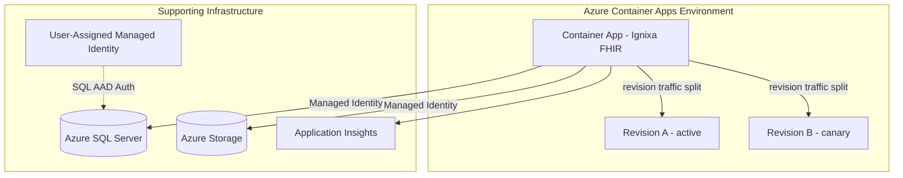

# ADR 2606: Azure Container Apps Hosting

## Status

Proposed

## Context

The current Bicep deployment provisions an Azure App Service running a Linux container from GHCR. This works well for a single ARM deployment (one-click), but App Service is not ideal for production multi-instance scenarios requiring autoscaling, revision-based deployments, or tighter cost control at low traffic volumes. The infrastructure should move to Azure Container Apps (ACA) for the primary Bicep template while retaining App Service compatibility for simplified single-instance deployments.

## Decision

Replace the App Service module in the Bicep template with Azure Container Apps:

### Key Choices

- **Container Apps Environment**: Single environment per deployment; supports multiple container apps if needed in future (e.g., separate worker for DurableTask)
- **Ingress**: External ingress with HTTPS auto-provisioned via ACA's built-in TLS; replaces App Service's default `*.azurewebsites.net` with `*.{region}.azurecontainerapps.io`
- **Scaling rules**: HTTP-based autoscale (min 0, max 10 replicas by default); scale-to-zero for dev/test environments to reduce cost
- **Identity**: User-Assigned Managed Identity (UAMI) for SQL AAD authentication, system-assigned identity for Storage RBAC — same pattern as existing App Service module
- **Revisions**: Single-revision mode by default; multi-revision mode available for blue/green or canary deployments
- **Container registry**: GHCR public image (no registry credentials needed), same as current App Service setup
- **Health probes**: Liveness and readiness probes pointing at `/health/check`
- **Resource allocation**: 1.0 vCPU / 2Gi memory per replica (equivalent to App Service B2 tier)

### What Stays the Same

- All other modules (SQL Server, Storage, Monitoring, RBAC, Network Security Perimeter) remain unchanged
- Tenant configuration pattern (environment variables via `Tenants__Configurations__N__*`) works identically
- DurableTask Azure Storage backend configuration unchanged
- Deployment scripts updated to target `Microsoft.App/containerApps` instead of `Microsoft.Web/sites`

### App Service Retained For

- Single ARM template deployment (`azuredeploy.json`) for quick trials
- Scenarios where a fixed monthly cost is preferred over consumption-based billing

## Consequences

**Positive:**

- Scale-to-zero in dev/test eliminates idle compute cost
- HTTP-based autoscaling handles traffic spikes without manual SKU changes
- Revision management enables zero-downtime deployments and traffic splitting
- No App Service Plan overhead (no reserved compute when idle)
- Dapr sidecar available if future service mesh requirements emerge
- Container Apps Environment can host additional apps (worker processes, sidecar services) without separate infrastructure

**Negative:**

- Custom domain + TLS requires manual DNS validation (App Service handles this more simply)
- No built-in deployment slots equivalent — revision traffic splitting is the replacement
- Slightly more complex initial setup (Container Apps Environment + Container App vs single App Service + Plan)
- Cold start latency when scaling from zero (mitigated by min replica = 1 in production)
- VNet integration requires a dedicated subnet (minimum /23) if private networking is needed

## References

- Current App Service module: `deploy/azure/modules/app-service.bicep`
- Azure Container Apps documentation: https://learn.microsoft.com/en-us/azure/container-apps/
- Container Apps Bicep reference: `Microsoft.App/containerApps@2024-03-01`
