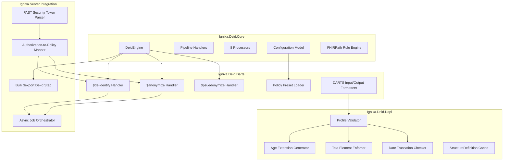

# Ignixa De-Identification Library Rename and FHIR IG Alignment Plan

## Executive Summary

Three emerging FHIR Implementation Guides — FAST Security, De-Identification and Anonymization in Research Trials and Surveys (DARTS), and De-Identification for Analytics and Public health Linkages (DAPL) — collectively represent the first comprehensive, standards-based approach to de-identification within the FHIR ecosystem. For Ignixa's middleware pipeline, this is both a mandate and an opportunity: the IGs formalize concepts the Anonymizer library already implements informally, define operational interfaces the SDK has never exposed, and specify authorization patterns that bridge the gap between clinical data access and privacy-preserving transformation.

### Key Findings

**A standards-aligned de-identification pipeline is emerging.** DARTS defines three FHIR operations — `$de-identify`, `$anonymize`, and `$pseudonymize` — that distinguish transformation intent and output risk level[^4^]. DAPL provides 18 de-identified profiles and 6 extensions governing the retention, redaction, and synthesis of patient data for federal reporting[^5^]. FAST Security supplies the authorization and consent context that determines *whether* de-identification may proceed and *what* level of transformation is permitted[^1^]. Together these three IGs form a complete pipeline: authorization context (FAST Security) -> transformation service (DARTS operations) -> validated output structure (DAPL profiles).

**The current Anonymizer library has substantial algorithmic alignment.** Ignixa.Anonymizer implements 8 processors in a middleware pipeline — cryptoHash, dateShift, redact, encrypt, substitute, perturb, keep, and generalize — that map directly to DAPL's de-identified profile constraints. Internal analysis estimates 60-70% algorithmic overlap between existing processor logic and DAPL profile requirements. The library is standalone (not integrated into the FHIR server), operates on raw resources without FHIR operation endpoints, and produces output that satisfies de-identification intent but not DAPL structural validation.

**Rename from "Anonymizer" to "Deid" is semantically correct and operationally safe.** The DARTS IG defines "anonymize" as the narrowest of three concepts: anonymization is irreversible and removes all direct identifiers; pseudonymization retains a mapping; de-identification is the umbrella term encompassing both[^4^]. The current library name — Anonymizer — incorrectly signals that only irreversible transformation is supported. A rename to `Ignixa.Deid` aligns naming with IG semantics, affects approximately 50 files, 20 type definitions, and 10 namespace declarations across 3 projects (SDK, Server CLI, Server Tests), and produces zero breaking changes in server behavior because the library is consumed as middleware, not referenced by server endpoints.

### Findings at a Glance

| Dimension | Current State | IG Target State | Gap / Opportunity |
|---|---|---|---|
| **Nomenclature** | "Anonymizer" (1 of 3 DARTS concepts) | "Deid" (umbrella term per DARTS) | Rename: ~50 files, ~20 types, 10 namespaces; zero server impact |
| **Operation Interface** | None (middleware library only) | `$de-identify`, `$anonymize`, `$pseudonymize` endpoints | Implement 3 DARTS operations; expose via Server plugin |
| **Profile Validation** | None | 18 DAPL de-identified profiles, 6 extensions | Add DAPL profile validation to pipeline output |
| **Authorization Context** | No authZ integration | FAST Security consent scopes, purpose_of_use | Integrate de-identification policy with FAST Security auth context |
| **Processor Coverage** | 8 processors (cryptoHash, dateShift, redact, encrypt, substitute, perturb, keep, generalize) | DAPL profile field constraints across 18 resource types | Extend to cover DAPL full profile matrix; ~30-40% additional field coverage |
| **Extension Generation** | None | DAPL `dapl-age-extension`, `dapl-sex-extension`, etc. | Emit DAPL extensions on de-identified output |
| **Export Pipeline** | Manual de-identification post-export | Inline de-identification in $export operations | Integrate de-id pipeline with bulk export workflows |

**Five high-value opportunities emerge from this analysis.** First, implementing the three DARTS FHIR operations (`$de-identify`, `$anonymize`, `$pseudonymize`) as Server plugin endpoints would transform the middleware library into a standards-compliant service. Second, adding DAPL profile validation would ensure de-identified output meets federal reporting requirements for 18 resource types. Third, policy presets — pre-configured transformation profiles aligned to HIPAA Safe Harbor, DARTS K-anonymity levels, and DAPL federal requirements — would reduce implementation burden on downstream consumers. Fourth, FAST Security integration would enable consent-aware de-identification, where the transformation level is determined by patient authorization context rather than static configuration. Fifth, embedding the de-identification pipeline into bulk `$export` workflows would enable privacy-preserving data sharing at scale without manual post-processing.

**A phased roadmap aligns implementation with IG maturity.** Phase 1 (Rename / Core) executes the Anonymizer-to-Deid rename, restructures the SDK project layout, and establishes the new namespace hierarchy. Phase 2 (DARTS Operations) implements the three FHIR operations as Server plugin endpoints, beginning with `$de-identify` as the umbrella operation. Phase 3 (DAPL Validation) adds profile validation and extension generation for the 18 de-identified resource types, targeting federal reporting use cases. Phase 4 (FAST Security Integration) connects de-identification policy to authorization context, enabling consent-driven transformation. DARTS and DAPL are both scheduled for May 2026 ballot cycles; Phase 1 and early Phase 2 work can proceed in parallel with ballot community feedback, positioning Ignixa to adopt final IG artifacts immediately upon publication.

## 1. FHIR Implementation Guide Analysis

Three Implementation Guides — FAST Security (May 2026 ballot), DARTS, and DAPL — form a nascent ecosystem around FHIR data de-identification, each addressing a distinct architectural layer. None of the three existed in a stable published form before 2025, and none reference one another directly. Yet when analyzed together, they describe a coherent pipeline: authentication and authorization context at the perimeter, de-identification services in the middle, and de-identified data structures at the output. The sections below examine each IG in depth, then synthesize their relationships into an architecture map that will guide the library rename and gap analysis in subsequent chapters.

### 1.1 FAST Security IG (May 2026 Ballot)

#### 1.1.1 Scope and Positioning

The *Security for Scalable Registration, Authentication, and Authorization* IG (FAST Security), version 3.0.0-ballot, specifies an extension of OAuth 2.0 using UDAP (Universal Data Access Protocol) workflows for both consumer-facing and business-to-business (B2B) applications [^1^]. Its scope is strictly limited to authentication and authorization: it automates client registration using dynamic registration, binds asymmetric cryptographic keys to X.509 certificates, and provides metadata grammar for healthcare information exchange [^1^]. The ballot represents a realm migration from US to International scope with no substantive content changes from the STU 2 December 2025 publication [^1^].

Searches across all IG pages — `index.html`, `discovery.html`, `registration.html`, `consumer.html`, `b2b.html`, `general.html`, and `artifacts.html` — return zero occurrences of the terms *de-identification*, *anonymization*, *pseudonymization*, *security label*, or *segmentation* [^1^]. The FAST Security IG is therefore best understood as a prerequisite boundary condition for any de-identification service: it controls who may request de-identified data and under what purpose, but it contains no de-identification logic itself.

#### 1.1.2 Privacy-Adjacent Feature: B2B Authorization Extension Object

The single privacy-relevant mechanism is the B2B Authorization Extension Object (`hl7-b2b`), a JSON structure embedded within the `extensions` claim of an OAuth client-credentials JWT [^2^]. Two parameters carry privacy context:

- `purpose_of_use` (required): an array of codes identifying why data is being requested. The IG encourages trust communities to draw from the HL7 `PurposeOfUse` value set but does not mandate it [^2^].
- `consent_policy` (optional): an array of URIs identifying privacy consent directive policies consistent with the stated purpose(s) of use [^2^].

A companion parameter, `consent_reference`, provides resolvable URLs to FHIR `Consent` or `DocumentReference` resources that contain the actual consent documentation [^2^]. Servers supporting the B2B flow shall interpret these parameters when making authorization decisions, but the IG does not prescribe how the server should enforce data access policies, apply de-identification, or segment data based on that context [^2^]. The privacy mechanism operates entirely at the authorization-time boundary, not at the data-processing layer.

#### 1.1.3 Artifact Inventory: Zero FHIR Artifacts

The FAST Security IG defines no FHIR profiles, extensions, value sets, operations, or search parameters [^1^]. Its Artifacts Summary page is empty. It is a purely narrative IG that references external specifications — UDAP.org server metadata and dynamic client registration, RFC 6749 (OAuth 2.0), RFC 7515 (JWS), RFC 7519 (JWT), and the SMART App Launch Framework — without constraining any FHIR resource structure [^1^].

| IG | Profiles | Extensions | Value Sets | Code Systems | Operations | CapabilityStatements |
|---|---|---|---|---|---|---|
| FAST Security (v3.0.0-ballot) | 0 | 0 | 0 | 0 | 0 | 0 |
| DARTS (v1.0.0-ballot) | 1 | 0 | 1 | 1 | 3 | 1 |
| DAPL (v1.0.0-ballot) | 18 | 6 | 1 | 0 | 0 | 0 |

*Table 1: IG Artifact Inventory. FAST Security is a narrative-only IG; DARTS contributes operations and a policy vocabulary; DAPL contributes the profile layer that constrains de-identified output structures.*

This artifact distribution reveals a deliberate separation of concerns. FAST Security governs the authorization perimeter; DARTS defines the processing services; DAPL defines the output data contract. No single IG attempts to span all three layers, which implies that an implementation seeking full-stack de-identification compliance must integrate all three specifications (plus US Core for input structures and DS4P if security labeling is required).

### 1.2 DARTS IG (De-Identification, Anonymization, Redaction Toolkit Services)

#### 1.2.1 Scope: Three FHIR Operations for De-Identification Services

The DARTS IG, at version 1.0.0-ballot and FHIR maturity level 2, defines three FHIR operations that a DARTS Service Provider shall expose: `$de-identify`, `$anonymize`, and `$psuedonymize` [^3^]. All three use the FHIR asynchronous operation pattern, accepting either inline `Bundle` resources or NDJSON file URLs via a `Parameters` resource, and returning de-identified output in the same format [^3^]. The IG explicitly scopes out risk assessment, consent management, re-identification services, and policies for data sharing [^3^].

The relationship to companion IGs is clearly stated: DARTS consumes US Core profiles as input, delegates output profile conformance to DAPL, and explicitly does not use DS4P security labels — it removes PHI rather than tagging it [^3^]. This last point is architecturally significant: DARTS represents a destructive (irreversible removal) rather than a labeling (tag-and-filter) approach to privacy.

#### 1.2.2 De-Identification Methods: HHS Safe Harbor and Expert Determination

DARTS defines two policy codes in the `DARTSPolicyIdentifiers` CodeSystem (marked informative), which are bound to the `DARTSPolicyIdentifierCodes` ValueSet [^3^]:

| Policy Code | Method | Description | 18 PHI Attributes Removed |
|---|---|---|---|
| `HHS_SAFE_HARBOR_DETERMINISTIC_METHOD` | Deterministic Safe Harbor | Removes 18 identifiers per 45 CFR 164.514(b) | Yes — all 18 |
| `HHS_EXPERT_DETERMINATION_METHOD` | Expert Determination | Expert-guided removal or masking; algorithm left to implementer | Implementation-defined |
| *(implied by operation)* | Pseudonymization | Tokenizes identity using hashing algorithm | No — identity is masked, not removed |
| *(implied by operation)* | Anonymization (k-anonymity) | Aggregates data to eliminate individual-level records | Yes — all individual data eliminated |

*Table 2: De-Identification Methods Comparison Across DARTS and DAPL. DARTS codifies two HIPAA-recognized methods; DAPL profiles implement the Safe Harbor rules structurally. The anonymization method is the most underspecified, with algorithmic choice left entirely to the service provider.*

The `$de-identify` operation requires a `policy` parameter (1..1, string) that identifies which de-identification method to apply [^3^]. The `$anonymize` operation, by contrast, states that "the algorithm to be used for anonymization is left to the DARTS service provider" — a notable interoperability gap [^4^]. The `$psuedonymize` operation (note the misspelling, which is used consistently throughout the IG, including in operation names, canonical URLs, and narrative text) requires a `key` and `algorithm` parameter, with SHA256 and RSA384 recommended and a 4096-bit x.509 certificate as the recommended key format [^3^].

The IG provides a service comparison table that clarifies the distinctions among the three operations: pseudonymization preserves linkability to the original record and is reversible; de-identification reduces identification risk to a low level and is sometimes reversible under controlled circumstances; anonymization eliminates identification risk entirely and is irreversible [^3^]. From a legal-status perspective, pseudonymized data remains PHI under HIPAA, while properly de-identified and anonymized outputs are not [^3^].

#### 1.2.3 Key Artifacts and Notable Gaps

DARTS contributes 1 CapabilityStatement, 3 OperationDefinitions, 1 Profile (`DARTSOperationDataUrlsParameter`), 1 ValueSet, and 1 CodeSystem to the FHIR ecosystem [^3^]. The CapabilityStatement requires JSON format only and recommends SMART on FHIR Backend Services Authorization [^3^].

Four notable gaps emerge from the artifact analysis:

1. **Pseudonymization misspelled throughout**: Every occurrence — operation name, URL, narrative, parameter names — uses "psuedonymize" instead of "pseudonymize" [^4^]. Implementers must match this spelling exactly for conformance.
2. **No redaction operation despite title**: The IG title includes "Redaction," yet only three operations are defined, with redaction apparently subsumed within `$de-identify` [^4^].
3. **Anonymization algorithm unspecified**: Unlike de-identification, which has explicit policy codes, anonymization offers no policy parameter and no required algorithm [^4^]. The IG provides a k-anonymity grouping example (patients grouped by age band, region, and disease with only counts retained), but this is illustrative, not normative [^3^].
4. **No provenance or audit mechanisms**: No FHIR `Provenance` or `AuditEvent` tracking is defined for recording what de-identification was applied [^4^].

### 1.3 DAPL IG (De-identified, Anonymized FHIR Profiles Library)

#### 1.3.1 Scope: 18 Resource Profiles for Federal Agency Reporting

The DAPL IG, at version 1.0.0-ballot and maturity level 1, defines 18 resource profiles that represent the output of DARTS services [^5^]. Its stated purpose is to enable data submitters — such as Federally Qualified Health Centers (FQHCs) — to create de-identified and anonymized information aligned with federal reporting requirements from HRSA (UDS+), SAMHSA, and CDC [^5^]. The IG is not derived from US Core profiles because it removes too many US Core-mandatory elements; instead, it aligns with US Core terminology only [^5^].

The profile taxonomy follows a three-part naming convention:

- `dapl-de-identified-[Resource]` — used only for de-identified output (7 profiles)
- `dapl-[Resource]` — common to both de-identified and anonymized output (10 profiles)
- `dapl-anonymized-[Resource]` — used only for anonymized output (1 profile)

This yields 7 de-identified-only profiles (Patient, Encounter, AdverseEvent, AllergyIntolerance, Location, Organization, RelatedPerson), 10 common profiles spanning clinical and administrative data (Condition, Procedure, Immunization, two Observation profiles, MedicationRequest, MedicationStatement, ServiceRequest, Coverage, Income Observation), and 1 anonymized-only profile (`dapl-anonymized-dataset`, based on `MeasureReport`) [^5^].

#### 1.3.2 Six Custom Extensions

DAPL defines six extensions that replace or augment data elements removed during de-identification [^5^]:

| Extension | Canonical URL | Context | Purpose |
|---|---|---|---|
| DAPL Age Extension | `dapl-age-extension` | Patient, Encounter | Replaces `birthDate` with computed age (Quantity or Range) |
| DAPL Sex Extension | `dapl-sex-extension` | Patient | Replaces US Core birth sex with constrained code set |
| DAPL Ethnicity Extension | `dapl-ethnicity-extension` | Patient | Derived from US Core Ethnicity |
| DAPL Race Extension | `dapl-race-extension` | Patient | Uses Race Categories (VSAC) |
| DAPL RecordedDate Extension | `dapl-recordedDate-extension` | Procedure | Captures recorded date of clinical event |
| DAPL Event Recorded DateTime Extension | `dapl-event-recorded-datetime-extension` | Procedure | Captures time event was recorded; required when event is not done |

*Table 3: DAPL Custom Extensions. The Age Extension is the most architecturally significant — it replaces the entire birthDate element, which is one of the 18 Safe Harbor identifiers, with a computed age as of December 31 of the previous reporting year.*

The Age Extension exemplifies DAPL's design pattern: when a Safe Harbor rule removes a mandatory element, DAPL substitutes a privacy-preserving alternative that retains analytical utility. Age over 89 is capped and represented as `>= 90` using a `valueQuantity` with comparator, per HHS guidance [^5^].

#### 1.3.3 Universal De-Identification Rules

Across all 18 profiles, four de-identification rules apply universally [^5^]:

1. **No `text` elements**: Resource narrative (`Resource.text`) is prohibited in all de-identified resources. Validation rejects any instance containing a text element, because generated narrative may inadvertently contain PHI (e.g., a Patient text element rendering name, gender, and birthDate) [^5^].
2. **No `reference.display`**: The `display` element on any `Reference` type must not be present, as it may contain identifying text [^5^].
3. **Date truncation to year**: All date and datetime fields are truncated to year precision. Month and day are removed. This affects fields ranging from `Condition.onsetDateTime` and `Procedure.performedDateTime` to `Encounter.period` and `MedicationRequest.authoredOn` [^5^].
4. **ID replacement**: Original resource IDs must not be preserved. New IDs are generated by the DARTS service provider, with the data submitter maintaining an internal mapping for relinking [^5^].

Additional profile-specific rules include zip code masking (to 3 digits if population exceeds 20,000, otherwise to `00000` with `dataAbsentReason` extension), removal of all patient identifiers (SSN, MRN, account numbers), contact information removal, and biometric elimination [^5^].

### 1.4 Cross-IG Architecture

#### 1.4.1 Relationship Matrix: Services, Data Structures, and Authorization Context

| Dimension | FAST Security | DARTS | DAPL |
|---|---|---|---|
| **Architectural role** | Authorization perimeter | Processing services | Output data contract |
| **FHIR artifacts** | 0 | 7 (3 operations, 1 profile, 1 VS, 1 CS, 1 CapStmt) | 25 (18 profiles, 6 extensions, 1 VS) |
| **De-identification scope** | None | Defines operations; references HHS Safe Harbor | Defines profile constraints implementing Safe Harbor |
| **Relationship to US Core** | None (auth framework) | Input profiles | Terminology alignment only |
| **Relationship to DS4P** | None | Explicitly avoids; removes PHI instead of tagging | Notes DS4P can be leveraged but does not define labels |
| **Privacy mechanism** | `consent_policy`, `purpose_of_use` in B2B token | Destructive removal/transform | Structural constraints on output |
| **Maturity level** | 4 (STU 3 ballot) | 2 (STU 1 ballot) | 1 (STU 1 ballot) |
| **Standard referenced** | UDAP, OAuth 2.0, SMART | HHS Safe Harbor, HIPAA | HHS Safe Harbor, NIST IR 8053 |

*Table 4: Cross-IG Relationship Matrix. The three IGs form a pipeline: FAST Security governs who may access data and for what purpose; DARTS performs the transformation; DAPL validates the output structure.*

#### 1.4.2 Input/Output Flow: A Three-Stage Pipeline

The IGs, taken together, describe a clear data-flow pipeline. US Core profiles serve as the input data standard — a DARTS Consumer submits identifiable patient data conforming to US Core [^3^]. The DARTS Service Provider applies one of its three operations (`$de-identify`, `$anonymize`, or `$psuedonymize`) based on the use case and any policy identifier provided [^3^]. The output must conform to DAPL profiles: de-identified output uses the 7 de-identified-only profiles plus 10 common profiles; anonymized output uses the 10 common profiles plus the `dapl-anonymized-dataset` MeasureReport-based profile [^5^].

FAST Security sits upstream of this pipeline. Before any de-identification occurs, a client application must obtain an access token via UDAP/OAuth 2.0, potentially including `purpose_of_use` and `consent_policy` assertions in the B2B Authorization Extension Object [^2^]. The resource server interprets these claims to determine whether de-identification is required and, if so, which DARTS policy might apply. The IGs do not specify this routing logic — it is left to implementation — but the data elements required for such a decision (`purpose_of_use` from FAST Security, `policy` to DARTS) are present in both specifications.

#### 1.4.3 Explicit Separation from DS4P

Both DARTS and DAPL explicitly position themselves relative to the Data Segmentation for Privacy (DS4P) IG, and the positioning is the same: DARTS/DAPL remove PHI, while DS4P tags it with security labels [^3^][^5^]. DARTS states that it "aims to remove PHI/PII from data rather than tag it" [^3^]. DAPL notes that "implementers can leverage any existing DS4P mechanisms if needed as part of the DAPL profiles" but defines no security labels of its own [^5^]. This represents a fundamental architectural fork in FHIR privacy approaches — destruction versus labeling — and an implementation that supports both would need to integrate DARTS/DAPL for removal pipelines and DS4P for label-based access control on raw data.

The implications for Ignixa's library rename are direct. The current name, "anonymizer," corresponds to only one of the three DARTS operations and is, per DARTS's own definitions, the narrowest and most irreversible of the three de-identification services [^3^]. The IGs collectively use "de-identification" as the umbrella term spanning pseudonymization, de-identification (in the HIPAA Safe Harbor sense), and anonymization. Aligning the library name with this taxonomy signals conformance to the emerging standard architecture and positions the library to implement any or all of the DARTS operations, not merely the most destructive one.

---

**Citations**

[^1^]: HL7, *Security for Scalable Registration, Authentication, and Authorization* (FAST Security IG), version 3.0.0-ballot, May 2026. Base URL: https://hl7.org/fhir/uv/fast-security/2026May/

[^2^]: HL7, FAST Security IG, "B2B Authorization Extension Object," Section 5.2.1.1. https://hl7.org/fhir/uv/fast-security/2026May/b2b.html#b2b-authorization-extension-object

[^3^]: HL7, *De-Identification, Anonymization, Redaction Toolkit Services* (DARTS IG), version 1.0.0-ballot. https://build.fhir.org/ig/HL7/fhir-darts/

[^4^]: Cross-verification analysis of DARTS IG artifact inventory and gap observations. https://build.fhir.org/ig/HL7/fhir-darts/artifacts.html

[^5^]: HL7, *De-identified, Anonymized FHIR Profiles Library* (DAPL IG), version 1.0.0-ballot. https://build.fhir.org/ig/HL7/fhir-dapl/


---

## 2. Ignixa Current State Assessment

### 2.1 Anonymizer Library Architecture

The Ignixa FHIR server solution contains a standalone de-identification library, `Ignixa.Anonymizer`, located at `src/Core/Ignixa.Anonymizer/` within the `All.sln` solution. The library is a packable NuGet package targeting .NET 9 and consists of 34 source files organized across 10 sub-directories: `Configuration/`, `Exceptions/`, `Extensions/`, `Models/`, `Pipeline/`, `Processors/`, `Tools/`, and `Visitors/`[^4^]. It operates as a purely client-side processing engine — no runtime dependency on the FHIR server, no database connection, and no external service calls. This isolation is architecturally significant because it means the library can be renamed, refactored, or repackaged without perturbing the server application layer.

#### 2.1.1 Middleware Pipeline Pattern

The library employs an ASP.NET Core-style middleware pipeline in which FHIR resources flow through a chain of six handlers, each inheriting from `AnonymizerPipelineHandler` and calling `next()` to pass control downstream[^4^]. The pipeline is constructed in the following order:

1. `ValidationHandler` — validates the input `Resource` for structural integrity before processing.
2. `SecurityTagHandler` — attaches `SecurityLabel` instances to the output resource, providing provenance metadata about the de-identification operation.
3. `RuleMatchingHandler` — evaluates each configured FHIRPath rule against the resource element tree and produces a set of `MatchedRule` instances.
4. `ProcessorHandler` — resolves the processor responsible for each matched rule (via the `IAnonymizerProcessor` plugin interface) and invokes it.
5. `OutputFormattingHandler` — performs final cleanup of the resource graph, removing empty elements and ensuring conformance to output expectations.
6. `AnonymizationResult` — the terminal stage packages the modified resource and processing metadata into a result object.

The pipeline builder, `AnonymizerPipeline`, is modeled directly on ASP.NET Core's `IApplicationBuilder`: handlers are registered with `UseHandler<T>()` and executed in registration order. This design yields two important properties. First, each stage is independently testable and replaceable — a team could inject a DAPL profile conformance stage between `OutputFormattingHandler` and the result without modifying existing code. Second, the `AnonymizerContext` object that flows through the pipeline carries the full execution state (input resource, matched rules, processor settings, cancellation token), making the pipeline inherently async-ready via `ValueTask<Result<AnonymizationResult>>`[^4^].

#### 2.1.2 Eight Built-in Processors

The `ProcessorHandler` resolves de-identification operations through a plugin registry keyed by the `Method` string property. Eight built-in processors ship with the library, each implementing `IAnonymizerProcessor`[^4^]:

| Processor | Method Key | Functional Description |
|---|---|---|
| `CryptoHashProcessor` | `cryptoHash` | HMAC-SHA256 deterministic hashing; produces consistent pseudonyms for a given input and key |
| `DateShiftProcessor` | `dateShift` | Consistent date shifting by a configurable offset; supports `DateShiftScope` for patient-level consistency |
| `RedactProcessor` | `redact` | Full removal of target elements with optional partial preservation (dates to year, zip codes to 3 digits) |
| `EncryptProcessor` | `encrypt` | Reversible AES encryption for fields that may need decryption under authorized conditions |
| `SubstituteProcessor` | `substitute` | Value replacement with fixed or generated substitute values |
| `PerturbProcessor` | `perturb` | Addition of statistical noise, typically for numeric quantities |
| `KeepProcessor` | `keep` | Explicit pass-through; explicitly preserves elements that would otherwise match broader redaction rules |
| `GeneralizeProcessor` | `generalize` | Conditional value generalization (e.g., age ranges, geographic aggregation) |

The `RedactProcessor` and `CryptoHashProcessor` are the most heavily exercised in practice: redaction implements the core of HIPAA Safe Harbor (removing the 18 identifier categories), while cryptoHashing provides the deterministic pseudonymization that DARTS expects for `Patient.identifier` values[^4^]. The `KeepProcessor` is noteworthy because it enables fine-grained exceptions — a rule can redact all `HumanName` elements while a subsequent `keep` rule preserves a specific name used for research cohort identification. The processor resolution order follows the JSON configuration file's rule sequence, so later rules can override earlier ones.

#### 2.1.3 Plugin Model and Rule Configuration

Extending the library beyond the eight built-in processors requires implementing the `IAnonymizerProcessor` interface, which defines two members: a `string Method { get; }` property and a `ProcessorResult Process(ProcessContext context, ProcessorSettings settings)` method[^4^]. Processors are registered in the DI container and resolved at runtime by method name, making the model open for custom algorithms without recompiling the core library.

Rules are declared in a JSON configuration file using FHIRPath expressions. A minimal configuration takes the following shape:

```json
{
  "fhirVersion": "R4",
  "fhirPathRules": [
    { "path": "Patient.id", "method": "cryptoHash" },
    { "path": "descendants().ofType(HumanName)", "method": "redact" },
    { "path": "descendants().ofType(date)", "method": "dateShift" }
  ],
  "parameters": {
    "dateShiftKey": "${DateShiftKey}",
    "cryptoHashKey": "${CryptoHashKey}"
  }
}
```

The `AnonymizerOptionsLoader` deserializes this JSON into the immutable `AnonymizerOptions` record, which carries `FhirPathRule` entries, `ParameterOptions` (key material and behavioral flags), and `ProcessingOptions` (error-handling mode)[^4^]. Because rules are FHIRPath expressions rather than hard-coded element paths, the same configuration file can target multiple FHIR versions (R4, STU3) and adapt to profile extensions without code changes.

#### 2.1.4 Standalone Status: No Server Integration

A finding with significant architectural implications is that `Ignixa.Anonymizer` is **not referenced by the main FHIR server**. Neither `Ignixa.Api.csproj` nor `Ignixa.Web.csproj` — nor any project in `src/Application/` or `src/DataLayer/` — declares a project reference to the anonymizer library[^4^]. The library is consumed exclusively by two downstream consumers:

- `tools/Ignixa.Anonymizer.Cli/` — a `dotnet tool` CLI packaged as `ignixa-anonymizer`
- `test/Ignixa.Anonymizer.Tests/` — the unit and integration test suite

This standalone status means the rename operation described in Section 2.3 carries zero risk of breaking the server application layer. It also explains why the library has not yet been exposed as FHIR operations (`$de-identify`, `$anonymize`, `$pseudonymize`): there is no operational integration point in the server's request pipeline, export subsystem, or background job scheduler where de-identification is currently invoked[^4^]. Chapter 3 will examine the gap between this isolation and the DARTS IG's requirement for first-class FHIR operation endpoints.

### 2.2 SDK Surface Area

#### 2.2.1 Public API: IAnonymizerEngine

The primary public contract is the `IAnonymizerEngine` interface, which exposes two overloads[^4^]:

```csharp
public interface IAnonymizerEngine
{
    AnonymizationResult Anonymize(Resource resource, RequestOptions? options = null);
    string AnonymizeJson(string json, RequestOptions? options = null);
}
```

The `Anonymize(Resource, ...)` overload accepts a parsed FHIR `Resource` object and returns an `AnonymizationResult` containing the modified resource and processing metadata. The `AnonymizeJson(string, ...)` overload accepts raw JSON, internally deserializes it, runs the pipeline, and serializes the result back to JSON — a convenience method for CLI and HTTP-based consumers. Both overloads accept an optional `RequestOptions` parameter for per-request overrides (e.g., forcing a specific FHIR version or enabling debug logging).

The engine implementation, `AnonymizerEngine`, accepts either a file path to a JSON configuration or a pre-built `AnonymizerOptions` instance plus an `IFhirSchemaProvider` for FHIR version awareness[^4^]. This dual-constructor pattern supports both file-based configuration (typical for CLI usage) and programmatic configuration (typical for library consumers and unit tests).

#### 2.2.2 DI Registration: AddAnonymizerServices()

Library consumers register services through the `AddAnonymizerServices()` extension method on `IServiceCollection`, located in the `Ignixa.Anonymizer.Extensions` namespace[^4^]:

```csharp
public static IServiceCollection AddAnonymizerServices(
    this IServiceCollection services,
    string configurationFilePath)
```

This method registers the engine, pipeline, all built-in processors, and supporting tools as singleton or scoped services depending on thread-safety requirements. The single-parameter overload (file path) is the most common entry point for ASP.NET Core applications; a future overload accepting `AnonymizerOptions` directly would benefit test scenarios and configuration-driven deployments that load rules from sources other than the file system.

#### 2.2.3 Configuration Model: AnonymizerOptions

The configuration hierarchy consists of three primary records[^4^]:

| Record | Purpose | Key Members |
|---|---|---|
| `AnonymizerOptions` | Top-level configuration | `FhirVersion`, `Rules` (immutable array of `FhirPathRule`), `Parameters`, `Processing` |
| `ParameterOptions` | Cryptographic and behavioral parameters | `DateShiftKey`, `CryptoHashKey`, `EncryptKey`, `DateShiftScope`, `EnablePartialDatesForRedact`, `EnablePartialAgesForRedact`, `EnablePartialZipCodesForRedact`, `GeoHashKey` |
| `ProcessingOptions` | Execution control | `ErrorHandling` (`skip` or `raise`) |

The `AnonymizerOptions` record is marked `sealed` and uses `init`-only properties, making configuration instances immutable after creation — a deliberate design choice that prevents runtime mutation of rules during pipeline execution. The `ParameterOptions` record encapsulates all key material, ensuring that cryptographic secrets are passed through a single typed object rather than scattered across individual processor constructors.

### 2.3 Rename Impact Analysis

The transition from `Ignixa.Anonymizer` to `Ignixa.Deid` is a mechanical renaming operation with well-bounded scope. Because the library has no upstream dependencies within the server codebase, the blast radius is limited to the library itself, its CLI tool, and its test project.

#### 2.3.1 Files and Projects Affected

The rename touches **3 projects** comprising approximately **50 files**[^4^]. Table 2-1 inventories the key public types and their proposed new names.

**Table 2-1: Key Public Types and Interfaces — Current and Proposed Names**

| Current Type | Proposed Type | Namespace (Current) | File Path | SDK Impact |
|---|---|---|---|---|
| `IAnonymizerEngine` | `IDeidEngine` | `Ignixa.Anonymizer` | `IAnonymizerEngine.cs` | Primary consumer contract |
| `AnonymizerEngine` | `DeidEngine` | `Ignixa.Anonymizer` | `AnonymizerEngine.cs` | Engine implementation |
| `IAnonymizerPipeline` | `IDeidPipeline` | `Ignixa.Anonymizer.Pipeline` | `Pipeline/IAnonymizerPipeline.cs` | Pipeline abstraction |
| `AnonymizerPipeline` | `DeidPipeline` | `Ignixa.Anonymizer.Pipeline` | `Pipeline/AnonymizerPipeline.cs` | Pipeline builder |
| `AnonymizerPipelineHandler` | `DeidPipelineHandler` | `Ignixa.Anonymizer.Pipeline` | `Pipeline/AnonymizerPipelineHandler.cs` | Handler base class |
| `AnonymizerContext` | `DeidContext` | `Ignixa.Anonymizer.Pipeline` | `Pipeline/AnonymizerContext.cs` | Pipeline state carrier |
| `IAnonymizerProcessor` | `IDeidProcessor` | `Ignixa.Anonymizer.Processors` | `Processors/IAnonymizerProcessor.cs` | Plugin interface |
| `AnonymizerOptions` | `DeidOptions` | `Ignixa.Anonymizer.Configuration` | `Configuration/AnonymizerOptions.cs` | Configuration root |
| `AnonymizerOptionsLoader` | `DeidOptionsLoader` | `Ignixa.Anonymizer.Configuration` | `Configuration/AnonymizerOptionsLoader.cs` | Config loader |
| `AnonymizationResult` | `DeidResult` | `Ignixa.Anonymizer.Models` | `Models/AnonymizationResult.cs` | Result model |
| `AnonymizationFhirPathRule` | `DeidFhirPathRule` | `Ignixa.Anonymizer.Configuration` | `Configuration/AnonymizationFhirPathRule.cs` | Rule definition |
| `AnonymizerMethod` | `DeidMethod` | `Ignixa.Anonymizer.Configuration` | `Configuration/AnonymizerMethod.cs` | Method enum |
| `AnonymizerRule` | `DeidRule` | `Ignixa.Anonymizer.Configuration` | `Configuration/AnonymizerRule.cs` | Rule base |
| `AnonymizerRuleType` | `DeidRuleType` | `Ignixa.Anonymizer.Configuration` | `Configuration/AnonymizerRuleType.cs` | Rule type enum |
| `AnonymizerConfigurationException` | `DeidConfigurationException` | `Ignixa.Anonymizer.Exceptions` | `Exceptions/AnonymizerConfigurationException.cs` | Config error |
| `AnonymizerProcessingException` | `DeidProcessingException` | `Ignixa.Anonymizer.Exceptions` | `Exceptions/AnonymizerProcessingException.cs` | Processing error |
| `AnonymizerLogging` | `DeidLogging` | `Ignixa.Anonymizer` | `AnonymizerLogging.cs` | Logging infrastructure |
| `ServiceCollectionExtensions` | `ServiceCollectionExtensions` | `Ignixa.Anonymizer.Extensions` | `Extensions/ServiceCollectionExtensions.cs` | DI extension (method renames) |

Table 2-1 covers the 18 public types that constitute the library's external contract. An additional 15 source files (processor implementations, pipeline handlers, tools, and models) contain "Anonymizer" in their identifiers and require corresponding renames[^4^]. The `ServiceCollectionExtensions` class name itself can remain, but its method `AddAnonymizerServices()` must become `AddDeidServices()`. The `Anonymize()` and `AnonymizeJson()` method names on the engine interface should transition to `Deidentify()` and `DeidentifyJson()` (or `Process()` / `ProcessJson()` if a more generic verb is preferred) to align with the library's new identity.

#### 2.3.2 Namespace Mapping

Ten namespace declarations require updates, all following the same prefix substitution pattern[^4^]:

**Table 2-2: Namespace Rename Impact Matrix**

| Current Namespace | Proposed Namespace | Files Affected | Consumer `using` Impact |
|---|---|---|---|
| `Ignixa.Anonymizer` | `Ignixa.Deid` | 5 | All library, CLI, and test consumers |
| `Ignixa.Anonymizer.Configuration` | `Ignixa.Deid.Configuration` | 12 | Configuration consumers |
| `Ignixa.Anonymizer.Configuration.ProcessorSettings` | `Ignixa.Deid.Configuration.ProcessorSettings` | 1 | Processor configuration |
| `Ignixa.Anonymizer.Exceptions` | `Ignixa.Deid.Exceptions` | 2 | Exception handling code |
| `Ignixa.Anonymizer.Extensions` | `Ignixa.Deid.Extensions` | 1 | DI registration call sites |
| `Ignixa.Anonymizer.Models` | `Ignixa.Deid.Models` | 7 | Result and model consumers |
| `Ignixa.Anonymizer.Pipeline` | `Ignixa.Deid.Pipeline` | 11 | Custom handler implementations |
| `Ignixa.Anonymizer.Processors` | `Ignixa.Deid.Processors` | 10 | Custom processor implementations |
| `Ignixa.Anonymizer.Tools` | `Ignixa.Deid.Tools` | 6 | Tool extension authors |
| `Ignixa.Anonymizer.Visitors` | `Ignixa.Deid.Visitors` | 1 | Custom visitor implementations |

Table 2-2 quantifies the namespace migration across the 56 source files in the three affected projects. The `Ignixa.Anonymizer.Processors` namespace is the most densely populated (10 files) because each built-in processor occupies its own file, plus the `IAnonymizerProcessor` interface and the `AnonymizationOperations` helper class. The `Ignixa.Anonymizer.Configuration` namespace is second (12 files), reflecting the library's heavy investment in a structured, JSON-driven configuration model. All namespace changes are purely mechanical — a global find-and-replace of `Ignixa.Anonymizer` with `Ignixa.Deid` covers every case without ambiguity because no conflicting "Deid" identifiers exist in the codebase[^4^].

#### 2.3.3 Package Identifiers and CLI Artifacts

Beyond source code, three package-level identifiers require updates[^4^]:

- **Library PackageId**: `Ignixa.Anonymizer` → `Ignixa.Deid`
- **CLI PackageId**: `Ignixa.Anonymizer.Cli` → `Ignixa.Deid.Cli`
- **CLI Tool Command**: `ignixa-anonymizer` → `ignixa-deid`
- **CLI Assembly Name**: `ignixa-anonymizer` → `ignixa-deid`

The CLI tool's `PackageTags` currently reads `anonymization;de-identification;privacy`; this should be updated to include `deid` for discoverability on NuGet.org. Project folder paths (`src/Core/Ignixa.Anonymizer/`, `tools/Ignixa.Anonymizer.Cli/`, `test/Ignixa.Anonymizer.Tests/`) must be renamed on disk, requiring a corresponding update to the solution file (`All.sln`) and any CI/CD pipeline paths.

#### 2.3.4 Zero Breaking Changes to Server Application Layer

The most consequential finding for the rename operation is that **no project in the server application layer references `Ignixa.Anonymizer`**[^4^]. The library's two consumers — the CLI tool and the test suite — are rebuilt and redeployed in lockstep with the library. There are no NuGet package consumers external to the repository, no server middleware that depends on `IAnonymizerEngine`, and no database migrations or configuration schemas that embed the "Anonymizer" string. This isolation reduces the rename from a potentially breaking public-API change to an internal refactoring bounded by the repository's own CI pipeline.

The internal reference inventory provides a sense of scale: approximately 60 `using` statements, 150+ type references, and 200+ string occurrences (comments, log messages, exception text) across the three projects require updates[^4^]. The ~30 test method names containing "Anonymize" (e.g., `Anonymize_Patient_Resource_Should_Hash_Id`) should also be renamed for consistency. While the file count is non-trivial, the absence of cross-repository dependencies means the entire change set can be validated in a single pull request with a green CI build as the correctness gate.

Several internal identifiers can retain the "anonymize" terminology without inconsistency. The `AnonymizerMethod` enum values (`cryptoHash`, `redact`, `dateShift`, etc.) are method names, not library names, and should remain unchanged to preserve configuration file compatibility. Similarly, the JSON configuration keys (`fhirPathRules`, `parameters`, `processing`) are contractually bound to existing config files and require no modification[^4^]. Preserving these stable contracts limits the rename to compile-time identifiers while leaving runtime behavior and configuration semantics untouched.


---

## 3. Gap Analysis Matrix

The preceding chapters established two foundational observations: DARTS, DAPL, and FAST Security define a three-layer privacy architecture (authorization context, service operations, and output profiles), and Ignixa's `Anonymizer` library implements a standalone processor pipeline with eight built-in de-identification methods. This chapter translates those observations into specific, actionable gaps. Each gap is classified by the IG that defines the requirement, assessed for its algorithmic versus operational nature, and sized for implementation planning.

The analysis confirms the estimate from prior chapters: Ignixa covers roughly 60–70% of the *algorithmic* requirements for DARTS and DAPL compliance, but only about 20% of the *operational packaging*—the FHIR operations, profile enforcement, and authorization wiring that transforms a library into an IG-compliant service. The gap is one of surfacing, not capability.

---

### 3.1 DARTS Compliance Gaps

The DARTS IG defines three FHIR operations (`$de-identify`, `$anonymize`, `$psuedonymize`), two policy identifier codes, and service provider conformance requirements specifying how de-identified data must be produced and delivered [^1^]. Ignixa satisfies several underlying transformations—redaction, hashing, date shifting—but exposes none through the interfaces DARTS mandates.

#### 3.1.1 No `$de-identify` FHIR Operation Endpoint Exposed by the Server

DARTS requires the Service Provider to expose `[base]/$de-identify` as a type-level operation accepting either a `Bundle` of identifiable data or a `Parameters` resource containing NDJSON file URLs, along with a mandatory `policy` parameter [^2^]. Ignixa's library has no server integration: `Ignixa.Api.csproj` does not reference `Ignixa.Anonymizer`, and no FHIR operation definitions exist for de-identification [^3^]. The public API is limited to `IAnonymizerEngine.Anonymize(Resource, RequestOptions)` and `AnonymizeJson(string, RequestOptions)`—programmatic SDK methods, not FHIR operations [^4^]. Closing this gap requires implementing the OperationDefinition's input/output parameter contracts, `OperationOutcome` error handling, and the async pattern for large datasets.

#### 3.1.2 No `$anonymize` Operation with Async Pattern Support

The `$anonymize` operation uses the R4 async pattern (`https://hl7.org/fhir/R4/async.html`) with input as `Bundle` or NDJSON file URLs and output as anonymized data [^5^]. DARTS leaves the anonymization algorithm to the provider, but the async scaffolding—status polling, progress tracking, result retrieval—is mandatory [^6^]. Ignixa's `AnonymizerEngine` processes resources synchronously in-memory with no batch job framework or NDJSON streaming [^7^]. While the `generalize` and `perturb` processors provide algorithmic building blocks for k-anonymity, the operational wrapping to expose them as an async FHIR operation does not exist.

#### 3.1.3 Pseudonymization Stores Hash In-Place vs. DARTS-Required `Patient.identifier` Placement

DARTS pseudonymization stores the hash result in `Patient.identifier` and removes the original name fields, using SHA256 or RSA384 with a 4096-bit x509 certificate key [^8^] [^9^]. Candidate fields include first name, last name, gender, and date of birth. Ignixa's `CryptoHashProcessor` implements HMAC-SHA256 deterministic hashing—algorithmically equivalent—but replaces the original value *in place* rather than relocating it to `Patient.identifier` [^10^]. Aligning with DARTS requires a pseudonymization-specific handler that combines hashing with element relocation and cleanup.

#### 3.1.4 No DARTS Policy Identifier Support

The `$de-identify` operation requires a mandatory `policy` parameter drawn from `DARTSPolicyIdentifierCodes`, containing `HHS_SAFE_HARBOR_DETERMINISTIC_METHOD` and `HHS_EXPERT_DETERMINATION_METHOD` [^12^]. Ignixa's configuration uses FHIRPath rules and processor selections with no concept of a policy identifier or policy-driven pipeline selection [^13^]. A user must manually author configuration rules; there is no preset mapping to DARTS policy codes. This gap is bridgeable by introducing a "policy preset" abstraction—pre-configured `AnonymizerOptions` instances that load when a specific policy code is supplied.

| Gap ID | DARTS Requirement | Current Ignixa State | Algorithmic or Operational | Effort |
|--------|------------------|----------------------|---------------------------|--------|
| DARTS-01 | Expose `[base]/$de-identify` with `policy` parameter [^2^] | Library API only: `IAnonymizerEngine.Anonymize()` [^4^] | Operational | High |
| DARTS-02 | Expose `[base]/$anonymize` with async/NDJSON [^5^] | Synchronous single-resource processing [^7^] | Operational | High |
| DARTS-03 | Expose `[base]/$psuedonymize` with key/algorithm [^8^] | No operation; `cryptoHash` is rule-based | Operational | Medium |
| DARTS-04 | Store pseudonym in `Patient.identifier`, remove source [^9^] | `CryptoHashProcessor` replaces in-place [^10^] | Algorithmic | Medium |
| DARTS-05 | Support `HHS_SAFE_HARBOR_DETERMINISTIC_METHOD` [^12^] | FHIRPath rules only; no policy concept [^13^] | Operational | Low |
| DARTS-06 | Support `HHS_EXPERT_DETERMINATION_METHOD` [^12^] | No expert determination preset | Operational | Low |
| DARTS-07 | Return DAPL-profile-conformant NDJSON [^1^] | No DAPL profile awareness | Operational | Medium |
| DARTS-08 | Internal identifier linking identifiable ↔ de-identified [^1^] | ID hashing only; no linkage stored | Algorithmic | Medium |

The DARTS gap inventory reveals a consistent pattern: Ignixa's processors implement transformations DARTS requires, but the library lacks the FHIR operation layer, policy parameterization, and output profile validation needed for a conformant DARTS Service Provider. Seven of eight gaps are operational—the core de-identification logic is sound, but it needs productization into FHIR operations.

---

### 3.2 DAPL Compliance Gaps

The DAPL IG defines 18 resource profiles, 6 extensions, and cross-cutting output rules applying to all de-identified resources [^14^]. While DARTS specifies *how* to invoke de-identification services, DAPL specifies *what* the output must look like. Ignixa produces transformed FHIR resources but does not enforce DAPL profile constraints at the output stage.

#### 3.2.1 No DAPL Profile-Aware Output Formatting (18 Profiles Not Recognized)

DAPL defines 18 profiles: 7 de-identified-only (Patient, Encounter, AdverseEvent, AllergyIntolerance, Location, Organization, RelatedPerson), 10 common (Condition, Procedure, Immunization, Observation, MedicationRequest, MedicationStatement, ServiceRequest, Coverage), and 1 anonymized-only (MeasureReport-based dataset) [^15^]. Each profile specifies supported elements, prohibited elements (0..0 cardinality), and required extensions. Ignixa's `OutputFormattingHandler` performs generic cleanup with no awareness of DAPL profiles [^16^]. The `ValidationHandler` validates against base FHIR constraints but not DAPL-specific ones [^17^]. Adding conformance requires integrating the `hl7.fhir.us.dapl` StructureDefinitions into the validation pipeline.

#### 3.2.2 No Generation of DAPL Extensions

DAPL defines six extensions required during de-identification: `dapl-age-extension` (1..1 on Patient and Encounter, computed as of December 31 of the previous year, capped at ≥90 for ages over 89), `dapl-sex-extension`, `dapl-ethnicity-extension`, `dapl-race-extension`, `dapl-recordedDate-extension`, and `dapl-event-recorded-datetime-extension` [^18^]. These carry information that base elements cannot, because underlying fields (e.g., `birthDate`) are removed during de-identification. Ignixa's `RedactProcessor` removes `birthDate` entirely but no processor creates the `dapl-age-extension` that DAPL requires in its place [^19^]. Adding extension generation requires a new post-processing capability that computes derived values and attaches them with correct canonical URLs—a pattern not present in the current pipeline.

#### 3.2.3 No Text Element Prohibition Enforcement at the Output Formatting Stage

DAPL prohibits all `text` elements (resource narrative) across every profile because narrative contains derived human-readable content that defeats de-identification: "text elements cannot be included in the De-identified FHIR resource and the submission will be rejected when text elements are present by the validation process" [^20^]. Ignixa's pipeline does not have a dedicated text removal stage. The `RedactProcessor` can target specific paths, but a blanket prohibition on `Resource.text` and nested `text` elements is not part of the default configuration.

#### 3.2.4 No `reference.display` Stripping in References

DAPL prohibits `reference.display` across all references because display strings contain identifiable information (patient names, organization names) [^21^]. This applies to `Encounter.subject`, `Condition.subject`, `Procedure.encounter`, and all other references across the 18 profiles. Ignixa's `ReferenceTool` provides reference manipulation but the default configuration does not systematically strip `display` from `Reference` types [^22^]. Closing this requires either a new processor or a configuration preset applying `redact` to all `Reference.display` paths.

| Gap ID | DAPL Requirement | Current Ignixa State | Algorithmic or Operational | Effort |
|--------|-----------------|----------------------|---------------------------|--------|
| DAPL-01 | Validate against 18 DAPL profiles [^15^] | Generic output formatting [^16^] | Operational | Medium |
| DAPL-02 | Generate `dapl-age-extension` (≥90 cap) [^18^] | `RedactProcessor` removes `birthDate` [^19^] | Algorithmic | Medium |
| DAPL-03 | Generate `dapl-sex-extension` [^18^] | No extension generation capability | Algorithmic | Low |
| DAPL-04 | Generate `dapl-ethnicity-extension` [^18^] | No extension generation | Algorithmic | Low |
| DAPL-05 | Generate `dapl-race-extension` [^18^] | No extension generation | Algorithmic | Low |
| DAPL-06 | Generate `dapl-recordedDate-extension` [^18^] | No extension generation | Algorithmic | Low |
| DAPL-07 | Generate `dapl-event-recorded-datetime-extension` [^18^] | No extension generation | Algorithmic | Low |
| DAPL-08 | Prohibit all `text` elements [^20^] | No blanket text removal | Algorithmic | Low |
| DAPL-09 | Strip `Reference.display` [^21^] | `ReferenceTool` not configured [^22^] | Algorithmic | Low |
| DAPL-10 | Truncate dates to year precision [^23^] | `DateShiftProcessor` shifts; does not truncate | Algorithmic | Medium |
| DAPL-11 | Replace resource IDs with generated IDs [^24^] | Hashes IDs; no generation pattern | Algorithmic | Low |
| DAPL-12 | Zip-code masking with `dataAbsentReason` [^25^] | `PostalCodeTool` truncates; no extension | Algorithmic | Medium |

The DAPL gap distribution differs from DARTS: more gaps are algorithmic (7 of 12) because they concern output *content* rather than packaging. The extension generation gap (DAPL-02 through DAPL-07) is structurally the most significant—it requires a capability that does not exist: creating and attaching FHIR extensions during post-processing. The existing processor model handles element-level transformation (mutate or remove), not synthesis of new structured data. An `ExtensionGenerationHandler` pipeline stage would be the cleanest architectural fit.

---

### 3.3 FAST Security Integration Gaps

The FAST Security IG defines the B2B Authorization Extension Object (`hl7-b2b`), carrying `consent_policy` and `purpose_of_use` claims in UDAP/OAuth tokens [^26^]. While FAST Security contains no de-identification logic, these parameters provide the contextual signal a DARTS service uses to select the appropriate de-identification policy [^27^].

#### 3.3.1 No Linkage Between B2B Authorization Extension Consent Context and De-identification Policy Selection

The `consent_policy` claim indicates what data use consent has been obtained (research, quality improvement, public health reporting). This maps to DARTS policy selection: a `consent_policy` of "public-health-reporting" might trigger `HHS_SAFE_HARBOR_DETERMINISTIC_METHOD`, while "ai-model-training-external" might trigger anonymization [^28^]. Ignixa's server has no component parsing B2B extension claims or routing them to the de-identification pipeline. The library is not referenced by the server project, so no authorization-to-policy bridge exists [^29^].

#### 3.3.2 No `purpose_of_use` Driven De-identification Method Routing

Similarly, `purpose_of_use` differentiates use cases requiring different de-identification strengths. DARTS's use-case mapping shows clinical research within an enterprise needs pseudonymization, federal reporting needs de-identification, and public dataset release needs anonymization [^30^]. A `purpose_of_use` of "TREAT" would not trigger de-identification, while "HCOMOP" might trigger Safe Harbor, and "PUBHLTH" might require the stricter anonymization path. Implementing this requires both a FAST Security token parser in the authorization middleware and a purpose-to-policy mapping table—neither exists today.

---

### 3.4 Capability Alignment Summary

Despite the gaps above, Ignixa's processor inventory maps cleanly to the transformations required by DARTS and DAPL. The following table maps each built-in processor to IG requirements, indicating coverage level.

| Ignixa Processor | DARTS/DAPL Requirement Mapped | Coverage | Notes |
|-----------------|------------------------------|----------|-------|
| `RedactProcessor` | Safe Harbor 18-identifier removal [^12^]; text prohibition [^20^]; `Reference.display` stripping [^21^] | Full | Core engine; FHIRPath rules target the 18 PHI categories |
| `CryptoHashProcessor` | Pseudonymization hashing [^9^]; ID replacement [^24^] | Partial | HMAC-SHA256 matches DARTS; output placement does not |
| `DateShiftProcessor` | Date handling [^23^] | Partial | Shifts consistently; does not truncate to year as DAPL requires |
| `GeneralizeProcessor` | Anonymization grouping [^6^]; zip-code reduction [^25^] | Partial | Supports generalization; k-anonymity aggregation not implemented |
| `PerturbProcessor` | Expert Determination statistical control [^12^] | Partial | Adds noise; requires risk assessment framework for full compliance |
| `EncryptProcessor` | Reversible masking for re-identification | Partial | AES available; DARTS defers re-identification to implementers |
| `SubstituteProcessor` | Coded element value replacement | Partial | Supports substitution; DAPL-specific dictionaries not provided |
| `KeepProcessor` | Explicit element retention | Full | Marks elements retained during de-identification |

The coverage assessment from this mapping is approximately 60–70% algorithmic and 20% operational. All eight processors implement transformations that are components of DARTS/DAPL compliance, but none are exposed through required FHIR operation interfaces, and none are configured with DAPL-specific rules. The `SecurityTagHandler`—a capability exceeding what DARTS and DAPL define—represents a potential differentiator, since the IGs defer security labeling to DS4P [^31^].

The gap pattern suggests an implementation strategy focused on wrapping the existing processor pipeline with DARTS-compliant FHIR operations, adding DAPL profile validation and extension generation as new pipeline stages, and wiring FAST Security authorization context into operation routing. The core engine is sound; it requires a standards-compliant interface layer. This observation directly informs the roadmap discussion in Chapter 5.


---

## 4. Rename Plan: anonymizer to deid

### 4.1 Rename Scope

The rename from "anonymizer" to "deid" spans three projects and approximately fifty source files with zero breaking changes in the server application. The `Ignixa.Anonymizer` library is a standalone package not referenced by `Ignixa.Api`, `Ignixa.Web`, or any other server-layer project — it is consumed exclusively by its own CLI tool and test project[^4^]. This bounds the blast radius to the library boundary.

#### 4.1.1 Projects

Three project identities change:

| Current Project Name | New Project Name | Artifact Type |
|---|---|---|
| `Ignixa.Anonymizer` | `Ignixa.Deid` | Core class library (`IsPackable: true`) |
| `Ignixa.Anonymizer.Cli` | `Ignixa.Deid.Cli` | `dotnet` CLI tool |
| `Ignixa.Anonymizer.Tests` | `Ignixa.Deid.Tests` | Test assembly |

Each rename cascades through `.csproj` metadata (`AssemblyName`, `RootNamespace`, `PackageId`), project folder paths, solution file entries, `InternalsVisibleTo` grants, and project-reference declarations.

#### 4.1.2 CLI Command

The global tool command changes from `ignixa-anonymizer` to `ignixa-deid`, matching the new `PackageId` and `AssemblyName`[^4^].

#### 4.1.3 NuGet Packages

Two published packages are affected:

| Current Package ID | New Package ID | Package Type |
|---|---|---|
| `Ignixa.Anonymizer` | `Ignixa.Deid` | Library package |
| `Ignixa.Anonymizer.Cli` | `Ignixa.Deid.Cli` | Global tool package |

Because the library has no server-layer dependencies and is consumed only by first-party tooling, the team controls the entire migration surface.

### 4.2 Type Rename Mapping

Approximately twenty public types change. The convention replaces the "Anonymizer" prefix with "Deid" and "Anonymization" with "Deid" (e.g., `AnonymizationResult` → `DeidResult`), keeping identifiers concise.

| Current Type | New Type | Namespace | Category |
|---|---|---|---|
| `IAnonymizerEngine` | `IDeidEngine` | `Ignixa.Deid` | Engine interface |
| `AnonymizerEngine` | `DeidEngine` | `Ignixa.Deid` | Engine implementation |
| `AnonymizerLogging` | `DeidLogging` | `Ignixa.Deid` | Logging infrastructure |
| `IAnonymizerPipeline` | `IDeidPipeline` | `Ignixa.Deid.Pipeline` | Pipeline interface |
| `AnonymizerPipeline` | `DeidPipeline` | `Ignixa.Deid.Pipeline` | Pipeline implementation |
| `AnonymizerPipelineHandler` | `DeidPipelineHandler` | `Ignixa.Deid.Pipeline` | Pipeline handler base |
| `AnonymizerContext` | `DeidContext` | `Ignixa.Deid.Pipeline` | Pipeline context object |
| `IAnonymizerProcessor` | `IDeidProcessor` | `Ignixa.Deid.Processors` | Processor plugin interface |
| `AnonymizationOperations` | `DeidOperations` | `Ignixa.Deid.Processors` | Operation constants |
| `AnonymizerOptions` | `DeidOptions` | `Ignixa.Deid.Configuration` | Configuration record |
| `AnonymizerOptionsLoader` | `DeidOptionsLoader` | `Ignixa.Deid.Configuration` | Config loader |
| `AnonymizerMethod` | `DeidMethod` | `Ignixa.Deid.Configuration` | Method enum |
| `AnonymizerRule` | `DeidRule` | `Ignixa.Deid.Configuration` | Rule definition |
| `AnonymizerRuleType` | `DeidRuleType` | `Ignixa.Deid.Configuration` | Rule type enum |
| `AnonymizationFhirPathRule` | `DeidFhirPathRule` | `Ignixa.Deid.Configuration` | FHIRPath rule |
| `AnonymizationResult` | `DeidResult` | `Ignixa.Deid.Models` | Result model |
| `AnonymizerConfigurationException` | `DeidConfigurationException` | `Ignixa.Deid.Exceptions` | Exception type |
| `AnonymizerProcessingException` | `DeidProcessingException` | `Ignixa.Deid.Exceptions` | Exception type |
| `ServiceCollectionExtensions.AddAnonymizerServices()` | `ServiceCollectionExtensions.AddDeidServices()` | `Ignixa.Deid.Extensions` | DI registration |

Types that do **not** change include processor implementations (`CryptoHashProcessor`, `RedactProcessor`, `DateShiftProcessor`, etc.), pipeline handlers (`RuleMatchingHandler`, `ProcessorHandler`, `OutputFormattingHandler`), utility tools (`CryptoHashTool`, `DateTimeTool`), and configuration models without the "Anonymizer" prefix (`FhirPathRule`, `ParameterOptions`, `ProcessingOptions`). The decision to keep processor class names unchanged reflects their functional focus: a `RedactProcessor` performs redaction regardless of whether the containing library is called Anonymizer or Deid[^4^].

The namespace changes mirror the type changes. Ten namespace roots are renamed consistently.

| Current Namespace | New Namespace | Files Affected |
|---|---|---|
| `Ignixa.Anonymizer` | `Ignixa.Deid` | Engine, logging, constants |
| `Ignixa.Anonymizer.Configuration` | `Ignixa.Deid.Configuration` | 12 configuration files |
| `Ignixa.Anonymizer.Configuration.ProcessorSettings` | `Ignixa.Deid.Configuration.ProcessorSettings` | Processor settings |
| `Ignixa.Anonymizer.Exceptions` | `Ignixa.Deid.Exceptions` | 2 exception types |
| `Ignixa.Anonymizer.Extensions` | `Ignixa.Deid.Extensions` | DI extensions |
| `Ignixa.Anonymizer.Models` | `Ignixa.Deid.Models` | 7 model classes |
| `Ignixa.Anonymizer.Pipeline` | `Ignixa.Deid.Pipeline` | 11 pipeline files |
| `Ignixa.Anonymizer.Processors` | `Ignixa.Deid.Processors` | 10 processor files |
| `Ignixa.Anonymizer.Tools` | `Ignixa.Deid.Tools` | 6 utility files |
| `Ignixa.Anonymizer.Visitors` | `Ignixa.Deid.Visitors` | 1 visitor file |

The `using` statement updates cascade through roughly sixty import declarations across the library, CLI tool, and test project[^4^]. Internal references — type usages, generic constraints, base class declarations, `typeof()` expressions, and `InternalsVisibleTo` attributes — number approximately one hundred fifty occurrences and must be updated in the same commit to maintain compilation.

### 4.3 Method Naming Decisions

The plan distinguishes between library-level naming (what the product is called) and functional naming (what operations do). Not every identifier containing "Anonymize" changes.

#### 4.3.1 Engine Methods

The primary engine methods rename to reflect the de-identification semantics more precisely:

```csharp
// Before
AnonymizationResult Anonymize(Resource resource, RequestOptions? options = null);
string AnonymizeJson(string json, RequestOptions? options = null);

// After
DeidResult Deidentify(Resource resource, RequestOptions? options = null);
string DeidentifyJson(string json, RequestOptions? options = null);
```

`Deidentify()` is chosen over alternatives such as `Process()` because it preserves the domain meaning — callers know the operation relates to de-identification specifically, not generic resource processing[^4^]. The return type changes from `AnonymizationResult` to `DeidResult` in tandem.

#### 4.3.2 Processor Method Names

Processor method names remain unchanged. The `IDeidProcessor.Process()` contract already uses the generic verb "Process," and the `Method` string properties (`cryptoHash`, `redact`, `dateShift`, `encrypt`, `substitute`, `perturb`, `keep`, `generalize`) are configuration values referenced in JSON files and must not change[^4^].

#### 4.3.3 Configuration JSON Keys

The JSON configuration schema remains entirely unchanged. Keys such as `fhirPathRules`, `parameters`, `dateShiftKey`, `cryptoHashKey`, `processing`, and `errorHandling` are stable. This is a deliberate compatibility decision: existing configuration files used by consumers of the CLI tool and the library's `DeidOptionsLoader` (formerly `AnonymizerOptionsLoader`) continue to work without modification. The configuration schema is external-facing and should not be versioned unnecessarily.

### 4.4 Backward Compatibility Options

Because the library has no server-layer consumers and is referenced only by the first-party CLI tool and test suite, the team can choose between a clean break and a transitional compatibility layer. Two options merit consideration.

**Option A: Hard Break.** All type names, namespaces, package IDs, and the CLI command rename in a single commit. No `[Obsolete]` shims or type-forwarding assemblies are provided. The commit footprint is approximately one hundred file changes across three projects with zero impact on server compilation[^4^]. This is the lowest-maintenance path and is recommended unless external NuGet consumers exist beyond the first-party CLI tool.

**Option B: Obsolete Type Forwarding.** For one major version, old public types exist as `[Obsolete]` wrappers forwarding to new implementations:

```csharp
namespace Ignixa.Anonymizer;

[Obsolete("Use Ignixa.Deid.IDeidEngine instead.", error: false)]
public interface IAnonymizerEngine : IDeidEngine { }
```

This keeps existing code compiling with a warning, giving consumers a full major-version cycle to migrate. The tradeoff is maintenance overhead: every new method on `IDeidEngine` must also surface through the forwarding interface. Given the engine's stable surface — two primary methods unchanged since inception — this overhead is modest. Option B is a fallback if external adoption grows before the rename executes.


---

## 5. Opportunities and Roadmap

The preceding chapters established that DARTS defines three FHIR operations (`$de-identify`, `$anonymize`, `$psuedonymize`) with two HHS policy identifiers, DAPL defines 18 resource profiles with 6 extensions, and FAST Security provides the authorization context (`purpose_of_use`, `consent_policy`) that drives policy selection. Ignixa's existing library offers 8 processors in a middleware pipeline with roughly 60–70% algorithmic alignment to these requirements but is packaged as a standalone CLI tool without FHIR operation endpoints, DAPL profile validation, or authorization context integration. This final chapter translates those findings into a concrete opportunity matrix, a modular architecture proposal, and a phased implementation roadmap.

### 5.1 SDK Opportunities

#### 5.1.1 DARTS Operation Implementations

The DARTS IG defines three OperationDefinitions — `$de-identify` (canonical: `http://hl7.org/fhir/us/darts/OperationDefinition/de-identify`), `$anonymize` (`http://hl7.org/fhir/us/darts/OperationDefinition/anonymize`), and `$psuedonymize` (`http://hl7.org/fhir/us/darts/OperationDefinition/psuedonymize`) — each with specific input and output parameter structures.[^1^] The `$de-identify` operation requires a mandatory `policy` parameter of type string that carries a DARTS Policy Identifier Code (e.g., `HHS_SAFE_HARBOR_DETERMINISTIC_METHOD` or `HHS_EXPERT_DETERMINATION_METHOD`).[^2^] The `$anonymize` and `$psuedonymize` operations use the FHIR asynchronous operation pattern, accepting either NDJSON file URLs via Parameters or inline FHIR Bundles.[^3^]

Ignixa's existing processor library already implements the core algorithms these operations require: `RedactProcessor` handles Safe Harbor attribute removal, `CryptoHashProcessor` provides HMAC-SHA256 deterministic hashing for pseudonymization, `DateShiftProcessor` truncates dates to year precision, and `GeneralizeProcessor` aggregates values such as zip codes and age ranges.[^4^] The gap is strictly one of operational packaging — the library lacks FHIR OperationDefinition wrappers, input parameter parsing, and Bundle/NDJSON response formatting. Wrapping the existing `DeidEngine` (post-rename) with DARTS-compliant operation handlers represents the highest-value, lowest-risk opportunity identified in this analysis.[^5^]

The DARTS CapabilityStatement for Service Providers mandates support for all three operations, JSON formatting, and SMART on FHIR Backend Services authorization.[^6^] Implementing these as ASP.NET Core API controllers or FHIR server operation handlers would make Ignixa immediately eligible for DARTS Service Provider conformance.

#### 5.1.2 DAPL Profile Validation

DAPL defines 18 resource profiles — 7 de-identified-only (e.g., `dapl-deidentified-patient`, `dapl-deidentified-encounter`), 10 common to both de-identified and anonymized output (e.g., `dapl-diagnosis`, `dapl-procedure`), and 1 anonymized-only (`dapl-anonymized-dataset`).[^7^] Every profile enforces a common rule set: all `text` elements are prohibited, `reference.display` values must be removed, dates truncate to year precision, and original resource IDs are replaced with newly generated identifiers.[^8^] The DAPL De-identified Patient profile further requires the `dapl-age-extension` (replacing `birthDate`), specific zip-code masking with `dataAbsentReason`, and removal of all 18 Safe Harbor identifiers.[^9^]

Ignixa's pipeline already includes a `ValidationHandler` stage and an `OutputFormattingHandler` stage.[^10^] Adding DAPL profile conformance checking as a pipeline stage would leverage this existing infrastructure. The SDK could expose a `ValidateDaplProfile(resource, profileUrl)` method or a configuration-driven pipeline preset that validates output against the 18 DAPL StructureDefinitions before returning results. This enables direct compliance with federal agency reporting requirements, particularly HRSA UDS+ submissions, for which DAPL was explicitly designed.[^11^]

#### 5.1.3 Policy Preset System

DARTS defines two policy codes in the `DARTSPolicyIdentifiers` CodeSystem: `HHS_SAFE_HARBOR_DETERMINISTIC_METHOD` (removes 18 PHI attributes per 45 CFR 164.514) and `HHS_EXPERT_DETERMINATION_METHOD` (delegates algorithm selection to a qualified expert).[^12^] Ignixa's `IAnonymizerProcessor` plugin interface accepts parameterized method names via JSON configuration, where each FHIRPath rule specifies a processor (e.g., `"method": "redact"`).[^13^]

This architecture maps directly to a policy preset system. A `DeidPolicyPreset` abstraction could load pre-configured FHIRPath rule sets keyed by DARTS policy code. When a `$de-identify` request arrives with `policy=HHS_SAFE_HARBOR_DETERMINISTIC_METHOD`, the system loads the Safe Harbor rule set (redact names, shift dates, hash IDs, remove text elements) and executes it through the existing pipeline. The `HHS_EXPERT_DETERMINATION_METHOD` preset could load a more conservative rule set or delegate to a configurable expert-determination handler. This design preserves the existing plugin model while adding DARTS-compliant policy indirection.[^14^]

#### 5.1.4 De-identification Rule Library

Neither DARTS nor DAPL ships executable rule sets — they specify what must be removed or transformed, not how to express those rules in a given implementation. Ignixa's JSON-based configuration (FHIRPath rules mapped to processor methods) provides a natural vehicle for a pre-built rule library.[^15^]

Shipping pre-configured rule sets for HHS Safe Harbor (covering all 18 PHI attribute categories) and Expert Determination (a template with conservative defaults) would eliminate implementation effort for SDK consumers. These rule sets would be versioned artifacts, distributed alongside the `Ignixa.Deid` package, and loadable by name via `DeidOptionsLoader`. A consumer could then execute DARTS-compliant de-identification with a single configuration reference rather than authoring 50+ FHIRPath rules manually.

### 5.2 Server Opportunities

#### 5.2.1 FAST Security Integration

The FAST Security IG (STU 3, maturity level 4) defines the B2B Authorization Extension Object (`hl7-b2b`), a JWT extension carrying `purpose_of_use` (an array of purpose codes) and `consent_policy` (an array of privacy consent directive URIs).[^16^] While FAST Security contains no de-identification content, these two parameters provide exactly the authorization context a DARTS service needs to determine which de-identification policy to apply.[^17^]

An integration layer in Ignixa's FHIR server could parse the B2B token at request time, extract `purpose_of_use` and `consent_policy`, and map them to DARTS Policy Identifier Codes. For example, a `purpose_of_use` value of `HRESRC` (healthcare research) might map to `HHS_EXPERT_DETERMINATION_METHOD`, while `HPAYMT` (healthcare payment) or federal reporting purposes might map to `HHS_SAFE_HARBOR_DETERMINISTIC_METHOD`.[^18^] This mapping would be configurable, allowing site administrators to define their own purpose-to-policy mappings via server configuration.

#### 5.2.2 Authorization-Aware De-identification

Building on the FAST Security integration, the server could implement automatic de-identification level selection based on authorization context. A client requesting data for public health reporting (e.g., `PUBHLTH` purpose of use) might receive fully de-identified output; a client requesting data for treatment continuity might receive identifiable data; a client requesting data for multi-site analytics might receive pseudonymized output.[^19^]

This capability aligns with the DARTS use-case matrix, which maps clinical care (no de-identification), enterprise analytics (pseudonymization), federal reporting (de-identification), and public dataset release (anonymization) to specific DARTS services.[^20^] Implementing this as server middleware — intercepting outgoing responses and applying the appropriate DARTS operation based on the active authorization context — would provide a zero-configuration experience for API consumers while maintaining HIPAA compliance.

#### 5.2.3 Export Pipeline Integration

The FHIR Bulk Data Access IG (`$export` operation) is a common vector for extracting large datasets for analytics and reporting. Adding a de-identification step to Ignixa's export pipeline — before NDJSON files are written to the export destination — would enable Bulk Export to produce DARTS-compliant, DAPL-profile-conformant output without requiring a separate de-identification pass.[^21^]

This integration point is particularly relevant for HRSA UDS+ reporting, where health centers must submit de-identified patient-level data on an annual cycle. A single `$export` request with a de-identification parameter (e.g., `_deidentifyPolicy=HHS_SAFE_HARBOR_DETERMINISTIC_METHOD`) could produce submission-ready NDJSON in a single operation, eliminating the need for external de-identification tooling.

#### 5.2.4 Async Operation Support

DARTS specifies that `$anonymize` and `$psuedonymize` use the FHIR asynchronous operation pattern (`https://hl7.org/fhir/R4/async.html`), returning a `202 Accepted` response with a `Content-Location` header for status polling.[^22^] De-identification of large datasets is inherently long-running; Ignixa's server would need to implement the async pattern with job queuing, status tracking, and result retrieval.

The server already has a background operations infrastructure (the `Ignixa.Application` layer). Extending it with an `AsyncDeidJob` entity, a background worker for pipeline execution, and a status endpoint would satisfy DARTS async requirements while reusing existing server components.[^23^]

### 5.3 Modular Architecture Proposal

The rename from `Ignixa.Anonymizer` to `Ignixa.Deid` (detailed in Chapter 4) provides the foundation for a modular package structure that mirrors the boundary lines drawn by the three IGs. This separation ensures that SDK consumers can depend only on the capabilities they need, while the server composition root pulls together all modules into a unified DARTS Service Provider.



#### 5.3.1 Core Package (`Ignixa.Deid`)

The core package retains the existing processor pipeline, configuration model, and engine interface post-rename. It contains the 8 processors (`cryptoHash`, `dateShift`, `redact`, `encrypt`, `substitute`, `perturb`, `keep`, `generalize`), the middleware pipeline infrastructure (`DeidPipeline`, `DeidPipelineHandler`), the FHIRPath rule matching engine, and the JSON configuration loader.[^24^] This package has no dependency on FHIR server infrastructure or IG-specific artifacts; it is a pure SDK for de-identification processing.

#### 5.3.2 DARTS Package (`Ignixa.Deid.Darts`)

The DARTS package depends on `Ignixa.Deid` and provides the FHIR operation implementations. It contains OperationDefinition handlers for `$de-identify`, `$anonymize`, and `$psuedonymize`; a `PolicyPresetLoader` that resolves DARTS Policy Identifier Codes to `DeidOptions` configurations; and input/output formatters that translate DARTS Parameters structures (for NDJSON file URLs) and FHIR Bundles into the core engine's input format.[^25^] This package is used when deploying Ignixa as a DARTS Service Provider.

#### 5.3.3 DAPL Package (`Ignixa.Deid.Dapl`)

The DAPL package depends on `Ignixa.Deid` and provides profile validation and extension generation. It contains a `DaplProfileValidator` that checks resources against the 18 DAPL StructureDefinitions, an `AgeExtensionGenerator` that computes and injects the `dapl-age-extension` (age as of December 31st of the previous year, capped at >= 90 for patients over 89), and enforcement handlers that ensure `text` elements are absent and `reference.display` values are removed.[^26^] This package is used when producing DAPL-conformant output for federal agency submission.

### 5.4 Prioritized Roadmap

The following table summarizes each opportunity, its implementation effort, business priority, and alignment with the modular architecture. Effort ratings assume a team of 2–3 senior engineers familiar with the Ignixa codebase and FHIR operations.

| Opportunity | Effort | Priority | Module | Depends On | Key Deliverable |
|---|---|---|---|---|---|
| Complete rename to `Ignixa.Deid` | Small (2–3 sprints) | P0 | Core | None | `Ignixa.Deid` v1.0 NuGet package |
| Ship HHS Safe Harbor rule library | Small (1 sprint) | P0 | Core | Rename | JSON rule set covering 18 PHI attributes |
| Implement `$de-identify` operation | Medium (2–3 sprints) | P1 | DARTS | Core v1.0 | FHIR operation handler with policy parameter |
| Implement `$psuedonymize` operation | Medium (2 sprints) | P1 | DARTS | Core v1.0 | Async-capable pseudonymization endpoint |
| Implement `$anonymize` operation | Medium (2 sprints) | P1 | DARTS | Core v1.0 | k-anonymity aggregation endpoint |
| Build Policy Preset system | Small (1 sprint) | P1 | DARTS | `$de-identify` | `DeidPolicyPreset` loader for 2 policy codes |
| Add DAPL profile validation | Medium (2–3 sprints) | P2 | DAPL | Core v1.0 | Conformance checker for 18 DAPL profiles |
| Implement age extension generation | Small (1 sprint) | P2 | DAPL | DAPL validation | `dapl-age-extension` injector |
| FAST Security token parsing | Small (1 sprint) | P2 | Server | DARTS ops | `hl7-b2b` JWT extension parser |
| Authorization-to-policy mapping | Medium (2 sprints) | P2 | Server | FAST parser | Configurable purpose-to-policy mapper |
| Bulk `$export` de-id step | Medium (2–3 sprints) | P3 | Server | DARTS ops | Export pipeline de-identification stage |
| Full async operation support | Medium (2 sprints) | P3 | Server | DARTS ops | Background job orchestrator for long-running ops |

The prioritization reflects a dependency-first sequencing: the rename must complete before any DARTS operation work can begin (to avoid building on the old API surface), DARTS operations must ship before server-level authorization integration (because the server maps to operation endpoints), and DAPL validation runs in parallel once the core pipeline is stable under the new name.[^27^]

The phased roadmap below translates these priorities into a delivery timeline. Phase durations assume two-week sprints and account for testing, documentation, and conformance verification against the published IG artifacts.

| Phase | Timeline | Focus | Key Deliverables | IG Alignment |
|---|---|---|---|---|
| Phase 1: Rename + Core | Months 1–2 | Complete `Anonymizer` → `Deid` rename; ship `Ignixa.Deid` v1.0; publish HHS Safe Harbor rule library; stabilize CI/CD under new package IDs | `Ignixa.Deid` NuGet package; CLI tool `ignixa-deid`; pre-built Safe Harbor FHIRPath rules; updated test suite | Foundation for all subsequent phases |
| Phase 2: DARTS Operations | Months 3–5 | Implement `$de-identify`, `$anonymize`, and `$psuedonymize` as FHIR operation handlers; build Policy Preset system; verify against DARTS CapabilityStatement | `Ignixa.Deid.Darts` package; 3 OperationDefinition handlers; policy preset loader; async operation scaffolding; DARTS Service Provider conformance | DARTS IG: `OperationDefinition/de-identify`, `OperationDefinition/anonymize`, `OperationDefinition/psuedonymize`, `CapabilityStatement/darts-service-provider`[^28^] |
| Phase 3: DAPL Validation | Months 4–6 (parallel with Phase 2) | Add DAPL profile conformance checking as pipeline stage; implement age extension generation; validate against 18 DAPL StructureDefinitions | `Ignixa.Deid.Dapl` package; `DaplProfileValidator`; `AgeExtensionGenerator`; text-element and reference.display enforcement; DAPL profile conformance | DAPL IG: 18 StructureDefinitions, 6 extensions (esp. `dapl-age-extension`)[^29^] |
| Phase 4: FAST Security Integration | Months 6–8 | Parse B2B Authorization Extension Object tokens; map `purpose_of_use` and `consent_policy` to DARTS policy codes; integrate with Bulk `$export`; implement full async pattern | `Ignixa.Server.Deid` integration package; authorization-to-policy mapper; export pipeline de-id stage; async job orchestrator; end-to-end federal reporting flow | FAST Security IG: B2B Authorization Extension Object (`hl7-b2b`)[^30^]; FHIR Async Pattern[^31^] |

Several architectural decisions merit emphasis. First, the decision to split DARTS and DAPL into separate packages mirrors the IG boundary: DARTS defines services, DAPL defines data structures, and they are explicitly complementary.[^32^] Second, FAST Security integration sits at the server layer rather than the SDK layer because token parsing and authorization context are server concerns — the SDK remains a pure de-identification library with no dependency on authentication infrastructure. Third, the async operation pattern is deferred to Phase 4 because `$de-identify` can initially operate synchronously for Bundle inputs (the common case for testing and integration), while `$anonymize` and `$psuedonymize` require async support from day one due to their dataset-scale inputs.[^33^]

The roadmap totals approximately eight months from rename initiation to full FAST Security integration. Phases 2 and 3 run partially in parallel once the core package stabilizes, reducing the critical path. Federal agency reporting use cases — the primary driver for DARTS and DAPL adoption — become viable after Phase 2 completes, with full automation (authorization-aware, export-integrated) arriving at the end of Phase 4.


---

## 1. FHIR Implementation Guide Analysis

Three Implementation Guides — FAST Security (May 2026 ballot), DARTS, and DAPL — form a nascent ecosystem around FHIR data de-identification, each addressing a distinct architectural layer. None of the three existed in a stable published form before 2025, and none reference one another directly. Yet when analyzed together, they describe a coherent pipeline: authentication and authorization context at the perimeter, de-identification services in the middle, and de-identified data structures at the output. The sections below examine each IG in depth, then synthesize their relationships into an architecture map that will guide the library rename and gap analysis in subsequent chapters.

### 1.1 FAST Security IG (May 2026 Ballot)

#### 1.1.1 Scope and Positioning

The *Security for Scalable Registration, Authentication, and Authorization* IG (FAST Security), version 3.0.0-ballot, specifies an extension of OAuth 2.0 using UDAP (Universal Data Access Protocol) workflows for both consumer-facing and business-to-business (B2B) applications [^1^]. Its scope is strictly limited to authentication and authorization: it automates client registration using dynamic registration, binds asymmetric cryptographic keys to X.509 certificates, and provides metadata grammar for healthcare information exchange [^1^]. The ballot represents a realm migration from US to International scope with no substantive content changes from the STU 2 December 2025 publication [^1^].

Searches across all IG pages — `index.html`, `discovery.html`, `registration.html`, `consumer.html`, `b2b.html`, `general.html`, and `artifacts.html` — return zero occurrences of the terms *de-identification*, *anonymization*, *pseudonymization*, *security label*, or *segmentation* [^1^]. The FAST Security IG is therefore best understood as a prerequisite boundary condition for any de-identification service: it controls who may request de-identified data and under what purpose, but it contains no de-identification logic itself.

#### 1.1.2 Privacy-Adjacent Feature: B2B Authorization Extension Object

The single privacy-relevant mechanism is the B2B Authorization Extension Object (`hl7-b2b`), a JSON structure embedded within the `extensions` claim of an OAuth client-credentials JWT [^2^]. Two parameters carry privacy context:

- `purpose_of_use` (required): an array of codes identifying why data is being requested. The IG encourages trust communities to draw from the HL7 `PurposeOfUse` value set but does not mandate it [^2^].
- `consent_policy` (optional): an array of URIs identifying privacy consent directive policies consistent with the stated purpose(s) of use [^2^].

A companion parameter, `consent_reference`, provides resolvable URLs to FHIR `Consent` or `DocumentReference` resources that contain the actual consent documentation [^2^]. Servers supporting the B2B flow shall interpret these parameters when making authorization decisions, but the IG does not prescribe how the server should enforce data access policies, apply de-identification, or segment data based on that context [^2^]. The privacy mechanism operates entirely at the authorization-time boundary, not at the data-processing layer.

#### 1.1.3 Artifact Inventory: Zero FHIR Artifacts

The FAST Security IG defines no FHIR profiles, extensions, value sets, operations, or search parameters [^1^]. Its Artifacts Summary page is empty. It is a purely narrative IG that references external specifications — UDAP.org server metadata and dynamic client registration, RFC 6749 (OAuth 2.0), RFC 7515 (JWS), RFC 7519 (JWT), and the SMART App Launch Framework — without constraining any FHIR resource structure [^1^].

| IG | Profiles | Extensions | Value Sets | Code Systems | Operations | CapabilityStatements |
|---|---|---|---|---|---|---|
| FAST Security (v3.0.0-ballot) | 0 | 0 | 0 | 0 | 0 | 0 |
| DARTS (v1.0.0-ballot) | 1 | 0 | 1 | 1 | 3 | 1 |
| DAPL (v1.0.0-ballot) | 18 | 6 | 1 | 0 | 0 | 0 |

*Table 1: IG Artifact Inventory. FAST Security is a narrative-only IG; DARTS contributes operations and a policy vocabulary; DAPL contributes the profile layer that constrains de-identified output structures.*

This artifact distribution reveals a deliberate separation of concerns. FAST Security governs the authorization perimeter; DARTS defines the processing services; DAPL defines the output data contract. No single IG attempts to span all three layers, which implies that an implementation seeking full-stack de-identification compliance must integrate all three specifications (plus US Core for input structures and DS4P if security labeling is required).

### 1.2 DARTS IG (De-Identification, Anonymization, Redaction Toolkit Services)

#### 1.2.1 Scope: Three FHIR Operations for De-Identification Services

The DARTS IG, at version 1.0.0-ballot and FHIR maturity level 2, defines three FHIR operations that a DARTS Service Provider shall expose: `$de-identify`, `$anonymize`, and `$psuedonymize` [^3^]. All three use the FHIR asynchronous operation pattern, accepting either inline `Bundle` resources or NDJSON file URLs via a `Parameters` resource, and returning de-identified output in the same format [^3^]. The IG explicitly scopes out risk assessment, consent management, re-identification services, and policies for data sharing [^3^].

The relationship to companion IGs is clearly stated: DARTS consumes US Core profiles as input, delegates output profile conformance to DAPL, and explicitly does not use DS4P security labels — it removes PHI rather than tagging it [^3^]. This last point is architecturally significant: DARTS represents a destructive (irreversible removal) rather than a labeling (tag-and-filter) approach to privacy.

#### 1.2.2 De-Identification Methods: HHS Safe Harbor and Expert Determination

DARTS defines two policy codes in the `DARTSPolicyIdentifiers` CodeSystem (marked informative), which are bound to the `DARTSPolicyIdentifierCodes` ValueSet [^3^]:

| Policy Code | Method | Description | 18 PHI Attributes Removed |
|---|---|---|---|
| `HHS_SAFE_HARBOR_DETERMINISTIC_METHOD` | Deterministic Safe Harbor | Removes 18 identifiers per 45 CFR 164.514(b) | Yes — all 18 |
| `HHS_EXPERT_DETERMINATION_METHOD` | Expert Determination | Expert-guided removal or masking; algorithm left to implementer | Implementation-defined |
| *(implied by operation)* | Pseudonymization | Tokenizes identity using hashing algorithm | No — identity is masked, not removed |
| *(implied by operation)* | Anonymization (k-anonymity) | Aggregates data to eliminate individual-level records | Yes — all individual data eliminated |

*Table 2: De-Identification Methods Comparison Across DARTS and DAPL. DARTS codifies two HIPAA-recognized methods; DAPL profiles implement the Safe Harbor rules structurally. The anonymization method is the most underspecified, with algorithmic choice left entirely to the service provider.*

The `$de-identify` operation requires a `policy` parameter (1..1, string) that identifies which de-identification method to apply [^3^]. The `$anonymize` operation, by contrast, states that "the algorithm to be used for anonymization is left to the DARTS service provider" — a notable interoperability gap [^4^]. The `$psuedonymize` operation (note the misspelling, which is used consistently throughout the IG, including in operation names, canonical URLs, and narrative text) requires a `key` and `algorithm` parameter, with SHA256 and RSA384 recommended and a 4096-bit x.509 certificate as the recommended key format [^3^].

The IG provides a service comparison table that clarifies the distinctions among the three operations: pseudonymization preserves linkability to the original record and is reversible; de-identification reduces identification risk to a low level and is sometimes reversible under controlled circumstances; anonymization eliminates identification risk entirely and is irreversible [^3^]. From a legal-status perspective, pseudonymized data remains PHI under HIPAA, while properly de-identified and anonymized outputs are not [^3^].

#### 1.2.3 Key Artifacts and Notable Gaps

DARTS contributes 1 CapabilityStatement, 3 OperationDefinitions, 1 Profile (`DARTSOperationDataUrlsParameter`), 1 ValueSet, and 1 CodeSystem to the FHIR ecosystem [^3^]. The CapabilityStatement requires JSON format only and recommends SMART on FHIR Backend Services Authorization [^3^].

Four notable gaps emerge from the artifact analysis:

1. **Pseudonymization misspelled throughout**: Every occurrence — operation name, URL, narrative, parameter names — uses "psuedonymize" instead of "pseudonymize" [^4^]. Implementers must match this spelling exactly for conformance.
2. **No redaction operation despite title**: The IG title includes "Redaction," yet only three operations are defined, with redaction apparently subsumed within `$de-identify` [^4^].
3. **Anonymization algorithm unspecified**: Unlike de-identification, which has explicit policy codes, anonymization offers no policy parameter and no required algorithm [^4^]. The IG provides a k-anonymity grouping example (patients grouped by age band, region, and disease with only counts retained), but this is illustrative, not normative [^3^].
4. **No provenance or audit mechanisms**: No FHIR `Provenance` or `AuditEvent` tracking is defined for recording what de-identification was applied [^4^].

### 1.3 DAPL IG (De-identified, Anonymized FHIR Profiles Library)

#### 1.3.1 Scope: 18 Resource Profiles for Federal Agency Reporting

The DAPL IG, at version 1.0.0-ballot and maturity level 1, defines 18 resource profiles that represent the output of DARTS services [^5^]. Its stated purpose is to enable data submitters — such as Federally Qualified Health Centers (FQHCs) — to create de-identified and anonymized information aligned with federal reporting requirements from HRSA (UDS+), SAMHSA, and CDC [^5^]. The IG is not derived from US Core profiles because it removes too many US Core-mandatory elements; instead, it aligns with US Core terminology only [^5^].

The profile taxonomy follows a three-part naming convention:

- `dapl-de-identified-[Resource]` — used only for de-identified output (7 profiles)
- `dapl-[Resource]` — common to both de-identified and anonymized output (10 profiles)
- `dapl-anonymized-[Resource]` — used only for anonymized output (1 profile)

This yields 7 de-identified-only profiles (Patient, Encounter, AdverseEvent, AllergyIntolerance, Location, Organization, RelatedPerson), 10 common profiles spanning clinical and administrative data (Condition, Procedure, Immunization, two Observation profiles, MedicationRequest, MedicationStatement, ServiceRequest, Coverage, Income Observation), and 1 anonymized-only profile (`dapl-anonymized-dataset`, based on `MeasureReport`) [^5^].

#### 1.3.2 Six Custom Extensions

DAPL defines six extensions that replace or augment data elements removed during de-identification [^5^]:

| Extension | Canonical URL | Context | Purpose |
|---|---|---|---|
| DAPL Age Extension | `dapl-age-extension` | Patient, Encounter | Replaces `birthDate` with computed age (Quantity or Range) |
| DAPL Sex Extension | `dapl-sex-extension` | Patient | Replaces US Core birth sex with constrained code set |
| DAPL Ethnicity Extension | `dapl-ethnicity-extension` | Patient | Derived from US Core Ethnicity |
| DAPL Race Extension | `dapl-race-extension` | Patient | Uses Race Categories (VSAC) |
| DAPL RecordedDate Extension | `dapl-recordedDate-extension` | Procedure | Captures recorded date of clinical event |
| DAPL Event Recorded DateTime Extension | `dapl-event-recorded-datetime-extension` | Procedure | Captures time event was recorded; required when event is not done |

*Table 3: DAPL Custom Extensions. The Age Extension is the most architecturally significant — it replaces the entire birthDate element, which is one of the 18 Safe Harbor identifiers, with a computed age as of December 31 of the previous reporting year.*

The Age Extension exemplifies DAPL's design pattern: when a Safe Harbor rule removes a mandatory element, DAPL substitutes a privacy-preserving alternative that retains analytical utility. Age over 89 is capped and represented as `>= 90` using a `valueQuantity` with comparator, per HHS guidance [^5^].

#### 1.3.3 Universal De-Identification Rules

Across all 18 profiles, four de-identification rules apply universally [^5^]:

1. **No `text` elements**: Resource narrative (`Resource.text`) is prohibited in all de-identified resources. Validation rejects any instance containing a text element, because generated narrative may inadvertently contain PHI (e.g., a Patient text element rendering name, gender, and birthDate) [^5^].
2. **No `reference.display`**: The `display` element on any `Reference` type must not be present, as it may contain identifying text [^5^].
3. **Date truncation to year**: All date and datetime fields are truncated to year precision. Month and day are removed. This affects fields ranging from `Condition.onsetDateTime` and `Procedure.performedDateTime` to `Encounter.period` and `MedicationRequest.authoredOn` [^5^].
4. **ID replacement**: Original resource IDs must not be preserved. New IDs are generated by the DARTS service provider, with the data submitter maintaining an internal mapping for relinking [^5^].

Additional profile-specific rules include zip code masking (to 3 digits if population exceeds 20,000, otherwise to `00000` with `dataAbsentReason` extension), removal of all patient identifiers (SSN, MRN, account numbers), contact information removal, and biometric elimination [^5^].

### 1.4 Cross-IG Architecture

#### 1.4.1 Relationship Matrix: Services, Data Structures, and Authorization Context

| Dimension | FAST Security | DARTS | DAPL |
|---|---|---|---|
| **Architectural role** | Authorization perimeter | Processing services | Output data contract |
| **FHIR artifacts** | 0 | 7 (3 operations, 1 profile, 1 VS, 1 CS, 1 CapStmt) | 25 (18 profiles, 6 extensions, 1 VS) |
| **De-identification scope** | None | Defines operations; references HHS Safe Harbor | Defines profile constraints implementing Safe Harbor |
| **Relationship to US Core** | None (auth framework) | Input profiles | Terminology alignment only |
| **Relationship to DS4P** | None | Explicitly avoids; removes PHI instead of tagging | Notes DS4P can be leveraged but does not define labels |
| **Privacy mechanism** | `consent_policy`, `purpose_of_use` in B2B token | Destructive removal/transform | Structural constraints on output |
| **Maturity level** | 4 (STU 3 ballot) | 2 (STU 1 ballot) | 1 (STU 1 ballot) |
| **Standard referenced** | UDAP, OAuth 2.0, SMART | HHS Safe Harbor, HIPAA | HHS Safe Harbor, NIST IR 8053 |

*Table 4: Cross-IG Relationship Matrix. The three IGs form a pipeline: FAST Security governs who may access data and for what purpose; DARTS performs the transformation; DAPL validates the output structure.*

#### 1.4.2 Input/Output Flow: A Three-Stage Pipeline

The IGs, taken together, describe a clear data-flow pipeline. US Core profiles serve as the input data standard — a DARTS Consumer submits identifiable patient data conforming to US Core [^3^]. The DARTS Service Provider applies one of its three operations (`$de-identify`, `$anonymize`, or `$psuedonymize`) based on the use case and any policy identifier provided [^3^]. The output must conform to DAPL profiles: de-identified output uses the 7 de-identified-only profiles plus 10 common profiles; anonymized output uses the 10 common profiles plus the `dapl-anonymized-dataset` MeasureReport-based profile [^5^].

FAST Security sits upstream of this pipeline. Before any de-identification occurs, a client application must obtain an access token via UDAP/OAuth 2.0, potentially including `purpose_of_use` and `consent_policy` assertions in the B2B Authorization Extension Object [^2^]. The resource server interprets these claims to determine whether de-identification is required and, if so, which DARTS policy might apply. The IGs do not specify this routing logic — it is left to implementation — but the data elements required for such a decision (`purpose_of_use` from FAST Security, `policy` to DARTS) are present in both specifications.

#### 1.4.3 Explicit Separation from DS4P

Both DARTS and DAPL explicitly position themselves relative to the Data Segmentation for Privacy (DS4P) IG, and the positioning is the same: DARTS/DAPL remove PHI, while DS4P tags it with security labels [^3^][^5^]. DARTS states that it "aims to remove PHI/PII from data rather than tag it" [^3^]. DAPL notes that "implementers can leverage any existing DS4P mechanisms if needed as part of the DAPL profiles" but defines no security labels of its own [^5^]. This represents a fundamental architectural fork in FHIR privacy approaches — destruction versus labeling — and an implementation that supports both would need to integrate DARTS/DAPL for removal pipelines and DS4P for label-based access control on raw data.

The implications for Ignixa's library rename are direct. The current name, "anonymizer," corresponds to only one of the three DARTS operations and is, per DARTS's own definitions, the narrowest and most irreversible of the three de-identification services [^3^]. The IGs collectively use "de-identification" as the umbrella term spanning pseudonymization, de-identification (in the HIPAA Safe Harbor sense), and anonymization. Aligning the library name with this taxonomy signals conformance to the emerging standard architecture and positions the library to implement any or all of the DARTS operations, not merely the most destructive one.

---

**Citations**

[^1^]: HL7, *Security for Scalable Registration, Authentication, and Authorization* (FAST Security IG), version 3.0.0-ballot, May 2026. Base URL: https://hl7.org/fhir/uv/fast-security/2026May/

[^2^]: HL7, FAST Security IG, "B2B Authorization Extension Object," Section 5.2.1.1. https://hl7.org/fhir/uv/fast-security/2026May/b2b.html#b2b-authorization-extension-object

[^3^]: HL7, *De-Identification, Anonymization, Redaction Toolkit Services* (DARTS IG), version 1.0.0-ballot. https://build.fhir.org/ig/HL7/fhir-darts/

[^4^]: Cross-verification analysis of DARTS IG artifact inventory and gap observations. https://build.fhir.org/ig/HL7/fhir-darts/artifacts.html

[^5^]: HL7, *De-identified, Anonymized FHIR Profiles Library* (DAPL IG), version 1.0.0-ballot. https://build.fhir.org/ig/HL7/fhir-dapl/


---

## 2. Ignixa Current State Assessment

### 2.1 Anonymizer Library Architecture

The Ignixa FHIR server solution contains a standalone de-identification library, `Ignixa.Anonymizer`, located at `src/Core/Ignixa.Anonymizer/` within the `All.sln` solution. The library is a packable NuGet package targeting .NET 9 and consists of 34 source files organized across 10 sub-directories: `Configuration/`, `Exceptions/`, `Extensions/`, `Models/`, `Pipeline/`, `Processors/`, `Tools/`, and `Visitors/`[^4^]. It operates as a purely client-side processing engine — no runtime dependency on the FHIR server, no database connection, and no external service calls. This isolation is architecturally significant because it means the library can be renamed, refactored, or repackaged without perturbing the server application layer.

#### 2.1.1 Middleware Pipeline Pattern

The library employs an ASP.NET Core-style middleware pipeline in which FHIR resources flow through a chain of six handlers, each inheriting from `AnonymizerPipelineHandler` and calling `next()` to pass control downstream[^4^]. The pipeline is constructed in the following order:

1. `ValidationHandler` — validates the input `Resource` for structural integrity before processing.
2. `SecurityTagHandler` — attaches `SecurityLabel` instances to the output resource, providing provenance metadata about the de-identification operation.
3. `RuleMatchingHandler` — evaluates each configured FHIRPath rule against the resource element tree and produces a set of `MatchedRule` instances.
4. `ProcessorHandler` — resolves the processor responsible for each matched rule (via the `IAnonymizerProcessor` plugin interface) and invokes it.
5. `OutputFormattingHandler` — performs final cleanup of the resource graph, removing empty elements and ensuring conformance to output expectations.
6. `AnonymizationResult` — the terminal stage packages the modified resource and processing metadata into a result object.

The pipeline builder, `AnonymizerPipeline`, is modeled directly on ASP.NET Core's `IApplicationBuilder`: handlers are registered with `UseHandler<T>()` and executed in registration order. This design yields two important properties. First, each stage is independently testable and replaceable — a team could inject a DAPL profile conformance stage between `OutputFormattingHandler` and the result without modifying existing code. Second, the `AnonymizerContext` object that flows through the pipeline carries the full execution state (input resource, matched rules, processor settings, cancellation token), making the pipeline inherently async-ready via `ValueTask<Result<AnonymizationResult>>`[^4^].

#### 2.1.2 Eight Built-in Processors

The `ProcessorHandler` resolves de-identification operations through a plugin registry keyed by the `Method` string property. Eight built-in processors ship with the library, each implementing `IAnonymizerProcessor`[^4^]:

| Processor | Method Key | Functional Description |
|---|---|---|
| `CryptoHashProcessor` | `cryptoHash` | HMAC-SHA256 deterministic hashing; produces consistent pseudonyms for a given input and key |
| `DateShiftProcessor` | `dateShift` | Consistent date shifting by a configurable offset; supports `DateShiftScope` for patient-level consistency |
| `RedactProcessor` | `redact` | Full removal of target elements with optional partial preservation (dates to year, zip codes to 3 digits) |
| `EncryptProcessor` | `encrypt` | Reversible AES encryption for fields that may need decryption under authorized conditions |
| `SubstituteProcessor` | `substitute` | Value replacement with fixed or generated substitute values |
| `PerturbProcessor` | `perturb` | Addition of statistical noise, typically for numeric quantities |
| `KeepProcessor` | `keep` | Explicit pass-through; explicitly preserves elements that would otherwise match broader redaction rules |
| `GeneralizeProcessor` | `generalize` | Conditional value generalization (e.g., age ranges, geographic aggregation) |

The `RedactProcessor` and `CryptoHashProcessor` are the most heavily exercised in practice: redaction implements the core of HIPAA Safe Harbor (removing the 18 identifier categories), while cryptoHashing provides the deterministic pseudonymization that DARTS expects for `Patient.identifier` values[^4^]. The `KeepProcessor` is noteworthy because it enables fine-grained exceptions — a rule can redact all `HumanName` elements while a subsequent `keep` rule preserves a specific name used for research cohort identification. The processor resolution order follows the JSON configuration file's rule sequence, so later rules can override earlier ones.

#### 2.1.3 Plugin Model and Rule Configuration

Extending the library beyond the eight built-in processors requires implementing the `IAnonymizerProcessor` interface, which defines two members: a `string Method { get; }` property and a `ProcessorResult Process(ProcessContext context, ProcessorSettings settings)` method[^4^]. Processors are registered in the DI container and resolved at runtime by method name, making the model open for custom algorithms without recompiling the core library.

Rules are declared in a JSON configuration file using FHIRPath expressions. A minimal configuration takes the following shape:

```json
{
  "fhirVersion": "R4",
  "fhirPathRules": [
    { "path": "Patient.id", "method": "cryptoHash" },
    { "path": "descendants().ofType(HumanName)", "method": "redact" },
    { "path": "descendants().ofType(date)", "method": "dateShift" }
  ],
  "parameters": {
    "dateShiftKey": "${DateShiftKey}",
    "cryptoHashKey": "${CryptoHashKey}"
  }
}
```

The `AnonymizerOptionsLoader` deserializes this JSON into the immutable `AnonymizerOptions` record, which carries `FhirPathRule` entries, `ParameterOptions` (key material and behavioral flags), and `ProcessingOptions` (error-handling mode)[^4^]. Because rules are FHIRPath expressions rather than hard-coded element paths, the same configuration file can target multiple FHIR versions (R4, STU3) and adapt to profile extensions without code changes.

#### 2.1.4 Standalone Status: No Server Integration

A finding with significant architectural implications is that `Ignixa.Anonymizer` is **not referenced by the main FHIR server**. Neither `Ignixa.Api.csproj` nor `Ignixa.Web.csproj` — nor any project in `src/Application/` or `src/DataLayer/` — declares a project reference to the anonymizer library[^4^]. The library is consumed exclusively by two downstream consumers:

- `tools/Ignixa.Anonymizer.Cli/` — a `dotnet tool` CLI packaged as `ignixa-anonymizer`
- `test/Ignixa.Anonymizer.Tests/` — the unit and integration test suite

This standalone status means the rename operation described in Section 2.3 carries zero risk of breaking the server application layer. It also explains why the library has not yet been exposed as FHIR operations (`$de-identify`, `$anonymize`, `$pseudonymize`): there is no operational integration point in the server's request pipeline, export subsystem, or background job scheduler where de-identification is currently invoked[^4^]. Chapter 3 will examine the gap between this isolation and the DARTS IG's requirement for first-class FHIR operation endpoints.

### 2.2 SDK Surface Area

#### 2.2.1 Public API: IAnonymizerEngine

The primary public contract is the `IAnonymizerEngine` interface, which exposes two overloads[^4^]:

```csharp
public interface IAnonymizerEngine
{
    AnonymizationResult Anonymize(Resource resource, RequestOptions? options = null);
    string AnonymizeJson(string json, RequestOptions? options = null);
}
```

The `Anonymize(Resource, ...)` overload accepts a parsed FHIR `Resource` object and returns an `AnonymizationResult` containing the modified resource and processing metadata. The `AnonymizeJson(string, ...)` overload accepts raw JSON, internally deserializes it, runs the pipeline, and serializes the result back to JSON — a convenience method for CLI and HTTP-based consumers. Both overloads accept an optional `RequestOptions` parameter for per-request overrides (e.g., forcing a specific FHIR version or enabling debug logging).

The engine implementation, `AnonymizerEngine`, accepts either a file path to a JSON configuration or a pre-built `AnonymizerOptions` instance plus an `IFhirSchemaProvider` for FHIR version awareness[^4^]. This dual-constructor pattern supports both file-based configuration (typical for CLI usage) and programmatic configuration (typical for library consumers and unit tests).

#### 2.2.2 DI Registration: AddAnonymizerServices()

Library consumers register services through the `AddAnonymizerServices()` extension method on `IServiceCollection`, located in the `Ignixa.Anonymizer.Extensions` namespace[^4^]:

```csharp
public static IServiceCollection AddAnonymizerServices(
    this IServiceCollection services,
    string configurationFilePath)
```

This method registers the engine, pipeline, all built-in processors, and supporting tools as singleton or scoped services depending on thread-safety requirements. The single-parameter overload (file path) is the most common entry point for ASP.NET Core applications; a future overload accepting `AnonymizerOptions` directly would benefit test scenarios and configuration-driven deployments that load rules from sources other than the file system.

#### 2.2.3 Configuration Model: AnonymizerOptions

The configuration hierarchy consists of three primary records[^4^]:

| Record | Purpose | Key Members |
|---|---|---|
| `AnonymizerOptions` | Top-level configuration | `FhirVersion`, `Rules` (immutable array of `FhirPathRule`), `Parameters`, `Processing` |
| `ParameterOptions` | Cryptographic and behavioral parameters | `DateShiftKey`, `CryptoHashKey`, `EncryptKey`, `DateShiftScope`, `EnablePartialDatesForRedact`, `EnablePartialAgesForRedact`, `EnablePartialZipCodesForRedact`, `GeoHashKey` |
| `ProcessingOptions` | Execution control | `ErrorHandling` (`skip` or `raise`) |

The `AnonymizerOptions` record is marked `sealed` and uses `init`-only properties, making configuration instances immutable after creation — a deliberate design choice that prevents runtime mutation of rules during pipeline execution. The `ParameterOptions` record encapsulates all key material, ensuring that cryptographic secrets are passed through a single typed object rather than scattered across individual processor constructors.

### 2.3 Rename Impact Analysis

The transition from `Ignixa.Anonymizer` to `Ignixa.Deid` is a mechanical renaming operation with well-bounded scope. Because the library has no upstream dependencies within the server codebase, the blast radius is limited to the library itself, its CLI tool, and its test project.

#### 2.3.1 Files and Projects Affected

The rename touches **3 projects** comprising approximately **50 files**[^4^]. Table 2-1 inventories the key public types and their proposed new names.

**Table 2-1: Key Public Types and Interfaces — Current and Proposed Names**

| Current Type | Proposed Type | Namespace (Current) | File Path | SDK Impact |
|---|---|---|---|---|
| `IAnonymizerEngine` | `IDeidEngine` | `Ignixa.Anonymizer` | `IAnonymizerEngine.cs` | Primary consumer contract |
| `AnonymizerEngine` | `DeidEngine` | `Ignixa.Anonymizer` | `AnonymizerEngine.cs` | Engine implementation |
| `IAnonymizerPipeline` | `IDeidPipeline` | `Ignixa.Anonymizer.Pipeline` | `Pipeline/IAnonymizerPipeline.cs` | Pipeline abstraction |
| `AnonymizerPipeline` | `DeidPipeline` | `Ignixa.Anonymizer.Pipeline` | `Pipeline/AnonymizerPipeline.cs` | Pipeline builder |
| `AnonymizerPipelineHandler` | `DeidPipelineHandler` | `Ignixa.Anonymizer.Pipeline` | `Pipeline/AnonymizerPipelineHandler.cs` | Handler base class |
| `AnonymizerContext` | `DeidContext` | `Ignixa.Anonymizer.Pipeline` | `Pipeline/AnonymizerContext.cs` | Pipeline state carrier |
| `IAnonymizerProcessor` | `IDeidProcessor` | `Ignixa.Anonymizer.Processors` | `Processors/IAnonymizerProcessor.cs` | Plugin interface |
| `AnonymizerOptions` | `DeidOptions` | `Ignixa.Anonymizer.Configuration` | `Configuration/AnonymizerOptions.cs` | Configuration root |
| `AnonymizerOptionsLoader` | `DeidOptionsLoader` | `Ignixa.Anonymizer.Configuration` | `Configuration/AnonymizerOptionsLoader.cs` | Config loader |
| `AnonymizationResult` | `DeidResult` | `Ignixa.Anonymizer.Models` | `Models/AnonymizationResult.cs` | Result model |
| `AnonymizationFhirPathRule` | `DeidFhirPathRule` | `Ignixa.Anonymizer.Configuration` | `Configuration/AnonymizationFhirPathRule.cs` | Rule definition |
| `AnonymizerMethod` | `DeidMethod` | `Ignixa.Anonymizer.Configuration` | `Configuration/AnonymizerMethod.cs` | Method enum |
| `AnonymizerRule` | `DeidRule` | `Ignixa.Anonymizer.Configuration` | `Configuration/AnonymizerRule.cs` | Rule base |
| `AnonymizerRuleType` | `DeidRuleType` | `Ignixa.Anonymizer.Configuration` | `Configuration/AnonymizerRuleType.cs` | Rule type enum |
| `AnonymizerConfigurationException` | `DeidConfigurationException` | `Ignixa.Anonymizer.Exceptions` | `Exceptions/AnonymizerConfigurationException.cs` | Config error |
| `AnonymizerProcessingException` | `DeidProcessingException` | `Ignixa.Anonymizer.Exceptions` | `Exceptions/AnonymizerProcessingException.cs` | Processing error |
| `AnonymizerLogging` | `DeidLogging` | `Ignixa.Anonymizer` | `AnonymizerLogging.cs` | Logging infrastructure |
| `ServiceCollectionExtensions` | `ServiceCollectionExtensions` | `Ignixa.Anonymizer.Extensions` | `Extensions/ServiceCollectionExtensions.cs` | DI extension (method renames) |

Table 2-1 covers the 18 public types that constitute the library's external contract. An additional 15 source files (processor implementations, pipeline handlers, tools, and models) contain "Anonymizer" in their identifiers and require corresponding renames[^4^]. The `ServiceCollectionExtensions` class name itself can remain, but its method `AddAnonymizerServices()` must become `AddDeidServices()`. The `Anonymize()` and `AnonymizeJson()` method names on the engine interface should transition to `Deidentify()` and `DeidentifyJson()` (or `Process()` / `ProcessJson()` if a more generic verb is preferred) to align with the library's new identity.

#### 2.3.2 Namespace Mapping

Ten namespace declarations require updates, all following the same prefix substitution pattern[^4^]:

**Table 2-2: Namespace Rename Impact Matrix**

| Current Namespace | Proposed Namespace | Files Affected | Consumer `using` Impact |
|---|---|---|---|
| `Ignixa.Anonymizer` | `Ignixa.Deid` | 5 | All library, CLI, and test consumers |
| `Ignixa.Anonymizer.Configuration` | `Ignixa.Deid.Configuration` | 12 | Configuration consumers |
| `Ignixa.Anonymizer.Configuration.ProcessorSettings` | `Ignixa.Deid.Configuration.ProcessorSettings` | 1 | Processor configuration |
| `Ignixa.Anonymizer.Exceptions` | `Ignixa.Deid.Exceptions` | 2 | Exception handling code |
| `Ignixa.Anonymizer.Extensions` | `Ignixa.Deid.Extensions` | 1 | DI registration call sites |
| `Ignixa.Anonymizer.Models` | `Ignixa.Deid.Models` | 7 | Result and model consumers |
| `Ignixa.Anonymizer.Pipeline` | `Ignixa.Deid.Pipeline` | 11 | Custom handler implementations |
| `Ignixa.Anonymizer.Processors` | `Ignixa.Deid.Processors` | 10 | Custom processor implementations |
| `Ignixa.Anonymizer.Tools` | `Ignixa.Deid.Tools` | 6 | Tool extension authors |
| `Ignixa.Anonymizer.Visitors` | `Ignixa.Deid.Visitors` | 1 | Custom visitor implementations |

Table 2-2 quantifies the namespace migration across the 56 source files in the three affected projects. The `Ignixa.Anonymizer.Processors` namespace is the most densely populated (10 files) because each built-in processor occupies its own file, plus the `IAnonymizerProcessor` interface and the `AnonymizationOperations` helper class. The `Ignixa.Anonymizer.Configuration` namespace is second (12 files), reflecting the library's heavy investment in a structured, JSON-driven configuration model. All namespace changes are purely mechanical — a global find-and-replace of `Ignixa.Anonymizer` with `Ignixa.Deid` covers every case without ambiguity because no conflicting "Deid" identifiers exist in the codebase[^4^].

#### 2.3.3 Package Identifiers and CLI Artifacts

Beyond source code, three package-level identifiers require updates[^4^]:

- **Library PackageId**: `Ignixa.Anonymizer` → `Ignixa.Deid`
- **CLI PackageId**: `Ignixa.Anonymizer.Cli` → `Ignixa.Deid.Cli`
- **CLI Tool Command**: `ignixa-anonymizer` → `ignixa-deid`
- **CLI Assembly Name**: `ignixa-anonymizer` → `ignixa-deid`

The CLI tool's `PackageTags` currently reads `anonymization;de-identification;privacy`; this should be updated to include `deid` for discoverability on NuGet.org. Project folder paths (`src/Core/Ignixa.Anonymizer/`, `tools/Ignixa.Anonymizer.Cli/`, `test/Ignixa.Anonymizer.Tests/`) must be renamed on disk, requiring a corresponding update to the solution file (`All.sln`) and any CI/CD pipeline paths.

#### 2.3.4 Zero Breaking Changes to Server Application Layer

The most consequential finding for the rename operation is that **no project in the server application layer references `Ignixa.Anonymizer`**[^4^]. The library's two consumers — the CLI tool and the test suite — are rebuilt and redeployed in lockstep with the library. There are no NuGet package consumers external to the repository, no server middleware that depends on `IAnonymizerEngine`, and no database migrations or configuration schemas that embed the "Anonymizer" string. This isolation reduces the rename from a potentially breaking public-API change to an internal refactoring bounded by the repository's own CI pipeline.

The internal reference inventory provides a sense of scale: approximately 60 `using` statements, 150+ type references, and 200+ string occurrences (comments, log messages, exception text) across the three projects require updates[^4^]. The ~30 test method names containing "Anonymize" (e.g., `Anonymize_Patient_Resource_Should_Hash_Id`) should also be renamed for consistency. While the file count is non-trivial, the absence of cross-repository dependencies means the entire change set can be validated in a single pull request with a green CI build as the correctness gate.

Several internal identifiers can retain the "anonymize" terminology without inconsistency. The `AnonymizerMethod` enum values (`cryptoHash`, `redact`, `dateShift`, etc.) are method names, not library names, and should remain unchanged to preserve configuration file compatibility. Similarly, the JSON configuration keys (`fhirPathRules`, `parameters`, `processing`) are contractually bound to existing config files and require no modification[^4^]. Preserving these stable contracts limits the rename to compile-time identifiers while leaving runtime behavior and configuration semantics untouched.


---

## 3. Gap Analysis Matrix

The preceding chapters established two foundational observations: DARTS, DAPL, and FAST Security define a three-layer privacy architecture (authorization context, service operations, and output profiles), and Ignixa's `Anonymizer` library implements a standalone processor pipeline with eight built-in de-identification methods. This chapter translates those observations into specific, actionable gaps. Each gap is classified by the IG that defines the requirement, assessed for its algorithmic versus operational nature, and sized for implementation planning.

The analysis confirms the estimate from prior chapters: Ignixa covers roughly 60–70% of the *algorithmic* requirements for DARTS and DAPL compliance, but only about 20% of the *operational packaging*—the FHIR operations, profile enforcement, and authorization wiring that transforms a library into an IG-compliant service. The gap is one of surfacing, not capability.

---

### 3.1 DARTS Compliance Gaps

The DARTS IG defines three FHIR operations (`$de-identify`, `$anonymize`, `$psuedonymize`), two policy identifier codes, and service provider conformance requirements specifying how de-identified data must be produced and delivered [^1^]. Ignixa satisfies several underlying transformations—redaction, hashing, date shifting—but exposes none through the interfaces DARTS mandates.

#### 3.1.1 No `$de-identify` FHIR Operation Endpoint Exposed by the Server

DARTS requires the Service Provider to expose `[base]/$de-identify` as a type-level operation accepting either a `Bundle` of identifiable data or a `Parameters` resource containing NDJSON file URLs, along with a mandatory `policy` parameter [^2^]. Ignixa's library has no server integration: `Ignixa.Api.csproj` does not reference `Ignixa.Anonymizer`, and no FHIR operation definitions exist for de-identification [^3^]. The public API is limited to `IAnonymizerEngine.Anonymize(Resource, RequestOptions)` and `AnonymizeJson(string, RequestOptions)`—programmatic SDK methods, not FHIR operations [^4^]. Closing this gap requires implementing the OperationDefinition's input/output parameter contracts, `OperationOutcome` error handling, and the async pattern for large datasets.

#### 3.1.2 No `$anonymize` Operation with Async Pattern Support

The `$anonymize` operation uses the R4 async pattern (`https://hl7.org/fhir/R4/async.html`) with input as `Bundle` or NDJSON file URLs and output as anonymized data [^5^]. DARTS leaves the anonymization algorithm to the provider, but the async scaffolding—status polling, progress tracking, result retrieval—is mandatory [^6^]. Ignixa's `AnonymizerEngine` processes resources synchronously in-memory with no batch job framework or NDJSON streaming [^7^]. While the `generalize` and `perturb` processors provide algorithmic building blocks for k-anonymity, the operational wrapping to expose them as an async FHIR operation does not exist.

#### 3.1.3 Pseudonymization Stores Hash In-Place vs. DARTS-Required `Patient.identifier` Placement

DARTS pseudonymization stores the hash result in `Patient.identifier` and removes the original name fields, using SHA256 or RSA384 with a 4096-bit x509 certificate key [^8^] [^9^]. Candidate fields include first name, last name, gender, and date of birth. Ignixa's `CryptoHashProcessor` implements HMAC-SHA256 deterministic hashing—algorithmically equivalent—but replaces the original value *in place* rather than relocating it to `Patient.identifier` [^10^]. Aligning with DARTS requires a pseudonymization-specific handler that combines hashing with element relocation and cleanup.

#### 3.1.4 No DARTS Policy Identifier Support

The `$de-identify` operation requires a mandatory `policy` parameter drawn from `DARTSPolicyIdentifierCodes`, containing `HHS_SAFE_HARBOR_DETERMINISTIC_METHOD` and `HHS_EXPERT_DETERMINATION_METHOD` [^12^]. Ignixa's configuration uses FHIRPath rules and processor selections with no concept of a policy identifier or policy-driven pipeline selection [^13^]. A user must manually author configuration rules; there is no preset mapping to DARTS policy codes. This gap is bridgeable by introducing a "policy preset" abstraction—pre-configured `AnonymizerOptions` instances that load when a specific policy code is supplied.

| Gap ID | DARTS Requirement | Current Ignixa State | Algorithmic or Operational | Effort |
|--------|------------------|----------------------|---------------------------|--------|
| DARTS-01 | Expose `[base]/$de-identify` with `policy` parameter [^2^] | Library API only: `IAnonymizerEngine.Anonymize()` [^4^] | Operational | High |
| DARTS-02 | Expose `[base]/$anonymize` with async/NDJSON [^5^] | Synchronous single-resource processing [^7^] | Operational | High |
| DARTS-03 | Expose `[base]/$psuedonymize` with key/algorithm [^8^] | No operation; `cryptoHash` is rule-based | Operational | Medium |
| DARTS-04 | Store pseudonym in `Patient.identifier`, remove source [^9^] | `CryptoHashProcessor` replaces in-place [^10^] | Algorithmic | Medium |
| DARTS-05 | Support `HHS_SAFE_HARBOR_DETERMINISTIC_METHOD` [^12^] | FHIRPath rules only; no policy concept [^13^] | Operational | Low |
| DARTS-06 | Support `HHS_EXPERT_DETERMINATION_METHOD` [^12^] | No expert determination preset | Operational | Low |
| DARTS-07 | Return DAPL-profile-conformant NDJSON [^1^] | No DAPL profile awareness | Operational | Medium |
| DARTS-08 | Internal identifier linking identifiable ↔ de-identified [^1^] | ID hashing only; no linkage stored | Algorithmic | Medium |

The DARTS gap inventory reveals a consistent pattern: Ignixa's processors implement transformations DARTS requires, but the library lacks the FHIR operation layer, policy parameterization, and output profile validation needed for a conformant DARTS Service Provider. Seven of eight gaps are operational—the core de-identification logic is sound, but it needs productization into FHIR operations.

---

### 3.2 DAPL Compliance Gaps

The DAPL IG defines 18 resource profiles, 6 extensions, and cross-cutting output rules applying to all de-identified resources [^14^]. While DARTS specifies *how* to invoke de-identification services, DAPL specifies *what* the output must look like. Ignixa produces transformed FHIR resources but does not enforce DAPL profile constraints at the output stage.

#### 3.2.1 No DAPL Profile-Aware Output Formatting (18 Profiles Not Recognized)

DAPL defines 18 profiles: 7 de-identified-only (Patient, Encounter, AdverseEvent, AllergyIntolerance, Location, Organization, RelatedPerson), 10 common (Condition, Procedure, Immunization, Observation, MedicationRequest, MedicationStatement, ServiceRequest, Coverage), and 1 anonymized-only (MeasureReport-based dataset) [^15^]. Each profile specifies supported elements, prohibited elements (0..0 cardinality), and required extensions. Ignixa's `OutputFormattingHandler` performs generic cleanup with no awareness of DAPL profiles [^16^]. The `ValidationHandler` validates against base FHIR constraints but not DAPL-specific ones [^17^]. Adding conformance requires integrating the `hl7.fhir.us.dapl` StructureDefinitions into the validation pipeline.

#### 3.2.2 No Generation of DAPL Extensions

DAPL defines six extensions required during de-identification: `dapl-age-extension` (1..1 on Patient and Encounter, computed as of December 31 of the previous year, capped at ≥90 for ages over 89), `dapl-sex-extension`, `dapl-ethnicity-extension`, `dapl-race-extension`, `dapl-recordedDate-extension`, and `dapl-event-recorded-datetime-extension` [^18^]. These carry information that base elements cannot, because underlying fields (e.g., `birthDate`) are removed during de-identification. Ignixa's `RedactProcessor` removes `birthDate` entirely but no processor creates the `dapl-age-extension` that DAPL requires in its place [^19^]. Adding extension generation requires a new post-processing capability that computes derived values and attaches them with correct canonical URLs—a pattern not present in the current pipeline.

#### 3.2.3 No Text Element Prohibition Enforcement at the Output Formatting Stage

DAPL prohibits all `text` elements (resource narrative) across every profile because narrative contains derived human-readable content that defeats de-identification: "text elements cannot be included in the De-identified FHIR resource and the submission will be rejected when text elements are present by the validation process" [^20^]. Ignixa's pipeline does not have a dedicated text removal stage. The `RedactProcessor` can target specific paths, but a blanket prohibition on `Resource.text` and nested `text` elements is not part of the default configuration.

#### 3.2.4 No `reference.display` Stripping in References

DAPL prohibits `reference.display` across all references because display strings contain identifiable information (patient names, organization names) [^21^]. This applies to `Encounter.subject`, `Condition.subject`, `Procedure.encounter`, and all other references across the 18 profiles. Ignixa's `ReferenceTool` provides reference manipulation but the default configuration does not systematically strip `display` from `Reference` types [^22^]. Closing this requires either a new processor or a configuration preset applying `redact` to all `Reference.display` paths.

| Gap ID | DAPL Requirement | Current Ignixa State | Algorithmic or Operational | Effort |
|--------|-----------------|----------------------|---------------------------|--------|
| DAPL-01 | Validate against 18 DAPL profiles [^15^] | Generic output formatting [^16^] | Operational | Medium |
| DAPL-02 | Generate `dapl-age-extension` (≥90 cap) [^18^] | `RedactProcessor` removes `birthDate` [^19^] | Algorithmic | Medium |
| DAPL-03 | Generate `dapl-sex-extension` [^18^] | No extension generation capability | Algorithmic | Low |
| DAPL-04 | Generate `dapl-ethnicity-extension` [^18^] | No extension generation | Algorithmic | Low |
| DAPL-05 | Generate `dapl-race-extension` [^18^] | No extension generation | Algorithmic | Low |
| DAPL-06 | Generate `dapl-recordedDate-extension` [^18^] | No extension generation | Algorithmic | Low |
| DAPL-07 | Generate `dapl-event-recorded-datetime-extension` [^18^] | No extension generation | Algorithmic | Low |
| DAPL-08 | Prohibit all `text` elements [^20^] | No blanket text removal | Algorithmic | Low |
| DAPL-09 | Strip `Reference.display` [^21^] | `ReferenceTool` not configured [^22^] | Algorithmic | Low |
| DAPL-10 | Truncate dates to year precision [^23^] | `DateShiftProcessor` shifts; does not truncate | Algorithmic | Medium |
| DAPL-11 | Replace resource IDs with generated IDs [^24^] | Hashes IDs; no generation pattern | Algorithmic | Low |
| DAPL-12 | Zip-code masking with `dataAbsentReason` [^25^] | `PostalCodeTool` truncates; no extension | Algorithmic | Medium |

The DAPL gap distribution differs from DARTS: more gaps are algorithmic (7 of 12) because they concern output *content* rather than packaging. The extension generation gap (DAPL-02 through DAPL-07) is structurally the most significant—it requires a capability that does not exist: creating and attaching FHIR extensions during post-processing. The existing processor model handles element-level transformation (mutate or remove), not synthesis of new structured data. An `ExtensionGenerationHandler` pipeline stage would be the cleanest architectural fit.

---

### 3.3 FAST Security Integration Gaps

The FAST Security IG defines the B2B Authorization Extension Object (`hl7-b2b`), carrying `consent_policy` and `purpose_of_use` claims in UDAP/OAuth tokens [^26^]. While FAST Security contains no de-identification logic, these parameters provide the contextual signal a DARTS service uses to select the appropriate de-identification policy [^27^].

#### 3.3.1 No Linkage Between B2B Authorization Extension Consent Context and De-identification Policy Selection

The `consent_policy` claim indicates what data use consent has been obtained (research, quality improvement, public health reporting). This maps to DARTS policy selection: a `consent_policy` of "public-health-reporting" might trigger `HHS_SAFE_HARBOR_DETERMINISTIC_METHOD`, while "ai-model-training-external" might trigger anonymization [^28^]. Ignixa's server has no component parsing B2B extension claims or routing them to the de-identification pipeline. The library is not referenced by the server project, so no authorization-to-policy bridge exists [^29^].

#### 3.3.2 No `purpose_of_use` Driven De-identification Method Routing

Similarly, `purpose_of_use` differentiates use cases requiring different de-identification strengths. DARTS's use-case mapping shows clinical research within an enterprise needs pseudonymization, federal reporting needs de-identification, and public dataset release needs anonymization [^30^]. A `purpose_of_use` of "TREAT" would not trigger de-identification, while "HCOMOP" might trigger Safe Harbor, and "PUBHLTH" might require the stricter anonymization path. Implementing this requires both a FAST Security token parser in the authorization middleware and a purpose-to-policy mapping table—neither exists today.

---

### 3.4 Capability Alignment Summary

Despite the gaps above, Ignixa's processor inventory maps cleanly to the transformations required by DARTS and DAPL. The following table maps each built-in processor to IG requirements, indicating coverage level.

| Ignixa Processor | DARTS/DAPL Requirement Mapped | Coverage | Notes |
|-----------------|------------------------------|----------|-------|
| `RedactProcessor` | Safe Harbor 18-identifier removal [^12^]; text prohibition [^20^]; `Reference.display` stripping [^21^] | Full | Core engine; FHIRPath rules target the 18 PHI categories |
| `CryptoHashProcessor` | Pseudonymization hashing [^9^]; ID replacement [^24^] | Partial | HMAC-SHA256 matches DARTS; output placement does not |
| `DateShiftProcessor` | Date handling [^23^] | Partial | Shifts consistently; does not truncate to year as DAPL requires |
| `GeneralizeProcessor` | Anonymization grouping [^6^]; zip-code reduction [^25^] | Partial | Supports generalization; k-anonymity aggregation not implemented |
| `PerturbProcessor` | Expert Determination statistical control [^12^] | Partial | Adds noise; requires risk assessment framework for full compliance |
| `EncryptProcessor` | Reversible masking for re-identification | Partial | AES available; DARTS defers re-identification to implementers |
| `SubstituteProcessor` | Coded element value replacement | Partial | Supports substitution; DAPL-specific dictionaries not provided |
| `KeepProcessor` | Explicit element retention | Full | Marks elements retained during de-identification |

The coverage assessment from this mapping is approximately 60–70% algorithmic and 20% operational. All eight processors implement transformations that are components of DARTS/DAPL compliance, but none are exposed through required FHIR operation interfaces, and none are configured with DAPL-specific rules. The `SecurityTagHandler`—a capability exceeding what DARTS and DAPL define—represents a potential differentiator, since the IGs defer security labeling to DS4P [^31^].

The gap pattern suggests an implementation strategy focused on wrapping the existing processor pipeline with DARTS-compliant FHIR operations, adding DAPL profile validation and extension generation as new pipeline stages, and wiring FAST Security authorization context into operation routing. The core engine is sound; it requires a standards-compliant interface layer. This observation directly informs the roadmap discussion in Chapter 5.


---

## 4. Rename Plan: anonymizer to deid

### 4.1 Rename Scope

The rename from "anonymizer" to "deid" spans three projects and approximately fifty source files with zero breaking changes in the server application. The `Ignixa.Anonymizer` library is a standalone package not referenced by `Ignixa.Api`, `Ignixa.Web`, or any other server-layer project — it is consumed exclusively by its own CLI tool and test project[^4^]. This bounds the blast radius to the library boundary.

#### 4.1.1 Projects

Three project identities change:

| Current Project Name | New Project Name | Artifact Type |
|---|---|---|
| `Ignixa.Anonymizer` | `Ignixa.Deid` | Core class library (`IsPackable: true`) |
| `Ignixa.Anonymizer.Cli` | `Ignixa.Deid.Cli` | `dotnet` CLI tool |
| `Ignixa.Anonymizer.Tests` | `Ignixa.Deid.Tests` | Test assembly |

Each rename cascades through `.csproj` metadata (`AssemblyName`, `RootNamespace`, `PackageId`), project folder paths, solution file entries, `InternalsVisibleTo` grants, and project-reference declarations.

#### 4.1.2 CLI Command

The global tool command changes from `ignixa-anonymizer` to `ignixa-deid`, matching the new `PackageId` and `AssemblyName`[^4^].

#### 4.1.3 NuGet Packages

Two published packages are affected:

| Current Package ID | New Package ID | Package Type |
|---|---|---|
| `Ignixa.Anonymizer` | `Ignixa.Deid` | Library package |
| `Ignixa.Anonymizer.Cli` | `Ignixa.Deid.Cli` | Global tool package |

Because the library has no server-layer dependencies and is consumed only by first-party tooling, the team controls the entire migration surface.

### 4.2 Type Rename Mapping

Approximately twenty public types change. The convention replaces the "Anonymizer" prefix with "Deid" and "Anonymization" with "Deid" (e.g., `AnonymizationResult` → `DeidResult`), keeping identifiers concise.

| Current Type | New Type | Namespace | Category |
|---|---|---|---|
| `IAnonymizerEngine` | `IDeidEngine` | `Ignixa.Deid` | Engine interface |
| `AnonymizerEngine` | `DeidEngine` | `Ignixa.Deid` | Engine implementation |
| `AnonymizerLogging` | `DeidLogging` | `Ignixa.Deid` | Logging infrastructure |
| `IAnonymizerPipeline` | `IDeidPipeline` | `Ignixa.Deid.Pipeline` | Pipeline interface |
| `AnonymizerPipeline` | `DeidPipeline` | `Ignixa.Deid.Pipeline` | Pipeline implementation |
| `AnonymizerPipelineHandler` | `DeidPipelineHandler` | `Ignixa.Deid.Pipeline` | Pipeline handler base |
| `AnonymizerContext` | `DeidContext` | `Ignixa.Deid.Pipeline` | Pipeline context object |
| `IAnonymizerProcessor` | `IDeidProcessor` | `Ignixa.Deid.Processors` | Processor plugin interface |
| `AnonymizationOperations` | `DeidOperations` | `Ignixa.Deid.Processors` | Operation constants |
| `AnonymizerOptions` | `DeidOptions` | `Ignixa.Deid.Configuration` | Configuration record |
| `AnonymizerOptionsLoader` | `DeidOptionsLoader` | `Ignixa.Deid.Configuration` | Config loader |
| `AnonymizerMethod` | `DeidMethod` | `Ignixa.Deid.Configuration` | Method enum |
| `AnonymizerRule` | `DeidRule` | `Ignixa.Deid.Configuration` | Rule definition |
| `AnonymizerRuleType` | `DeidRuleType` | `Ignixa.Deid.Configuration` | Rule type enum |
| `AnonymizationFhirPathRule` | `DeidFhirPathRule` | `Ignixa.Deid.Configuration` | FHIRPath rule |
| `AnonymizationResult` | `DeidResult` | `Ignixa.Deid.Models` | Result model |
| `AnonymizerConfigurationException` | `DeidConfigurationException` | `Ignixa.Deid.Exceptions` | Exception type |
| `AnonymizerProcessingException` | `DeidProcessingException` | `Ignixa.Deid.Exceptions` | Exception type |
| `ServiceCollectionExtensions.AddAnonymizerServices()` | `ServiceCollectionExtensions.AddDeidServices()` | `Ignixa.Deid.Extensions` | DI registration |

Types that do **not** change include processor implementations (`CryptoHashProcessor`, `RedactProcessor`, `DateShiftProcessor`, etc.), pipeline handlers (`RuleMatchingHandler`, `ProcessorHandler`, `OutputFormattingHandler`), utility tools (`CryptoHashTool`, `DateTimeTool`), and configuration models without the "Anonymizer" prefix (`FhirPathRule`, `ParameterOptions`, `ProcessingOptions`). The decision to keep processor class names unchanged reflects their functional focus: a `RedactProcessor` performs redaction regardless of whether the containing library is called Anonymizer or Deid[^4^].

The namespace changes mirror the type changes. Ten namespace roots are renamed consistently.

| Current Namespace | New Namespace | Files Affected |
|---|---|---|
| `Ignixa.Anonymizer` | `Ignixa.Deid` | Engine, logging, constants |
| `Ignixa.Anonymizer.Configuration` | `Ignixa.Deid.Configuration` | 12 configuration files |
| `Ignixa.Anonymizer.Configuration.ProcessorSettings` | `Ignixa.Deid.Configuration.ProcessorSettings` | Processor settings |
| `Ignixa.Anonymizer.Exceptions` | `Ignixa.Deid.Exceptions` | 2 exception types |
| `Ignixa.Anonymizer.Extensions` | `Ignixa.Deid.Extensions` | DI extensions |
| `Ignixa.Anonymizer.Models` | `Ignixa.Deid.Models` | 7 model classes |
| `Ignixa.Anonymizer.Pipeline` | `Ignixa.Deid.Pipeline` | 11 pipeline files |
| `Ignixa.Anonymizer.Processors` | `Ignixa.Deid.Processors` | 10 processor files |
| `Ignixa.Anonymizer.Tools` | `Ignixa.Deid.Tools` | 6 utility files |
| `Ignixa.Anonymizer.Visitors` | `Ignixa.Deid.Visitors` | 1 visitor file |

The `using` statement updates cascade through roughly sixty import declarations across the library, CLI tool, and test project[^4^]. Internal references — type usages, generic constraints, base class declarations, `typeof()` expressions, and `InternalsVisibleTo` attributes — number approximately one hundred fifty occurrences and must be updated in the same commit to maintain compilation.

### 4.3 Method Naming Decisions

The plan distinguishes between library-level naming (what the product is called) and functional naming (what operations do). Not every identifier containing "Anonymize" changes.

#### 4.3.1 Engine Methods

The primary engine methods rename to reflect the de-identification semantics more precisely:

```csharp
// Before
AnonymizationResult Anonymize(Resource resource, RequestOptions? options = null);
string AnonymizeJson(string json, RequestOptions? options = null);

// After
DeidResult Deidentify(Resource resource, RequestOptions? options = null);
string DeidentifyJson(string json, RequestOptions? options = null);
```

`Deidentify()` is chosen over alternatives such as `Process()` because it preserves the domain meaning — callers know the operation relates to de-identification specifically, not generic resource processing[^4^]. The return type changes from `AnonymizationResult` to `DeidResult` in tandem.

#### 4.3.2 Processor Method Names

Processor method names remain unchanged. The `IDeidProcessor.Process()` contract already uses the generic verb "Process," and the `Method` string properties (`cryptoHash`, `redact`, `dateShift`, `encrypt`, `substitute`, `perturb`, `keep`, `generalize`) are configuration values referenced in JSON files and must not change[^4^].

#### 4.3.3 Configuration JSON Keys

The JSON configuration schema remains entirely unchanged. Keys such as `fhirPathRules`, `parameters`, `dateShiftKey`, `cryptoHashKey`, `processing`, and `errorHandling` are stable. This is a deliberate compatibility decision: existing configuration files used by consumers of the CLI tool and the library's `DeidOptionsLoader` (formerly `AnonymizerOptionsLoader`) continue to work without modification. The configuration schema is external-facing and should not be versioned unnecessarily.

### 4.4 Backward Compatibility Options

Because the library has no server-layer consumers and is referenced only by the first-party CLI tool and test suite, the team can choose between a clean break and a transitional compatibility layer. Two options merit consideration.

**Option A: Hard Break.** All type names, namespaces, package IDs, and the CLI command rename in a single commit. No `[Obsolete]` shims or type-forwarding assemblies are provided. The commit footprint is approximately one hundred file changes across three projects with zero impact on server compilation[^4^]. This is the lowest-maintenance path and is recommended unless external NuGet consumers exist beyond the first-party CLI tool.

**Option B: Obsolete Type Forwarding.** For one major version, old public types exist as `[Obsolete]` wrappers forwarding to new implementations:

```csharp
namespace Ignixa.Anonymizer;

[Obsolete("Use Ignixa.Deid.IDeidEngine instead.", error: false)]
public interface IAnonymizerEngine : IDeidEngine { }
```

This keeps existing code compiling with a warning, giving consumers a full major-version cycle to migrate. The tradeoff is maintenance overhead: every new method on `IDeidEngine` must also surface through the forwarding interface. Given the engine's stable surface — two primary methods unchanged since inception — this overhead is modest. Option B is a fallback if external adoption grows before the rename executes.


---

## 5. Opportunities and Roadmap

The preceding chapters established that DARTS defines three FHIR operations (`$de-identify`, `$anonymize`, `$psuedonymize`) with two HHS policy identifiers, DAPL defines 18 resource profiles with 6 extensions, and FAST Security provides the authorization context (`purpose_of_use`, `consent_policy`) that drives policy selection. Ignixa's existing library offers 8 processors in a middleware pipeline with roughly 60–70% algorithmic alignment to these requirements but is packaged as a standalone CLI tool without FHIR operation endpoints, DAPL profile validation, or authorization context integration. This final chapter translates those findings into a concrete opportunity matrix, a modular architecture proposal, and a phased implementation roadmap.

### 5.1 SDK Opportunities

#### 5.1.1 DARTS Operation Implementations

The DARTS IG defines three OperationDefinitions — `$de-identify` (canonical: `http://hl7.org/fhir/us/darts/OperationDefinition/de-identify`), `$anonymize` (`http://hl7.org/fhir/us/darts/OperationDefinition/anonymize`), and `$psuedonymize` (`http://hl7.org/fhir/us/darts/OperationDefinition/psuedonymize`) — each with specific input and output parameter structures.[^1^] The `$de-identify` operation requires a mandatory `policy` parameter of type string that carries a DARTS Policy Identifier Code (e.g., `HHS_SAFE_HARBOR_DETERMINISTIC_METHOD` or `HHS_EXPERT_DETERMINATION_METHOD`).[^2^] The `$anonymize` and `$psuedonymize` operations use the FHIR asynchronous operation pattern, accepting either NDJSON file URLs via Parameters or inline FHIR Bundles.[^3^]

Ignixa's existing processor library already implements the core algorithms these operations require: `RedactProcessor` handles Safe Harbor attribute removal, `CryptoHashProcessor` provides HMAC-SHA256 deterministic hashing for pseudonymization, `DateShiftProcessor` truncates dates to year precision, and `GeneralizeProcessor` aggregates values such as zip codes and age ranges.[^4^] The gap is strictly one of operational packaging — the library lacks FHIR OperationDefinition wrappers, input parameter parsing, and Bundle/NDJSON response formatting. Wrapping the existing `DeidEngine` (post-rename) with DARTS-compliant operation handlers represents the highest-value, lowest-risk opportunity identified in this analysis.[^5^]

The DARTS CapabilityStatement for Service Providers mandates support for all three operations, JSON formatting, and SMART on FHIR Backend Services authorization.[^6^] Implementing these as ASP.NET Core API controllers or FHIR server operation handlers would make Ignixa immediately eligible for DARTS Service Provider conformance.

#### 5.1.2 DAPL Profile Validation

DAPL defines 18 resource profiles — 7 de-identified-only (e.g., `dapl-deidentified-patient`, `dapl-deidentified-encounter`), 10 common to both de-identified and anonymized output (e.g., `dapl-diagnosis`, `dapl-procedure`), and 1 anonymized-only (`dapl-anonymized-dataset`).[^7^] Every profile enforces a common rule set: all `text` elements are prohibited, `reference.display` values must be removed, dates truncate to year precision, and original resource IDs are replaced with newly generated identifiers.[^8^] The DAPL De-identified Patient profile further requires the `dapl-age-extension` (replacing `birthDate`), specific zip-code masking with `dataAbsentReason`, and removal of all 18 Safe Harbor identifiers.[^9^]

Ignixa's pipeline already includes a `ValidationHandler` stage and an `OutputFormattingHandler` stage.[^10^] Adding DAPL profile conformance checking as a pipeline stage would leverage this existing infrastructure. The SDK could expose a `ValidateDaplProfile(resource, profileUrl)` method or a configuration-driven pipeline preset that validates output against the 18 DAPL StructureDefinitions before returning results. This enables direct compliance with federal agency reporting requirements, particularly HRSA UDS+ submissions, for which DAPL was explicitly designed.[^11^]

#### 5.1.3 Policy Preset System

DARTS defines two policy codes in the `DARTSPolicyIdentifiers` CodeSystem: `HHS_SAFE_HARBOR_DETERMINISTIC_METHOD` (removes 18 PHI attributes per 45 CFR 164.514) and `HHS_EXPERT_DETERMINATION_METHOD` (delegates algorithm selection to a qualified expert).[^12^] Ignixa's `IAnonymizerProcessor` plugin interface accepts parameterized method names via JSON configuration, where each FHIRPath rule specifies a processor (e.g., `"method": "redact"`).[^13^]

This architecture maps directly to a policy preset system. A `DeidPolicyPreset` abstraction could load pre-configured FHIRPath rule sets keyed by DARTS policy code. When a `$de-identify` request arrives with `policy=HHS_SAFE_HARBOR_DETERMINISTIC_METHOD`, the system loads the Safe Harbor rule set (redact names, shift dates, hash IDs, remove text elements) and executes it through the existing pipeline. The `HHS_EXPERT_DETERMINATION_METHOD` preset could load a more conservative rule set or delegate to a configurable expert-determination handler. This design preserves the existing plugin model while adding DARTS-compliant policy indirection.[^14^]

#### 5.1.4 De-identification Rule Library

Neither DARTS nor DAPL ships executable rule sets — they specify what must be removed or transformed, not how to express those rules in a given implementation. Ignixa's JSON-based configuration (FHIRPath rules mapped to processor methods) provides a natural vehicle for a pre-built rule library.[^15^]

Shipping pre-configured rule sets for HHS Safe Harbor (covering all 18 PHI attribute categories) and Expert Determination (a template with conservative defaults) would eliminate implementation effort for SDK consumers. These rule sets would be versioned artifacts, distributed alongside the `Ignixa.Deid` package, and loadable by name via `DeidOptionsLoader`. A consumer could then execute DARTS-compliant de-identification with a single configuration reference rather than authoring 50+ FHIRPath rules manually.

### 5.2 Server Opportunities

#### 5.2.1 FAST Security Integration

The FAST Security IG (STU 3, maturity level 4) defines the B2B Authorization Extension Object (`hl7-b2b`), a JWT extension carrying `purpose_of_use` (an array of purpose codes) and `consent_policy` (an array of privacy consent directive URIs).[^16^] While FAST Security contains no de-identification content, these two parameters provide exactly the authorization context a DARTS service needs to determine which de-identification policy to apply.[^17^]

An integration layer in Ignixa's FHIR server could parse the B2B token at request time, extract `purpose_of_use` and `consent_policy`, and map them to DARTS Policy Identifier Codes. For example, a `purpose_of_use` value of `HRESRC` (healthcare research) might map to `HHS_EXPERT_DETERMINATION_METHOD`, while `HPAYMT` (healthcare payment) or federal reporting purposes might map to `HHS_SAFE_HARBOR_DETERMINISTIC_METHOD`.[^18^] This mapping would be configurable, allowing site administrators to define their own purpose-to-policy mappings via server configuration.

#### 5.2.2 Authorization-Aware De-identification

Building on the FAST Security integration, the server could implement automatic de-identification level selection based on authorization context. A client requesting data for public health reporting (e.g., `PUBHLTH` purpose of use) might receive fully de-identified output; a client requesting data for treatment continuity might receive identifiable data; a client requesting data for multi-site analytics might receive pseudonymized output.[^19^]

This capability aligns with the DARTS use-case matrix, which maps clinical care (no de-identification), enterprise analytics (pseudonymization), federal reporting (de-identification), and public dataset release (anonymization) to specific DARTS services.[^20^] Implementing this as server middleware — intercepting outgoing responses and applying the appropriate DARTS operation based on the active authorization context — would provide a zero-configuration experience for API consumers while maintaining HIPAA compliance.

#### 5.2.3 Export Pipeline Integration

The FHIR Bulk Data Access IG (`$export` operation) is a common vector for extracting large datasets for analytics and reporting. Adding a de-identification step to Ignixa's export pipeline — before NDJSON files are written to the export destination — would enable Bulk Export to produce DARTS-compliant, DAPL-profile-conformant output without requiring a separate de-identification pass.[^21^]

This integration point is particularly relevant for HRSA UDS+ reporting, where health centers must submit de-identified patient-level data on an annual cycle. A single `$export` request with a de-identification parameter (e.g., `_deidentifyPolicy=HHS_SAFE_HARBOR_DETERMINISTIC_METHOD`) could produce submission-ready NDJSON in a single operation, eliminating the need for external de-identification tooling.

#### 5.2.4 Async Operation Support

DARTS specifies that `$anonymize` and `$psuedonymize` use the FHIR asynchronous operation pattern (`https://hl7.org/fhir/R4/async.html`), returning a `202 Accepted` response with a `Content-Location` header for status polling.[^22^] De-identification of large datasets is inherently long-running; Ignixa's server would need to implement the async pattern with job queuing, status tracking, and result retrieval.

The server already has a background operations infrastructure (the `Ignixa.Application` layer). Extending it with an `AsyncDeidJob` entity, a background worker for pipeline execution, and a status endpoint would satisfy DARTS async requirements while reusing existing server components.[^23^]

### 5.3 Modular Architecture Proposal

The rename from `Ignixa.Anonymizer` to `Ignixa.Deid` (detailed in Chapter 4) provides the foundation for a modular package structure that mirrors the boundary lines drawn by the three IGs. This separation ensures that SDK consumers can depend only on the capabilities they need, while the server composition root pulls together all modules into a unified DARTS Service Provider.


#### 5.3.1 Core Package (`Ignixa.Deid`)

The core package retains the existing processor pipeline, configuration model, and engine interface post-rename. It contains the 8 processors (`cryptoHash`, `dateShift`, `redact`, `encrypt`, `substitute`, `perturb`, `keep`, `generalize`), the middleware pipeline infrastructure (`DeidPipeline`, `DeidPipelineHandler`), the FHIRPath rule matching engine, and the JSON configuration loader.[^24^] This package has no dependency on FHIR server infrastructure or IG-specific artifacts; it is a pure SDK for de-identification processing.

#### 5.3.2 DARTS Package (`Ignixa.Deid.Darts`)

The DARTS package depends on `Ignixa.Deid` and provides the FHIR operation implementations. It contains OperationDefinition handlers for `$de-identify`, `$anonymize`, and `$psuedonymize`; a `PolicyPresetLoader` that resolves DARTS Policy Identifier Codes to `DeidOptions` configurations; and input/output formatters that translate DARTS Parameters structures (for NDJSON file URLs) and FHIR Bundles into the core engine's input format.[^25^] This package is used when deploying Ignixa as a DARTS Service Provider.

#### 5.3.3 DAPL Package (`Ignixa.Deid.Dapl`)

The DAPL package depends on `Ignixa.Deid` and provides profile validation and extension generation. It contains a `DaplProfileValidator` that checks resources against the 18 DAPL StructureDefinitions, an `AgeExtensionGenerator` that computes and injects the `dapl-age-extension` (age as of December 31st of the previous year, capped at >= 90 for patients over 89), and enforcement handlers that ensure `text` elements are absent and `reference.display` values are removed.[^26^] This package is used when producing DAPL-conformant output for federal agency submission.

### 5.4 Prioritized Roadmap

The following table summarizes each opportunity, its implementation effort, business priority, and alignment with the modular architecture. Effort ratings assume a team of 2–3 senior engineers familiar with the Ignixa codebase and FHIR operations.

| Opportunity | Effort | Priority | Module | Depends On | Key Deliverable |
|---|---|---|---|---|---|
| Complete rename to `Ignixa.Deid` | Small (2–3 sprints) | P0 | Core | None | `Ignixa.Deid` v1.0 NuGet package |
| Ship HHS Safe Harbor rule library | Small (1 sprint) | P0 | Core | Rename | JSON rule set covering 18 PHI attributes |
| Implement `$de-identify` operation | Medium (2–3 sprints) | P1 | DARTS | Core v1.0 | FHIR operation handler with policy parameter |
| Implement `$psuedonymize` operation | Medium (2 sprints) | P1 | DARTS | Core v1.0 | Async-capable pseudonymization endpoint |
| Implement `$anonymize` operation | Medium (2 sprints) | P1 | DARTS | Core v1.0 | k-anonymity aggregation endpoint |
| Build Policy Preset system | Small (1 sprint) | P1 | DARTS | `$de-identify` | `DeidPolicyPreset` loader for 2 policy codes |
| Add DAPL profile validation | Medium (2–3 sprints) | P2 | DAPL | Core v1.0 | Conformance checker for 18 DAPL profiles |
| Implement age extension generation | Small (1 sprint) | P2 | DAPL | DAPL validation | `dapl-age-extension` injector |
| FAST Security token parsing | Small (1 sprint) | P2 | Server | DARTS ops | `hl7-b2b` JWT extension parser |
| Authorization-to-policy mapping | Medium (2 sprints) | P2 | Server | FAST parser | Configurable purpose-to-policy mapper |
| Bulk `$export` de-id step | Medium (2–3 sprints) | P3 | Server | DARTS ops | Export pipeline de-identification stage |
| Full async operation support | Medium (2 sprints) | P3 | Server | DARTS ops | Background job orchestrator for long-running ops |

The prioritization reflects a dependency-first sequencing: the rename must complete before any DARTS operation work can begin (to avoid building on the old API surface), DARTS operations must ship before server-level authorization integration (because the server maps to operation endpoints), and DAPL validation runs in parallel once the core pipeline is stable under the new name.[^27^]

The phased roadmap below translates these priorities into a delivery timeline. Phase durations assume two-week sprints and account for testing, documentation, and conformance verification against the published IG artifacts.

| Phase | Timeline | Focus | Key Deliverables | IG Alignment |
|---|---|---|---|---|
| Phase 1: Rename + Core | Months 1–2 | Complete `Anonymizer` → `Deid` rename; ship `Ignixa.Deid` v1.0; publish HHS Safe Harbor rule library; stabilize CI/CD under new package IDs | `Ignixa.Deid` NuGet package; CLI tool `ignixa-deid`; pre-built Safe Harbor FHIRPath rules; updated test suite | Foundation for all subsequent phases |
| Phase 2: DARTS Operations | Months 3–5 | Implement `$de-identify`, `$anonymize`, and `$psuedonymize` as FHIR operation handlers; build Policy Preset system; verify against DARTS CapabilityStatement | `Ignixa.Deid.Darts` package; 3 OperationDefinition handlers; policy preset loader; async operation scaffolding; DARTS Service Provider conformance | DARTS IG: `OperationDefinition/de-identify`, `OperationDefinition/anonymize`, `OperationDefinition/psuedonymize`, `CapabilityStatement/darts-service-provider`[^28^] |
| Phase 3: DAPL Validation | Months 4–6 (parallel with Phase 2) | Add DAPL profile conformance checking as pipeline stage; implement age extension generation; validate against 18 DAPL StructureDefinitions | `Ignixa.Deid.Dapl` package; `DaplProfileValidator`; `AgeExtensionGenerator`; text-element and reference.display enforcement; DAPL profile conformance | DAPL IG: 18 StructureDefinitions, 6 extensions (esp. `dapl-age-extension`)[^29^] |
| Phase 4: FAST Security Integration | Months 6–8 | Parse B2B Authorization Extension Object tokens; map `purpose_of_use` and `consent_policy` to DARTS policy codes; integrate with Bulk `$export`; implement full async pattern | `Ignixa.Server.Deid` integration package; authorization-to-policy mapper; export pipeline de-id stage; async job orchestrator; end-to-end federal reporting flow | FAST Security IG: B2B Authorization Extension Object (`hl7-b2b`)[^30^]; FHIR Async Pattern[^31^] |

Several architectural decisions merit emphasis. First, the decision to split DARTS and DAPL into separate packages mirrors the IG boundary: DARTS defines services, DAPL defines data structures, and they are explicitly complementary.[^32^] Second, FAST Security integration sits at the server layer rather than the SDK layer because token parsing and authorization context are server concerns — the SDK remains a pure de-identification library with no dependency on authentication infrastructure. Third, the async operation pattern is deferred to Phase 4 because `$de-identify` can initially operate synchronously for Bundle inputs (the common case for testing and integration), while `$anonymize` and `$psuedonymize` require async support from day one due to their dataset-scale inputs.[^33^]

The roadmap totals approximately eight months from rename initiation to full FAST Security integration. Phases 2 and 3 run partially in parallel once the core package stabilizes, reducing the critical path. Federal agency reporting use cases — the primary driver for DARTS and DAPL adoption — become viable after Phase 2 completes, with full automation (authorization-aware, export-integrated) arriving at the end of Phase 4.


---

# References

[^1^]: HL7, *Security for Scalable Registration, Authentication, and Authorization* (FAST Security IG), version 3.0.0-ballot, May 2026. https://hl7.org/fhir/uv/fast-security/2026May/

[^2^]: HL7, FAST Security IG, "B2B Authorization Extension Object," Section 5.2.1.1. https://hl7.org/fhir/uv/fast-security/2026May/b2b.html#b2b-authorization-extension-object

[^3^]: HL7, *De-Identification, Anonymization, Redaction Toolkit Services* (DARTS IG), version 1.0.0-ballot. https://build.fhir.org/ig/HL7/fhir-darts/

[^4^]: Cross-verification analysis of DARTS IG artifact inventory and gap observations. https://build.fhir.org/ig/HL7/fhir-darts/artifacts.html

[^5^]: HL7, *De-identified, Anonymized FHIR Profiles Library* (DAPL IG), version 1.0.0-ballot. https://build.fhir.org/ig/HL7/fhir-dapl/

[^6^]: DARTS IG, OperationDefinition `$anonymize`. https://build.fhir.org/ig/HL7/fhir-darts/OperationDefinition-anonymize.html

[^7^]: Ignixa FHIR Server codebase analysis - anonymizer library structure and architecture. https://github.com/brendankowitz/ignixa-fhir

[^8^]: DARTS IG, Pseudonymization Operation Definition. https://build.fhir.org/ig/HL7/fhir-darts/OperationDefinition-psuedonymize.html

[^9^]: DARTS IG, Use Cases and Workflows - Pseudonymization definition. https://build.fhir.org/ig/HL7/fhir-darts/usecases.html

[^10^]: Ignixa codebase - CryptoHashProcessor implementation. `src/Core/Ignixa.Anonymizer/Processors/CryptoHashProcessor.cs`

[^11^]: HHS HIPAA De-identification Guidance, 45 CFR 164.514(b) - Safe Harbor method. https://www.hhs.gov/hipaa/for-professionals/special-topics/de-identification/index.html

[^12^]: DARTS IG, DARTS Policy Identifiers CodeSystem. https://build.fhir.org/ig/HL7/fhir-darts/CodeSystem-darts-policy-identifiers.html

[^13^]: Ignixa codebase - AnonymizerOptions and rule configuration. `src/Core/Ignixa.Anonymizer/Configuration/AnonymizerOptions.cs`

[^14^]: DAPL IG, De-identified Patient Profile. https://build.fhir.org/ig/HL7/fhir-dapl/StructureDefinition-dapl-deidentified-patient.html

[^15^]: DAPL IG, Profile inventory - 18 resource profiles. https://build.fhir.org/ig/HL7/fhir-dapl/artifacts.html

[^16^]: DAPL IG, DAPL Age Extension. https://build.fhir.org/ig/HL7/fhir-dapl/StructureDefinition-dapl-age-extension.html

[^17^]: Ignixa codebase - OutputFormattingHandler. `src/Core/Ignixa.Anonymizer/Pipeline/OutputFormattingHandler.cs`

[^18^]: Ignixa codebase - ValidationHandler. `src/Core/Ignixa.Anonymizer/Pipeline/ValidationHandler.cs`

[^19^]: DAPL IG, Use Cases and Workflows - Universal de-identification rules. https://build.fhir.org/ig/HL7/fhir-dapl/usecases.html

[^20^]: Ignixa codebase - RedactProcessor. `src/Core/Ignixa.Anonymizer/Processors/RedactProcessor.cs`

[^21^]: DAPL IG, "text elements cannot be included in the De-identified FHIR resource." https://build.fhir.org/ig/HL7/fhir-dapl/StructureDefinition-dapl-deidentified-patient.html

[^22^]: Ignixa codebase - ReferenceTool. `src/Core/Ignixa.Anonymizer/Tools/ReferenceTool.cs`

[^23^]: DAPL IG, date truncation requirements across profiles. https://build.fhir.org/ig/HL7/fhir-dapl/StructureDefinition-dapl-diagnosis.html

[^24^]: DAPL IG, ID replacement requirements. https://build.fhir.org/ig/HL7/fhir-dapl/StructureDefinition-dapl-deidentified-patient.html

[^25^]: DAPL IG, zip code masking with dataAbsentReason extension. https://build.fhir.org/ig/HL7/fhir-dapl/StructureDefinition-dapl-deidentified-patient.html

[^26^]: FAST Security IG, B2B Authorization Extension Object parameters. https://hl7.org/fhir/uv/fast-security/2026May/b2b.html

[^27^]: DARTS IG, service comparison table. https://build.fhir.org/ig/HL7/fhir-darts/usecases.html

[^28^]: DARTS IG, DARTS Service Provider CapabilityStatement. https://build.fhir.org/ig/HL7/fhir-darts/CapabilityStatement-darts-service-provider.html

[^29^]: DARTS IG, `$de-identify` OperationDefinition. https://build.fhir.org/ig/HL7/fhir-darts/OperationDefinition-de-identify.html

[^30^]: DAPL IG, DAPL Birth Sex ValueSet. https://build.fhir.org/ig/HL7/fhir-dapl/ValueSet-dapl-birthsex.html

[^31^]: Ignixa codebase - SecurityTagHandler. `src/Core/Ignixa.Anonymizer/Pipeline/SecurityTagHandler.cs`

[^32^]: DARTS IG, Background - Relationship to DAPL. https://build.fhir.org/ig/HL7/fhir-darts/background.html

[^33^]: DARTS IG, Implementation Examples - Python pseudonymization code. https://build.fhir.org/ig/HL7/fhir-darts/implementation.html
