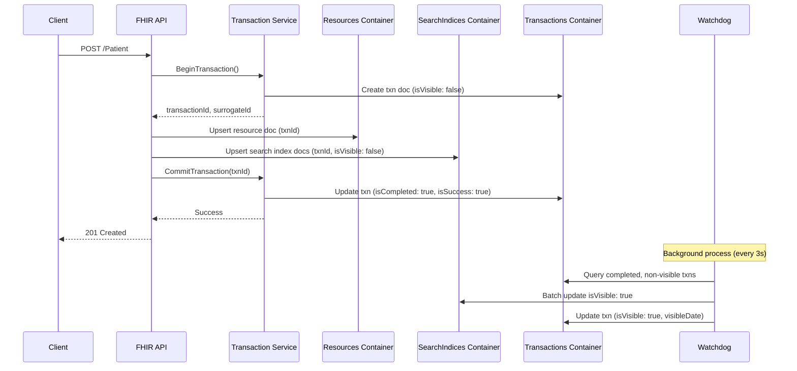
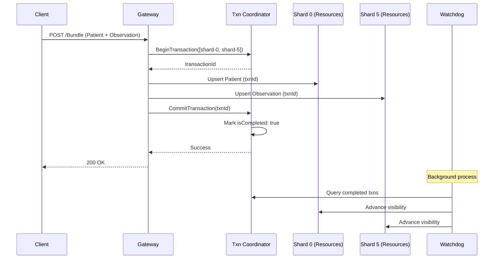

# ADR 2510: Cosmos DB v2 Data Provider for Multi-Petabyte Scale

Labels: [CosmosDB](https://github.com/microsoft/fhir-server/labels/Area-CosmosDB), [Architecture](https://github.com/microsoft/fhir-server/labels/Type-Architecture)

## Context

The current Cosmos DB data provider (v1) has fundamental architectural limitations that prevent scaling beyond ~25TB:

### Current Architecture Limitations

1. **Partition Scalability Ceiling (~25TB / ~500 Physical Partitions)**
   - Current partition key: `{ResourceType}_{ResourceId}` (single-level, document-scoped)
   - When the database reaches ~500 physical partitions (~25TB at 50GB/partition), the Cosmos SDK creates 500+ parallel tasks for cross-partition queries
   - This task explosion causes thread pool exhaustion, memory pressure, and system hangs
   - The partition model does not leverage Cosmos DB's ability to scale to thousands of physical partitions

2. **Inefficient Search Index Storage ([Issue #2686](https://github.com/microsoft/fhir-server/issues/2686))**
   - Search indices stored as: `{ "p": "_lastUpdated", "st": "timestamp" }`
   - Parameter name `"p"` is part of each index entry, forcing collection scans for range queries
   - High RU costs and poor index utilization on large databases (20GB+)
   - Recommended structure: `"_lastUpdated": [{ "st": "timestamp" }]` enables native indexing

3. **Monolithic Document Model**
   - Resources and search indices are tightly coupled in `FhirCosmosResourceWrapper`
   - Every resource read includes all search parameter data (unnecessary overhead)
   - Point reads by ID/version are fast, but search-heavy workloads suffer
   - No separation of concerns: updates to search parameters require full document rewrites

4. **Lack of Cross-Partition Transactional Semantics**
   - Cosmos DB transactional batches are limited to single logical partitions
   - No equivalent to SQL Server's `Transactions` table for multi-resource consistency
   - Bundle transactions with resources across partitions use compensating transactions (error-prone)
   - No durable transaction log for failure recovery or auditing

5. **Chained Search Performance Degradation**
   - Chained searches execute recursive subqueries with 15-second timeouts
   - Each subquery limited to 1000 items
   - Deep chains (e.g., `Observation?subject.organization.identifier=X`) require multiple round-trips
   - No query plan optimization across chain levels

### Modern Cosmos DB Capabilities (2025)

Since the v1 provider was designed (circa 2018-2020), Cosmos DB has introduced significant new features:

1. **Hierarchical Partition Keys (GA)**
   - Up to 3-level partition key hierarchies
   - Logical partition prefixes can exceed 20GB (vs. previous 20GB hard limit)
   - Enables better data distribution: `[TenantId, ResourceType, ResourceId]`
   - Queries by prefix are efficiently routed to subset of partitions

2. **Change Feed Enhancements**
   - All Versions and Deletes mode (preview) captures full history
   - Enables event sourcing, CQRS, and transactional outbox patterns
   - Can be used for transaction coordination across containers

3. **Improved SDK (v3+)**
   - Better parallelism control with `MaxConcurrency`
   - Feed range support for fine-grained partition targeting
   - Bulk operations for high-throughput ingestion

4. **Azure Synapse Link (Analytical Store)**
   - Near real-time analytics over operational data
   - Separate column-store for complex aggregations
   - Can offload expensive search queries from transactional container

### SQL Server Patterns to Adopt

The SQL Server provider has proven patterns for multi-TB scale:

1. **Transaction Table** (`dbo.Transactions`)
   - Append-only log with surrogate ID ranges
   - Tracks transaction lifecycle: `IsCompleted`, `IsSuccess`, `IsVisible`
   - Enables eventual consistency with `TransactionWatchdog` for rollforward
   - Provides durable transaction semantics across resources

2. **Watchdog Pattern**
   - Background process monitors timed-out transactions
   - Rolls forward incomplete transactions based on committed data in Resource table
   - Advances visibility for newly completed transactions
   - Critical for eventual consistency model (ADR 2505)

3. **Separate Search Parameter Tables**
   - Resources stored in `dbo.Resource`
   - Search parameters in separate tables by type: `TokenSearchParam`, `StringSearchParam`, etc.
   - Enables independent indexing strategies and storage optimization
   - Reduces contention on resource table

### Requirements for v2 Architecture

1. **Scale to 10PB+**: Support multi-petabyte workloads without SDK task explosion or performance degradation
2. **Optimize Search Performance**: Address issue #2686 with restructured search indices and efficient query execution
3. **Transactional Consistency**: Implement SQL-like transaction table for cross-partition ACID semantics
4. **Separation of Concerns**: Decouple raw resources from search indices for independent scaling
5. **Backward Compatibility**: Provide migration path from v1 with minimal downtime
6. **Cost Efficiency**: Optimize RU consumption for common access patterns (point reads, searches, bulk operations)

## Decision

We will design **three alternative architectures** for Cosmos DB v2, each with distinct tradeoffs. The choice depends on deployment scale, access patterns, and operational requirements.

---

## Alternative 1: Hierarchical Partitioning with Separated Containers

**Summary**: Separate containers for resources, search indices, and transactions, using hierarchical partition keys for massive scale.

### Architecture

#### Container Structure

**1. Resources Container** (`fhir-resources-v2`)
- **Partition Key**: `[ResourceType, ShardId, ResourceId]` (3-level hierarchical)
  - `ShardId`: Hash-based shard (0-999) derived from `ResourceId` for even distribution
  - Enables 1000 logical partition prefixes per resource type
  - Each prefix can scale beyond 20GB with subpartitioning
- **Document Schema**:
  ```json
  {
    "id": "Patient/patient123/v5",
    "partitionKey": ["Patient", "42", "patient123"],
    "resourceId": "patient123",
    "versionId": "5",
    "resourceType": "Patient",
    "isDeleted": false,
    "isHistory": false,
    "lastModified": "2025-01-15T10:30:00Z",
    "resourceSurrogateId": 1234567890,
    "transactionId": 1234567000,
    "rawResource": { /* FHIR JSON */ },
    "searchParameterHash": "abc123"
  }
  ```
- **Key Characteristics**:
  - Point reads by `[ResourceType, ShardId, ResourceId]` are O(1)
  - No embedded search indices (lean documents)
  - History versions stored with composite ID: `{ResourceId}/v{VersionId}`

**2. SearchIndices Container** (`fhir-search-indices-v2`)
- **Partition Key**: `[ResourceType, SearchParamCode, ShardId]`
  - Enables targeted queries: all `Patient.name` indices in shard 42
  - Distributes search load across parameter types
- **Document Schema** (Optimized per issue #2686):
  ```json
  {
    "id": "Patient/patient123/name/0",
    "partitionKey": ["Patient", "name", "42"],
    "resourceId": "patient123",
    "resourceSurrogateId": 1234567890,
    "transactionId": 1234567000,
    "isVisible": true,
    "_lastUpdated": [
      { "st": "2025-01-15T10:30:00Z", "et": "2025-01-15T10:30:00Z" }
    ],
    "name": [
      { "str": "John Doe", "nstr": "JOHN DOE" }
    ]
  }
  ```
- **Key Optimizations**:
  - Search parameter values as top-level properties (not nested under `"p"`)
  - Native Cosmos DB indexing on `name[].nstr`, `_lastUpdated[].st`, etc.
  - Separate documents per resource per search parameter (normalized)
  - `isVisible` flag synced via change feed from Transactions container

**3. Transactions Container** (`fhir-transactions-v2`)
- **Partition Key**: `[TransactionId]` (single-level, transaction-scoped)
  - Each transaction is a logical partition for ACID batch operations
- **Document Schema**:
  ```json
  {
    "id": "txn-1234567000",
    "partitionKey": ["1234567000"],
    "transactionId": 1234567000,
    "surrogateIdRangeFirst": 1234567000,
    "surrogateIdRangeLast": 1234567099,
    "isCompleted": false,
    "isSuccess": false,
    "isVisible": false,
    "createDate": "2025-01-15T10:29:55Z",
    "heartbeatDate": "2025-01-15T10:30:10Z",
    "endDate": null,
    "visibleDate": null,
    "failureReason": null,
    "resources": [
      { "resourceType": "Patient", "resourceId": "patient123", "shardId": "42" }
    ]
  }
  ```
- **Transaction Lifecycle**:
  1. **Begin**: Allocate surrogate ID range, create transaction document
  2. **Write Resources**: Insert into Resources container with `transactionId`
  3. **Write Search Indices**: Insert into SearchIndices container with `transactionId`, `isVisible: false`
  4. **Commit**: Update transaction: `isCompleted: true`, `isSuccess: true`
  5. **Advance Visibility**: Watchdog updates search indices: `isVisible: true`

#### Transaction Flow



#### Search Execution

**Example**: `GET /Patient?name=John&_lastUpdated=gt2025-01-01`

1. **Determine Shards**: Hash search to identify target shards (or query all 1000 shards)
2. **Query SearchIndices Container**:
   ```sql
   SELECT r.resourceId, r.resourceSurrogateId
   FROM root r
   WHERE r.partitionKey[0] = 'Patient'
     AND r.partitionKey[1] = 'name'
     AND r.isVisible = true
     AND EXISTS (SELECT VALUE n FROM n IN r.name WHERE CONTAINS(n.nstr, 'JOHN'))
     AND EXISTS (SELECT VALUE d FROM d IN r._lastUpdated
                 WHERE d.st > '2025-01-01T00:00:00Z')
   ```
3. **Retrieve Resources**: Batch read from Resources container using `[ResourceType, ShardId, ResourceId]`
4. **Return Results**: Assemble SearchResult with resources

#### Watchdog Implementation

**CosmosTransactionWatchdog** (modeled after SQL `TransactionWatchdog.cs`):

- **Frequency**: Every 3 seconds
- **Operations**:
  1. **Advance Visibility**:
     - Query Transactions: `isCompleted = true AND isVisible = false`
     - For each transaction, batch update SearchIndices: `isVisible: true`
     - Update Transactions: `isVisible: true, visibleDate: now()`
  2. **Roll Forward Timed-Out Transactions**:
     - Query Transactions: `isCompleted = false AND heartbeatDate < now() - 60s`
     - For each transaction:
       - Retrieve resources from Resources container by `transactionId`
       - Recreate missing search indices
       - Commit transaction
- **Change Feed Integration**: Listen to Resources container change feed to detect orphaned resources (no transaction doc)

### Partition Key Design Rationale

**Resources Container: `[ResourceType, ShardId, ResourceId]`**
- **Level 1 (ResourceType)**: Groups by FHIR resource type (Patient, Observation, etc.)
  - Enables resource-type-scoped queries
  - ~150 unique resource types (high but not massive cardinality)
- **Level 2 (ShardId)**: Hash-based shard (0-999)
  - Distributes each resource type across 1000 logical partitions
  - ShardId = Hash(ResourceId) % 1000
  - Ensures even distribution even for skewed ResourceId patterns
  - Each prefix (e.g., `["Patient", "42"]`) can exceed 20GB
- **Level 3 (ResourceId)**: Unique resource identifier
  - Final level for precise partition routing
  - Enables point reads without scanning

**SearchIndices Container: `[ResourceType, SearchParamCode, ShardId]`**
- **Level 1 (ResourceType)**: Same as Resources
- **Level 2 (SearchParamCode)**: Search parameter code (e.g., "name", "_lastUpdated")
  - Enables parameter-specific queries
  - ~200 unique search parameters across all resource types
- **Level 3 (ShardId)**: Same hash-based shard as Resources
  - Co-locates search indices with their resources (same ShardId)
  - Enables efficient multi-parameter searches within a shard

**Scale Calculation**:
- 150 resource types × 1000 shards = 150,000 logical partition prefixes (Resources)
- 150 resource types × 200 search params × 1000 shards = 30M logical partition prefixes (SearchIndices)
- Cosmos DB physical partition limit: ~10,000 partitions (500GB each, 5PB total per container)
- **Effective limit**: 5PB per container × 2 containers = **10PB+ total**

### Advantages

1. **Massive Scale**: 10PB+ capacity per deployment
2. **Optimized Search**: Issue #2686 resolved with top-level search parameter properties
3. **Transactional Consistency**: SQL-like transaction table with watchdog
4. **Independent Scaling**: Resources and search indices scale independently
5. **Efficient Point Reads**: O(1) retrieval by resource ID (no search index overhead)
6. **SDK Compatibility**: Hierarchical keys supported in Cosmos SDK v3+

### Disadvantages

1. **Complexity**: Three containers with complex coordination logic
2. **Cross-Container Consistency**: Eventual consistency between Resources and SearchIndices
3. **Change Feed Latency**: Watchdog introduces ~3-5 second visibility delay
4. **Migration Effort**: Requires full data migration from v1 (no in-place upgrade)
5. **Cost**: Additional RU consumption for transaction management and watchdog operations
6. **Chained Search**: Still requires multi-hop queries (not fully optimized)

### Query Execution Examples

#### Example 1: Chained Search with Multiple Parameters

**Query**: `GET /Patient?general-practitioner:Practitioner.name=Sarah&general-practitioner:Practitioner.address-state=WA`

**Description**: Find patients whose general practitioner is named "Sarah" and practices in Washington state.

**Alternative 1 Execution** (Separated Containers):

1. **Subquery 1 - Find Practitioners**:
   ```sql
   -- Query SearchIndices Container
   SELECT DISTINCT r.resourceId, r.resourceSurrogateId
   FROM root r
   WHERE r.partitionKey[0] = 'Practitioner'
     AND r.partitionKey[1] = 'name'
     AND r.isVisible = true
     AND EXISTS (SELECT VALUE n FROM n IN r.name WHERE CONTAINS(n.nstr, 'SARAH'))
   ```
   Returns: `[practitioner123, practitioner456]`

2. **Subquery 2 - Filter by State** (same container):
   ```sql
   SELECT r.resourceId
   FROM root r
   WHERE r.partitionKey[0] = 'Practitioner'
     AND r.partitionKey[1] = 'address-state'
     AND r.isVisible = true
     AND r.resourceId IN ('practitioner123', 'practitioner456')
     AND EXISTS (SELECT VALUE s FROM s IN r."address-state"
                 WHERE s.str = 'WA')
   ```
   Returns: `[practitioner123]`

3. **Main Query - Find Patients**:
   ```sql
   SELECT r.resourceId
   FROM root r
   WHERE r.partitionKey[0] = 'Patient'
     AND r.partitionKey[1] = 'general-practitioner'
     AND r.isVisible = true
     AND EXISTS (SELECT VALUE gp FROM gp IN r."general-practitioner"
                 WHERE gp.referenceResourceType = 'Practitioner'
                   AND gp.referenceResourceId IN ('practitioner123'))
   ```

4. **Retrieve Resources**: Batch read from Resources container using partition keys

**RU Estimate**: ~50 RUs (3 targeted queries + batch read)

**Alternative 2 Execution** (Synapse Link):

1. **Single Synapse SQL Query**:
   ```sql
   SELECT p.resourceId, p.rawResource
   FROM OPENROWSET(
       BULK 'https://.../fhir-resources-v2',
       FORMAT = 'CosmosDBAnalytical'
   ) AS p
   CROSS APPLY OPENJSON(p.searchIndices."general-practitioner") AS gp
   WHERE p.resourceType = 'Patient'
     AND gp.referenceResourceType = 'Practitioner'
     AND gp.referenceResourceId IN (
       SELECT prac.resourceId
       FROM OPENROWSET(...) AS prac
       CROSS APPLY OPENJSON(prac.searchIndices.name) AS name
       CROSS APPLY OPENJSON(prac.searchIndices."address-state") AS state
       WHERE prac.resourceType = 'Practitioner'
         AND name.nstr LIKE '%SARAH%'
         AND state.str = 'WA'
     )
   ```

**RU Estimate**: ~100 RUs (Synapse analytical query, 2-5 min lag)

**Alternative 3 Execution** (Sharded Gateway):

1. **Gateway Routes**: Fan out to all 100 shards (practitioners could be in any shard)
2. **Per-Shard Execution**: Same as Alternative 1, but within each shard
3. **Aggregation**: Gateway merges results from all shards

**RU Estimate**: ~5000 RUs (100 shards × ~50 RUs per shard)

---

#### Example 2: Complex Multi-Parameter Search with Includes

**Query**: `GET /Condition?patient=37e9d66c&verification-status=active&clinical-status=active&category=main&category=important&asserter=6db9b2c6&recorder=f4845d77&note-text=deat&_include=Condition:recorder&_include=Condition:asserter&_revinclude=Goal:addresses-conditions&onset-date=ge2022-11-01`

**Description**: Find active conditions for a patient with specific categories, asserter, recorder, note text, and onset date, including related practitioners and goals.

**Alternative 1 Execution** (Separated Containers):

1. **Main Search - SearchIndices Container**:
   ```sql
   SELECT r.resourceId, r.resourceSurrogateId
   FROM root r
   WHERE r.partitionKey[0] = 'Condition'
     AND r.isVisible = true
     AND (
       -- Patient filter
       (r.partitionKey[1] = 'patient' AND EXISTS (
         SELECT VALUE p FROM p IN r.patient
         WHERE p.referenceResourceId = '37e9d66c'))
       OR
       -- Verification status filter
       (r.partitionKey[1] = 'verification-status' AND EXISTS (
         SELECT VALUE v FROM v IN r."verification-status"
         WHERE v.str = 'active'))
       OR
       -- Clinical status filter
       (r.partitionKey[1] = 'clinical-status' AND EXISTS (
         SELECT VALUE c FROM c IN r."clinical-status"
         WHERE c.str = 'active'))
       OR
       -- Category filters
       (r.partitionKey[1] = 'category' AND EXISTS (
         SELECT VALUE cat FROM cat IN r.category
         WHERE cat.str IN ('main', 'important')))
       OR
       -- Asserter filter
       (r.partitionKey[1] = 'asserter' AND EXISTS (
         SELECT VALUE a FROM a IN r.asserter
         WHERE a.referenceResourceId = '6db9b2c6'))
       OR
       -- Recorder filter
       (r.partitionKey[1] = 'recorder' AND EXISTS (
         SELECT VALUE rec FROM rec IN r.recorder
         WHERE rec.referenceResourceId = 'f4845d77'))
       OR
       -- Note text filter
       (r.partitionKey[1] = 'note-text' AND EXISTS (
         SELECT VALUE n FROM n IN r."note-text"
         WHERE CONTAINS(n.str, 'deat')))
       OR
       -- Onset date filter
       (r.partitionKey[1] = 'onset-date' AND EXISTS (
         SELECT VALUE d FROM d IN r."onset-date"
         WHERE d.st >= '2022-11-01T00:00:00Z'))
     )
   -- Group by resourceId and ensure all conditions match
   GROUP BY r.resourceId
   HAVING COUNT(DISTINCT r.partitionKey[1]) = 8
   ```

   **Note**: This requires multiple queries (one per search parameter) and client-side intersection, OR a single query with grouping.

2. **Optimized Approach** - Multiple Targeted Queries:
   ```sql
   -- Query 1: Most selective filter (patient)
   SELECT r.resourceId FROM root r
   WHERE r.partitionKey = ['Condition', 'patient', ShardId]
     AND EXISTS (SELECT VALUE p FROM p IN r.patient
                 WHERE p.referenceResourceId = '37e9d66c')
   -- Returns ~100 condition IDs

   -- Query 2-8: Validate remaining parameters for matched resources
   -- Only query for specific resourceIds from Query 1
   SELECT r.resourceId FROM root r
   WHERE r.partitionKey = ['Condition', 'verification-status', ShardId]
     AND r.resourceId IN (result from Query 1)
     AND EXISTS (SELECT VALUE v FROM v IN r."verification-status"
                 WHERE v.str = 'active')
   ```

3. **_include Processing**:
   ```sql
   -- Extract recorder and asserter references from matched Condition resources
   -- Batch read from Resources container:
   GET /docs/Practitioner/f4845d77  -- partition: ['Practitioner', ShardId, 'f4845d77']
   GET /docs/Practitioner/6db9b2c6  -- partition: ['Practitioner', ShardId, '6db9b2c6']
   ```

4. **_revinclude Processing**:
   ```sql
   -- Find Goals that reference matched Conditions
   SELECT r.resourceId FROM root r
   WHERE r.partitionKey[0] = 'Goal'
     AND r.partitionKey[1] = 'addresses-conditions'
     AND r.isVisible = true
     AND EXISTS (SELECT VALUE addr FROM addr IN r."addresses-conditions"
                 WHERE addr.referenceResourceType = 'Condition'
                   AND addr.referenceResourceId IN (<matched condition IDs>))
   ```

5. **Final Assembly**: Batch read all resources from Resources container

**RU Estimate**: ~200 RUs (8 search queries + 2 include reads + 1 revinclude query + batch reads)

**Alternative 2 Execution** (Synapse Link):

```sql
-- Single Synapse SQL query with all filters
SELECT
  c.resourceId,
  c.rawResource,
  recorder.rawResource AS recorderResource,
  asserter.rawResource AS asserterResource,
  goals.resourceId AS goalId,
  goals.rawResource AS goalResource
FROM OPENROWSET(
    BULK 'https://.../fhir-resources-v2',
    FORMAT = 'CosmosDBAnalytical'
) AS c
CROSS APPLY OPENJSON(c.searchIndices.patient) AS patient
CROSS APPLY OPENJSON(c.searchIndices."verification-status") AS vstatus
CROSS APPLY OPENJSON(c.searchIndices."clinical-status") AS cstatus
CROSS APPLY OPENJSON(c.searchIndices.category) AS category
CROSS APPLY OPENJSON(c.searchIndices.asserter) AS asserter_ref
CROSS APPLY OPENJSON(c.searchIndices.recorder) AS recorder_ref
CROSS APPLY OPENJSON(c.searchIndices."note-text") AS note
CROSS APPLY OPENJSON(c.searchIndices."onset-date") AS onset
LEFT JOIN OPENROWSET(...) AS recorder
  ON recorder.resourceId = recorder_ref.referenceResourceId
LEFT JOIN OPENROWSET(...) AS asserter
  ON asserter.resourceId = asserter_ref.referenceResourceId
LEFT JOIN OPENROWSET(...) AS goals
  ON goals.searchIndices."addresses-conditions" LIKE '%' + c.resourceId + '%'
WHERE c.resourceType = 'Condition'
  AND patient.referenceResourceId = '37e9d66c'
  AND vstatus.str = 'active'
  AND cstatus.str = 'active'
  AND category.str IN ('main', 'important')
  AND asserter_ref.referenceResourceId = '6db9b2c6'
  AND recorder_ref.referenceResourceId = 'f4845d77'
  AND note.str LIKE '%deat%'
  AND onset.st >= '2022-11-01T00:00:00Z'
```

**RU Estimate**: ~300 RUs (complex analytical query with joins)

**Alternative 3 Execution** (Sharded Gateway):

1. **Shard Routing**: Patient ID `37e9d66c` hashes to specific shard (e.g., shard-42)
2. **Single Shard Query**: Execute Alternative 1 logic within shard-42 only
3. **No Fan-Out**: Patient parameter eliminates need to query all shards

**RU Estimate**: ~200 RUs (same as Alt 1, but confined to single shard)

---

#### Example 3: Compartment Search with Type Filtering

**Query**: `GET /Patient/patient-id/$everything?_type=ExplanationOfBenefit`

**Description**: Retrieve all ExplanationOfBenefit resources in a patient's compartment.

**Alternative 1 Execution** (Separated Containers):

1. **Compartment Membership Query**:
   ```sql
   -- Query SearchIndices Container for all resource types that can be in Patient compartment
   -- ExplanationOfBenefit uses 'patient' reference parameter
   SELECT r.resourceId, r.resourceSurrogateId
   FROM root r
   WHERE r.partitionKey[0] = 'ExplanationOfBenefit'
     AND r.partitionKey[1] = 'patient'
     AND r.isVisible = true
     AND EXISTS (SELECT VALUE p FROM p IN r.patient
                 WHERE p.referenceResourceType = 'Patient'
                   AND p.referenceResourceId = 'patient-id')
   ```

2. **Retrieve Resources**:
   ```sql
   -- Batch read from Resources Container
   -- For each resourceId from step 1, compute ShardId and read:
   GET /docs/ExplanationOfBenefit/eob123  -- partition: ['ExplanationOfBenefit', ShardId, 'eob123']
   GET /docs/ExplanationOfBenefit/eob456  -- partition: ['ExplanationOfBenefit', ShardId, 'eob456']
   ```

**RU Estimate**: ~30 RUs (1 search query + batch reads)

**Alternative 2 Execution** (Synapse Link):

```sql
SELECT eob.resourceId, eob.rawResource
FROM OPENROWSET(
    BULK 'https://.../fhir-resources-v2',
    FORMAT = 'CosmosDBAnalytical'
) AS eob
CROSS APPLY OPENJSON(eob.searchIndices.patient) AS patient
WHERE eob.resourceType = 'ExplanationOfBenefit'
  AND eob.isDeleted = false
  AND patient.referenceResourceType = 'Patient'
  AND patient.referenceResourceId = 'patient-id'
```

**RU Estimate**: ~50 RUs (analytical query)

**Alternative 3 Execution** (Sharded Gateway):

1. **Shard Resolution**: Patient `patient-id` hashes to shard-15
2. **Query Shard-15**: Execute Alternative 1 logic within single shard
3. **No Cross-Shard**: Patient compartment is always co-located with patient resource

**RU Estimate**: ~30 RUs (same as Alt 1, single shard)

---

### Performance Comparison Summary

| Query Type | Alt 1 (Separated) | Alt 2 (Synapse) | Alt 3 (Sharded) | v1 (Current) |
|------------|-------------------|-----------------|-----------------|--------------|
| **Chained Search** | 50 RUs | 100 RUs (2-5 min lag) | 5000 RUs (fan-out) | 200 RUs (recursive) |
| **Complex Multi-Param** | 200 RUs | 300 RUs (2-5 min lag) | 200 RUs | 500+ RUs (inefficient indices) |
| **Compartment Search** | 30 RUs | 50 RUs (2-5 min lag) | 30 RUs | 40 RUs |
| **Point Read** | 3 RUs | 5 RUs | 3 RUs | 3 RUs |

**Key Insights**:
- **Alternative 1** excels at targeted searches with optimized indices (issue #2686 resolved)
- **Alternative 2** trades latency (2-5 min) for powerful SQL joins and aggregations
- **Alternative 3** is optimal for tenant-scoped queries but poor for cross-tenant searches
- **v1** suffers from inefficient search index structure on multi-parameter queries

---

### Migration Path from v1

1. **Dual-Write Phase**:
   - Update API to write to both v1 (single container) and v2 (three containers)
   - Reads still served from v1
   - Duration: 1-2 weeks (validates v2 writes)

2. **Backfill Phase**:
   - Use Cosmos DB bulk operations to copy v1 → v2
   - Compute ShardId for each resource: `Hash(ResourceId) % 1000`
   - Extract search indices from `searchIndices` array into separate documents
   - Create transaction documents for historical data (all `isVisible: true`)
   - Duration: Days to weeks (depends on data size)

3. **Read Migration Phase**:
   - Enable feature flag: route 1% of reads to v2, validate correctness
   - Gradually increase: 10% → 50% → 100%
   - Duration: 1-2 weeks

4. **Cleanup Phase**:
   - Remove dual-write logic
   - Archive v1 container
   - Duration: 1 week

---

## Alternative 2: Hybrid Model with Azure Synapse Link

**Summary**: Keep resources in a single container with hierarchical partitioning, offload complex searches to Azure Synapse Link (analytical store).

### Architecture

#### Container Structure

**1. Resources Container** (`fhir-resources-v2`)
- **Partition Key**: `[ResourceType, ShardId, ResourceId]` (same as Alt 1)
- **Document Schema**:
  ```json
  {
    "id": "Patient/patient123",
    "partitionKey": ["Patient", "42", "patient123"],
    "resourceId": "patient123",
    "versionId": "5",
    "resourceType": "Patient",
    "isDeleted": false,
    "lastModified": "2025-01-15T10:30:00Z",
    "resourceSurrogateId": 1234567890,
    "transactionId": 1234567000,
    "rawResource": { /* FHIR JSON */ },
    "searchIndices": {
      "_lastUpdated": [
        { "st": "2025-01-15T10:30:00Z", "et": "2025-01-15T10:30:00Z" }
      ],
      "name": [
        { "str": "John Doe", "nstr": "JOHN DOE" }
      ]
    }
  }
  ```
- **Key Characteristics**:
  - Search indices embedded (similar to v1 but restructured per issue #2686)
  - Synapse Link enabled for analytical queries
  - Point reads remain O(1)

**2. Transactions Container** (`fhir-transactions-v2`)
- **Partition Key**: `[TransactionId]` (same as Alt 1)
- **Purpose**: Same transaction lifecycle management

**3. Azure Synapse Link (Analytical Store)**
- **Automatic Sync**: Near real-time sync from transactional container to column store
- **Query Engine**: Use Synapse SQL or Spark for complex searches
- **Use Cases**:
  - Multi-parameter searches: `name=John&birthdate=gt1990`
  - Aggregations: `_summary=count`
  - Chained searches: `Observation?subject.name=John`
  - Export operations ($export)

#### Search Execution

**Simple Searches** (served from transactional container):
- Point reads: `GET /Patient/patient123`
- Single-parameter: `GET /Patient?_id=patient123`

**Complex Searches** (routed to Synapse Link):
- Multi-parameter: `GET /Patient?name=John&birthdate=1990-01-01`
- Chained: `GET /Observation?subject.name=John`
- Aggregations: `GET /Patient?_summary=count`

**Query Example** (Synapse SQL):
```sql
SELECT r.resourceId, r.rawResource
FROM OPENROWSET(
    BULK 'https://.../fhir-resources-v2',
    FORMAT = 'CosmosDBAnalytical'
) AS r
CROSS APPLY OPENJSON(r.searchIndices.name) AS name
CROSS APPLY OPENJSON(r.searchIndices.birthdate) AS birthdate
WHERE name.nstr LIKE '%JOHN%'
  AND birthdate.st >= '1990-01-01T00:00:00Z'
  AND r.isDeleted = false
```

### Advantages

1. **Simplified Architecture**: Only two containers (vs. three in Alt 1)
2. **No Cross-Container Sync**: Search indices embedded in resource documents
3. **Powerful Analytics**: Synapse Link enables SQL/Spark queries over operational data
4. **Optimized for Read-Heavy**: Complex searches offloaded to analytical store
5. **Lower Latency for Writes**: No need to write to separate SearchIndices container
6. **Easier Migration**: Closer to v1 structure (embedded search indices)

### Disadvantages

1. **Synapse Link Cost**: Additional charges for analytical store storage and query execution
2. **Analytical Store Lag**: 2-5 minute sync delay (not suitable for strong consistency requirements)
3. **Not Pure Cosmos**: Introduces dependency on Synapse (additional service to manage)
4. **Limited Write Optimization**: Search indices still coupled with resources (larger documents)
5. **Scale Ceiling**: Single container limit (5PB, but Synapse Link may not scale linearly)
6. **Query Complexity**: Requires Synapse SQL/Spark expertise

### When to Choose This Alternative

- **Read-heavy workloads** with complex search patterns
- **Analytics requirements** beyond simple FHIR searches
- **Acceptable eventual consistency** for searches (2-5 min lag)
- **Budget for Synapse Link** (cost-benefit analysis shows value)

---

## Alternative 3: Ultra-Scale Sharded Architecture with Gateway Pattern

**Summary**: Multiple resource containers (sharded by tenant/region), centralized transaction coordinator, gateway for routing.

### Architecture

#### Container Structure

**1. Resource Containers** (`fhir-resources-shard-{N}`)
- **Count**: 10-100 shards (configurable)
- **Partition Key**: `[ResourceType, ResourceId]` (2-level hierarchical)
  - Simpler than Alt 1 (no ShardId in partition key)
  - Each shard is an independent Cosmos DB container
- **Shard Assignment**:
  - **Tenant-based**: Shard = Hash(TenantId) % ShardCount
  - **Region-based**: Shard = Region (e.g., US-East, EU-West)
  - **Hybrid**: Shard = Hash(TenantId + Region) % ShardCount
- **Document Schema**: Same as Alt 1 Resources container

**2. SearchIndices Containers** (`fhir-search-indices-shard-{N}`)
- **Count**: Matches resource shards (1:1 mapping)
- **Partition Key**: `[ResourceType, SearchParamCode]`
- **Document Schema**: Same as Alt 1 SearchIndices container

**3. Transactions Coordinator Container** (`fhir-transactions-global`)
- **Partition Key**: `[TransactionId]`
- **Global**: Single container tracks transactions across all shards
- **Document Schema**:
  ```json
  {
    "id": "txn-1234567000",
    "partitionKey": ["1234567000"],
    "transactionId": 1234567000,
    "shards": ["shard-0", "shard-5"],
    "isCompleted": false,
    "isSuccess": false,
    "resources": [
      { "shard": "shard-0", "resourceType": "Patient", "resourceId": "patient123" },
      { "shard": "shard-5", "resourceType": "Observation", "resourceId": "obs456" }
    ]
  }
  ```

**4. Gateway Service**
- **Responsibility**: Route requests to correct shard based on TenantId/Region
- **Shard Map**: In-memory cache of TenantId → ShardId mapping
- **Metadata Store**: Cosmos DB container or Redis cache for shard map persistence

#### Transaction Flow (Cross-Shard)



#### Shard Map Management

**Shard Map Document** (`fhir-shardmap-global`):
```json
{
  "id": "tenant-12345",
  "partitionKey": ["tenant-12345"],
  "tenantId": "tenant-12345",
  "shardId": "shard-7",
  "region": "US-East",
  "createdDate": "2024-01-01T00:00:00Z"
}
```

**Routing Logic**:
1. Extract `TenantId` from request (from JWT, header, or resource content)
2. Lookup shard map: `shardId = ShardMap[TenantId]`
3. If not found, assign new shard (round-robin or least-loaded)
4. Route request to `fhir-resources-shard-{shardId}`

### Advantages

1. **Infinite Scale**: Add shards as needed (100+ shards = 500PB+)
2. **Tenant Isolation**: Each tenant can be in dedicated shard (compliance, performance)
3. **Regional Distribution**: Shards can be geo-distributed for low latency
4. **Independent Scaling**: Scale each shard independently (RU provisioning per shard)
5. **Blast Radius Containment**: Issues in one shard don't affect others
6. **Cost Optimization**: Hot shards can have higher RU, cold shards lower RU

### Disadvantages

1. **Extreme Complexity**: Gateway, shard map, cross-shard transactions
2. **Operational Overhead**: Managing 100+ containers, watchdogs, shard rebalancing
3. **Cross-Shard Queries**: Expensive (must fan out to all shards)
4. **Shard Rebalancing**: Moving tenants between shards is complex
5. **Higher Latency**: Additional hop through gateway
6. **Cosmos DB Limits**: Account-level limits (100 containers per account, may need multiple accounts)

### When to Choose This Alternative

- **Multi-tenant SaaS** with 1000s of tenants
- **Regulatory requirements** for tenant data isolation
- **Global deployment** with regional data residency requirements
- **Massive scale** (100TB+) with ability to invest in complex infrastructure
- **Heterogeneous workloads** (some tenants write-heavy, others read-heavy)

---

## Comparison Matrix

| Criterion | Alt 1: Separated Containers | Alt 2: Synapse Link | Alt 3: Sharded Gateway |
|-----------|----------------------------|---------------------|------------------------|
| **Max Scale** | 10PB (3 containers × 5PB) | 5PB (single container + Synapse) | 500PB+ (100 shards × 5PB) |
| **Complexity** | Medium | Low-Medium | Very High |
| **Search Performance** | High (optimized indices) | Very High (Synapse SQL) | Medium (fan-out queries) |
| **Write Performance** | High (eventual consistency) | Medium (embedded indices) | High (parallel shards) |
| **Transaction Semantics** | Strong (watchdog) | Strong (watchdog) | Strong (distributed coord) |
| **Operational Cost** | Medium | High (Synapse charges) | Very High (100+ containers) |
| **Migration Effort** | High | Medium | Very High |
| **Multi-Tenancy** | Limited | Limited | Excellent |
| **Analytical Queries** | Manual (custom code) | Native (Synapse Link) | Manual (aggregation service) |
| **Latency** | Low | Medium (Synapse lag) | Medium (gateway hop) |

## Recommendation

**For most deployments**: **Alternative 1 (Separated Containers)** is recommended.

**Rationale**:
1. Balances scale (10PB+), performance (optimized search), and complexity
2. Proven pattern from SQL Server provider (transaction table + watchdog)
3. Addresses critical issue #2686 (search index structure)
4. Independent scaling for resources vs. search indices
5. No external dependencies (pure Cosmos DB)

**For analytics-heavy workloads**: **Alternative 2 (Synapse Link)** if:
- Budget allows Synapse Link costs
- 2-5 minute search lag is acceptable
- Complex aggregations and chained searches are common

**For massive multi-tenant SaaS**: **Alternative 3 (Sharded Gateway)** if:
- Scale requirements exceed 10PB
- Tenant isolation is mandatory (compliance)
- Investment in complex infrastructure is feasible

## Status

Proposed

## Consequences

### Benefits

1. **Scalability**: All alternatives exceed v1's 25TB limit
2. **Performance**: Issue #2686 resolved with optimized search index structure
3. **Transactional Consistency**: SQL-like transaction semantics with watchdog pattern
4. **Separation of Concerns**: Resources decoupled from search indices (Alt 1 & 3)
5. **Future-Proof**: Leverages modern Cosmos DB features (hierarchical partitioning, change feed)

### Risks and Mitigations

| Risk | Mitigation |
|------|------------|
| **Migration Downtime** | Dual-write strategy with gradual read migration |
| **Change Feed Lag** | Monitor watchdog performance, tune PeriodSec |
| **Cost Increase** | RU optimization (batch operations, efficient queries), reserved capacity |
| **Operational Complexity** | Comprehensive monitoring, automated deployment (IaC), runbooks |
| **Query Performance Regression** | Load testing on v2 before migration, rollback plan |

### Implementation Considerations

1. **Feature Flags**: Enable v2 incrementally (per resource type, per tenant)
2. **Monitoring**: Cosmos DB metrics (RU consumption, latency, throttling), custom telemetry
3. **Disaster Recovery**: Cross-region replication, point-in-time restore
4. **Schema Versioning**: Version documents (`schemaVersion: 2`) for future migrations
5. **Testing**: Chaos engineering (partition splits, throttling, network latency)

### Open Questions

1. **Hierarchical Key Performance**: Validate query performance with 3-level keys at 10PB scale
2. **Watchdog Scalability**: Can a single watchdog instance handle 1000s of transactions/sec?
3. **Change Feed Consumption**: Does change feed scale to 10PB container size?
4. **Cross-Region Transactions**: How to handle multi-region writes with global transaction coordinator?
5. **Backward Compatibility**: Can v1 and v2 coexist for gradual migration?

### Next Steps

1. **Prototype**: Build proof-of-concept for Alternative 1 with 1TB dataset
2. **Performance Testing**: Benchmark queries with hierarchical keys vs. v1
3. **Cost Analysis**: Estimate RU consumption for typical workloads
4. **Migration Tool**: Develop bulk copy utility (v1 → v2)
5. **ADR Update**: Refine based on prototype findings

---

## References

- [Issue #2686: Cosmos DB Search Index Optimization](https://github.com/microsoft/fhir-server/issues/2686)
- [Cosmos DB Hierarchical Partition Keys](https://learn.microsoft.com/en-us/azure/cosmos-db/hierarchical-partition-keys)
- [Cosmos DB Partitioning Overview](https://learn.microsoft.com/en-us/azure/cosmos-db/partitioning-overview)
- [Cosmos DB Change Feed](https://learn.microsoft.com/en-us/azure/cosmos-db/change-feed)
- [ADR 2505: Eventual Consistency in SQL](./adr-2505-eventual-consistency.md)
- [SQL Server Transaction Table](../src/Microsoft.Health.Fhir.SqlServer/Features/Schema/Sql/Tables/Transactions.sql)
- [SQL Server TransactionWatchdog](../src/Microsoft.Health.Fhir.SqlServer/Features/Watchdogs/TransactionWatchdog.cs)
